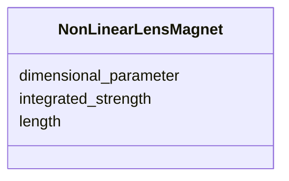

# Class: NonLinearLensMagnet 


_Integrable-optics non-linear lens field.  See the MAD-X manual and Danilov/Nagaitsev, PAC2011 WEP070._


<div data-search-exclude markdown="1">


URI: [laura:NonLinearLensMagnet](https://w3id.org/laura/NonLinearLensMagnet)





<!-- no inheritance hierarchy -->

## Class Properties

| Property | Value |
| --- | --- |
| Class URI | [laura:NonLinearLensMagnet](https://w3id.org/laura/NonLinearLensMagnet) |


## Slots

| Name | Cardinality and Range | Description | Inheritance |
| ---  | --- | --- | --- |
| [length](length.md) | 0..1 <br/> [Float](Float.md) | Magnetic length [m] | direct |
| [integrated_strength](integrated_strength.md) | 0..1 <br/> [Float](Float.md) | Integrated lens strength (MAD-X ``knll``) | direct |
| [dimensional_parameter](dimensional_parameter.md) | 0..1 <br/> [Float](Float.md) | Dimensional parameter setting the transverse scale (MAD-X ``cnll``) | direct |


## Usages

| used by | used in | type | used |
| ---  | --- | --- | --- |
| [NonLinearLens](NonLinearLens.md) | [magnetic](magnetic.md) | range | [NonLinearLensMagnet](NonLinearLensMagnet.md) |


## Identifier and Mapping Information


### Schema Source


* from schema: https://w3id.org/laura/schema


## Mappings

| Mapping Type | Mapped Value |
| ---  | ---  |
| self | laura:NonLinearLensMagnet |
| native | laura:NonLinearLensMagnet |


## LinkML Source

<!-- TODO: investigate https://stackoverflow.com/questions/37606292/how-to-create-tabbed-code-blocks-in-mkdocs-or-sphinx -->

### Direct

<details>
```yaml
name: NonLinearLensMagnet
description: Integrable-optics non-linear lens field.  See the MAD-X manual and Danilov/Nagaitsev,
  PAC2011 WEP070.
from_schema: https://w3id.org/laura/schema
attributes:
  length:
    name: length
    description: Magnetic length [m].
    from_schema: https://w3id.org/laura/schema/magnetic
    ifabsent: float(0.0)
    domain_of:
    - PhysicalElement
    - MagneticElement
    - Solenoid_Magnet
    - Wiggler_Magnet
    - NonLinearLensMagnet
    range: float
    minimum_value: 0
  integrated_strength:
    name: integrated_strength
    description: Integrated lens strength (MAD-X ``knll``). May be a functional expression.
    from_schema: https://w3id.org/laura/schema/magnetic
    rank: 1000
    ifabsent: float(0.0)
    domain_of:
    - NonLinearLensMagnet
    range: float
    minimum_value: 0
  dimensional_parameter:
    name: dimensional_parameter
    description: Dimensional parameter setting the transverse scale (MAD-X ``cnll``).
      May be a functional expression.
    from_schema: https://w3id.org/laura/schema/magnetic
    rank: 1000
    ifabsent: float(0.0)
    domain_of:
    - NonLinearLensMagnet
    range: float
class_uri: laura:NonLinearLensMagnet

```
</details>

### Induced

<details>
```yaml
name: NonLinearLensMagnet
description: Integrable-optics non-linear lens field.  See the MAD-X manual and Danilov/Nagaitsev,
  PAC2011 WEP070.
from_schema: https://w3id.org/laura/schema
attributes:
  length:
    name: length
    description: Magnetic length [m].
    from_schema: https://w3id.org/laura/schema/magnetic
    ifabsent: float(0.0)
    owner: NonLinearLensMagnet
    domain_of:
    - PhysicalElement
    - MagneticElement
    - Solenoid_Magnet
    - Wiggler_Magnet
    - NonLinearLensMagnet
    range: float
    minimum_value: 0
  integrated_strength:
    name: integrated_strength
    description: Integrated lens strength (MAD-X ``knll``). May be a functional expression.
    from_schema: https://w3id.org/laura/schema/magnetic
    rank: 1000
    ifabsent: float(0.0)
    owner: NonLinearLensMagnet
    domain_of:
    - NonLinearLensMagnet
    range: float
    minimum_value: 0
  dimensional_parameter:
    name: dimensional_parameter
    description: Dimensional parameter setting the transverse scale (MAD-X ``cnll``).
      May be a functional expression.
    from_schema: https://w3id.org/laura/schema/magnetic
    rank: 1000
    ifabsent: float(0.0)
    owner: NonLinearLensMagnet
    domain_of:
    - NonLinearLensMagnet
    range: float
class_uri: laura:NonLinearLensMagnet

```
</details></div>