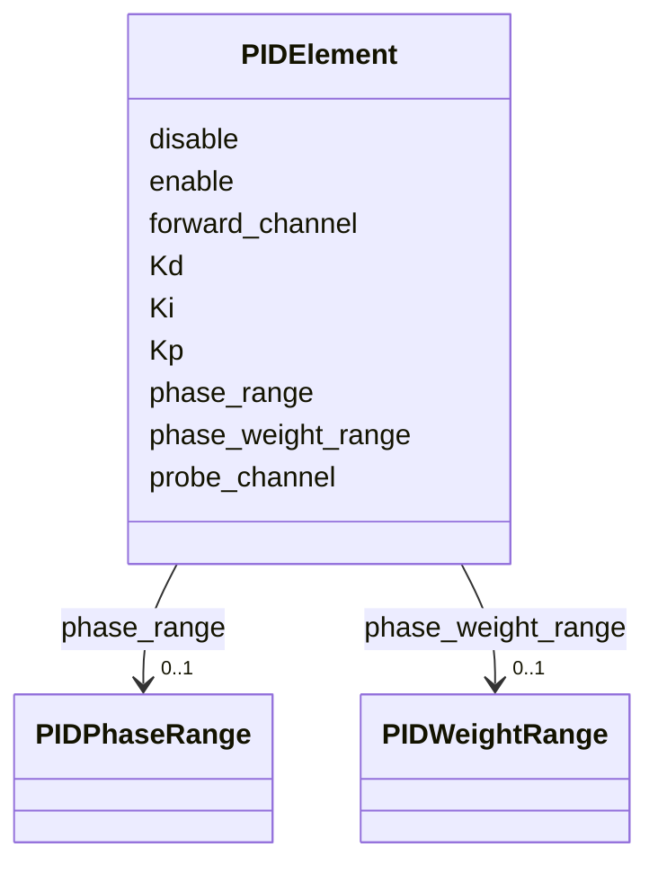

# Class: PIDElement 


_PID feedback-controller parameters._


<div data-search-exclude markdown="1">


URI: [laura:PIDElement](https://w3id.org/laura/PIDElement)





<!-- no inheritance hierarchy -->

## Class Properties

| Property | Value |
| --- | --- |
| Class URI | [laura:PIDElement](https://w3id.org/laura/PIDElement) |


## Slots

| Name | Cardinality and Range | Description | Inheritance |
| ---  | --- | --- | --- |
| [Kp](Kp.md) | 0..1 <br/> [Float](Float.md) | Proportional gain | direct |
| [Ki](Ki.md) | 0..1 <br/> [Float](Float.md) | Integral gain | direct |
| [Kd](Kd.md) | 0..1 <br/> [Float](Float.md) | Derivative gain | direct |
| [forward_channel](forward_channel.md) | 0..1 <br/> [Integer](Integer.md) | Forward channel index | direct |
| [probe_channel](probe_channel.md) | 0..1 <br/> [Integer](Integer.md) | Probe channel index | direct |
| [enable](enable.md) | 0..1 <br/> [String](String.md) | Enable command/value | direct |
| [disable](disable.md) | 0..1 <br/> [String](String.md) | Disable command/value | direct |
| [phase_range](phase_range.md) | 0..1 <br/> [PIDPhaseRange](PIDPhaseRange.md) | Phase tuning range | direct |
| [phase_weight_range](phase_weight_range.md) | 0..1 <br/> [PIDWeightRange](PIDWeightRange.md) | Phase weighting range | direct |


## Usages

| used by | used in | type | used |
| ---  | --- | --- | --- |
| [PID](PID.md) | [pid](pid.md) | range | [PIDElement](PIDElement.md) |


## Identifier and Mapping Information


### Schema Source


* from schema: https://w3id.org/laura/schema


## Mappings

| Mapping Type | Mapped Value |
| ---  | ---  |
| self | laura:PIDElement |
| native | laura:PIDElement |


## LinkML Source

<!-- TODO: investigate https://stackoverflow.com/questions/37606292/how-to-create-tabbed-code-blocks-in-mkdocs-or-sphinx -->

### Direct

<details>
```yaml
name: PIDElement
description: PID feedback-controller parameters.
from_schema: https://w3id.org/laura/schema
attributes:
  Kp:
    name: Kp
    description: Proportional gain.
    from_schema: https://w3id.org/laura/schema/rf
    rank: 1000
    domain_of:
    - PIDElement
    range: float
  Ki:
    name: Ki
    description: Integral gain.
    from_schema: https://w3id.org/laura/schema/rf
    rank: 1000
    domain_of:
    - PIDElement
    range: float
  Kd:
    name: Kd
    description: Derivative gain.
    from_schema: https://w3id.org/laura/schema/rf
    rank: 1000
    domain_of:
    - PIDElement
    range: float
  forward_channel:
    name: forward_channel
    description: Forward channel index.
    from_schema: https://w3id.org/laura/schema/rf
    rank: 1000
    domain_of:
    - PIDElement
    range: integer
  probe_channel:
    name: probe_channel
    description: Probe channel index.
    from_schema: https://w3id.org/laura/schema/rf
    rank: 1000
    domain_of:
    - PIDElement
    range: integer
  enable:
    name: enable
    description: Enable command/value.
    from_schema: https://w3id.org/laura/schema/rf
    rank: 1000
    domain_of:
    - PIDElement
    range: string
  disable:
    name: disable
    description: Disable command/value.
    from_schema: https://w3id.org/laura/schema/rf
    rank: 1000
    domain_of:
    - PIDElement
    range: string
  phase_range:
    name: phase_range
    description: Phase tuning range.
    from_schema: https://w3id.org/laura/schema/rf
    rank: 1000
    domain_of:
    - PIDElement
    range: PIDPhaseRange
  phase_weight_range:
    name: phase_weight_range
    description: Phase weighting range.
    from_schema: https://w3id.org/laura/schema/rf
    rank: 1000
    domain_of:
    - PIDElement
    range: PIDWeightRange
class_uri: laura:PIDElement

```
</details>

### Induced

<details>
```yaml
name: PIDElement
description: PID feedback-controller parameters.
from_schema: https://w3id.org/laura/schema
attributes:
  Kp:
    name: Kp
    description: Proportional gain.
    from_schema: https://w3id.org/laura/schema/rf
    rank: 1000
    owner: PIDElement
    domain_of:
    - PIDElement
    range: float
  Ki:
    name: Ki
    description: Integral gain.
    from_schema: https://w3id.org/laura/schema/rf
    rank: 1000
    owner: PIDElement
    domain_of:
    - PIDElement
    range: float
  Kd:
    name: Kd
    description: Derivative gain.
    from_schema: https://w3id.org/laura/schema/rf
    rank: 1000
    owner: PIDElement
    domain_of:
    - PIDElement
    range: float
  forward_channel:
    name: forward_channel
    description: Forward channel index.
    from_schema: https://w3id.org/laura/schema/rf
    rank: 1000
    owner: PIDElement
    domain_of:
    - PIDElement
    range: integer
  probe_channel:
    name: probe_channel
    description: Probe channel index.
    from_schema: https://w3id.org/laura/schema/rf
    rank: 1000
    owner: PIDElement
    domain_of:
    - PIDElement
    range: integer
  enable:
    name: enable
    description: Enable command/value.
    from_schema: https://w3id.org/laura/schema/rf
    rank: 1000
    owner: PIDElement
    domain_of:
    - PIDElement
    range: string
  disable:
    name: disable
    description: Disable command/value.
    from_schema: https://w3id.org/laura/schema/rf
    rank: 1000
    owner: PIDElement
    domain_of:
    - PIDElement
    range: string
  phase_range:
    name: phase_range
    description: Phase tuning range.
    from_schema: https://w3id.org/laura/schema/rf
    rank: 1000
    owner: PIDElement
    domain_of:
    - PIDElement
    range: PIDPhaseRange
  phase_weight_range:
    name: phase_weight_range
    description: Phase weighting range.
    from_schema: https://w3id.org/laura/schema/rf
    rank: 1000
    owner: PIDElement
    domain_of:
    - PIDElement
    range: PIDWeightRange
class_uri: laura:PIDElement

```
</details></div>