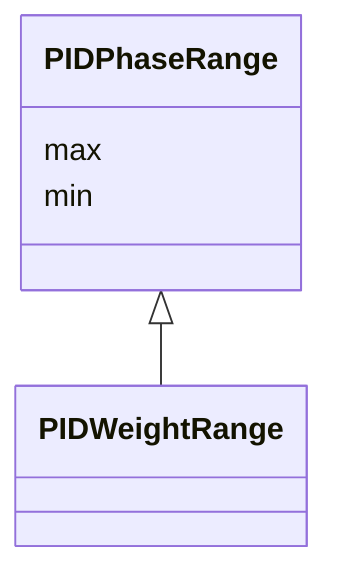

# Class: PIDPhaseRange 


_Numeric min/max range for PID phase control._


<div data-search-exclude markdown="1">


URI: [laura:PIDPhaseRange](https://w3id.org/laura/PIDPhaseRange)





## Inheritance
* **PIDPhaseRange**
    * [PIDWeightRange](PIDWeightRange.md)


## Class Properties

| Property | Value |
| --- | --- |
| Class URI | [laura:PIDPhaseRange](https://w3id.org/laura/PIDPhaseRange) |


## Slots

| Name | Cardinality and Range | Description | Inheritance |
| ---  | --- | --- | --- |
| [min](min.md) | 0..1 <br/> [Float](Float.md) | Minimum value | direct |
| [max](max.md) | 0..1 <br/> [Float](Float.md) | Maximum value | direct |


## Usages

| used by | used in | type | used |
| ---  | --- | --- | --- |
| [PIDElement](PIDElement.md) | [phase_range](phase_range.md) | range | [PIDPhaseRange](PIDPhaseRange.md) |


## Identifier and Mapping Information


### Schema Source


* from schema: https://w3id.org/laura/schema


## Mappings

| Mapping Type | Mapped Value |
| ---  | ---  |
| self | laura:PIDPhaseRange |
| native | laura:PIDPhaseRange |


## LinkML Source

<!-- TODO: investigate https://stackoverflow.com/questions/37606292/how-to-create-tabbed-code-blocks-in-mkdocs-or-sphinx -->

### Direct

<details>
```yaml
name: PIDPhaseRange
description: Numeric min/max range for PID phase control.
from_schema: https://w3id.org/laura/schema
attributes:
  min:
    name: min
    description: Minimum value.
    from_schema: https://w3id.org/laura/schema/rf
    rank: 1000
    domain_of:
    - PIDPhaseRange
    range: float
  max:
    name: max
    description: Maximum value.
    from_schema: https://w3id.org/laura/schema/rf
    rank: 1000
    domain_of:
    - PIDPhaseRange
    range: float
class_uri: laura:PIDPhaseRange

```
</details>

### Induced

<details>
```yaml
name: PIDPhaseRange
description: Numeric min/max range for PID phase control.
from_schema: https://w3id.org/laura/schema
attributes:
  min:
    name: min
    description: Minimum value.
    from_schema: https://w3id.org/laura/schema/rf
    rank: 1000
    owner: PIDPhaseRange
    domain_of:
    - PIDPhaseRange
    range: float
  max:
    name: max
    description: Maximum value.
    from_schema: https://w3id.org/laura/schema/rf
    rank: 1000
    owner: PIDPhaseRange
    domain_of:
    - PIDPhaseRange
    range: float
class_uri: laura:PIDPhaseRange

```
</details></div>