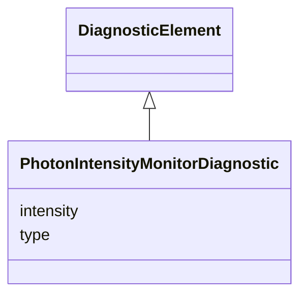

---
search:
  boost: 10.0
---

# Class: PhotonIntensityMonitorDiagnostic 


_Photon intensity monitor diagnostic data._


<div data-search-exclude markdown="1">


URI: [laura:PhotonIntensityMonitorDiagnostic](https://w3id.org/laura/PhotonIntensityMonitorDiagnostic)





## Inheritance
* [DiagnosticElement](DiagnosticElement.md)
    * **PhotonIntensityMonitorDiagnostic**


## Class Properties

| Property | Value |
| --- | --- |
| Class URI | [laura:PhotonIntensityMonitorDiagnostic](https://w3id.org/laura/PhotonIntensityMonitorDiagnostic) |


## Slots

| Name | Cardinality and Range | Description | Inheritance |
| ---  | --- | --- | --- |
| [type](type.md) | 0..1 <br/> [String](String.md) | Photon intensity monitor type | direct |
| [intensity](intensity.md) | 0..1 <br/> [Float](Float.md) | Measured photon intensity | direct |


## Usages

| used by | used in | type | used |
| ---  | --- | --- | --- |
| [PhotonMonitor](PhotonMonitor.md) | [intensity](intensity.md) | range | [PhotonIntensityMonitorDiagnostic](PhotonIntensityMonitorDiagnostic.md) |


## In Subsets


* [DiagnosticProperties](DiagnosticProperties.md)


## Identifier and Mapping Information


### Schema Source


* from schema: https://w3id.org/laura/schema


## Mappings

| Mapping Type | Mapped Value |
| ---  | ---  |
| self | laura:PhotonIntensityMonitorDiagnostic |
| native | laura:PhotonIntensityMonitorDiagnostic |


## LinkML Source

<!-- TODO: investigate https://stackoverflow.com/questions/37606292/how-to-create-tabbed-code-blocks-in-mkdocs-or-sphinx -->

### Direct

<details>
```yaml
name: PhotonIntensityMonitorDiagnostic
description: Photon intensity monitor diagnostic data.
in_subset:
- diagnostic_properties
from_schema: https://w3id.org/laura/schema
is_a: DiagnosticElement
attributes:
  type:
    name: type
    description: Photon intensity monitor type. Accepted in YAML as ``intensity_monitor_type``.
    from_schema: https://w3id.org/laura/schema/diagnostics
    aliases:
    - intensity_monitor_type
    ifabsent: string(I0)
    domain_of:
    - BPMDiagnosticElement
    - BAMDiagnosticElement
    - PhotonIntensityMonitorDiagnostic
    - BLMDiagnosticElement
    - ScreenDiagnosticElement
    - ChargeDiagnosticElement
    - CameraDiagnosticElement
    range: string
  intensity:
    name: intensity
    description: Measured photon intensity.
    from_schema: https://w3id.org/laura/schema/diagnostics
    ifabsent: float(0.0)
    domain_of:
    - PhotonMonitor
    - PhotonIntensityMonitorDiagnostic
    range: float
class_uri: laura:PhotonIntensityMonitorDiagnostic

```
</details>

### Induced

<details>
```yaml
name: PhotonIntensityMonitorDiagnostic
description: Photon intensity monitor diagnostic data.
in_subset:
- diagnostic_properties
from_schema: https://w3id.org/laura/schema
is_a: DiagnosticElement
attributes:
  type:
    name: type
    description: Photon intensity monitor type. Accepted in YAML as ``intensity_monitor_type``.
    from_schema: https://w3id.org/laura/schema/diagnostics
    aliases:
    - intensity_monitor_type
    ifabsent: string(I0)
    owner: PhotonIntensityMonitorDiagnostic
    domain_of:
    - BPMDiagnosticElement
    - BAMDiagnosticElement
    - PhotonIntensityMonitorDiagnostic
    - BLMDiagnosticElement
    - ScreenDiagnosticElement
    - ChargeDiagnosticElement
    - CameraDiagnosticElement
    range: string
  intensity:
    name: intensity
    description: Measured photon intensity.
    from_schema: https://w3id.org/laura/schema/diagnostics
    ifabsent: float(0.0)
    owner: PhotonIntensityMonitorDiagnostic
    domain_of:
    - PhotonMonitor
    - PhotonIntensityMonitorDiagnostic
    range: float
class_uri: laura:PhotonIntensityMonitorDiagnostic

```
</details></div>