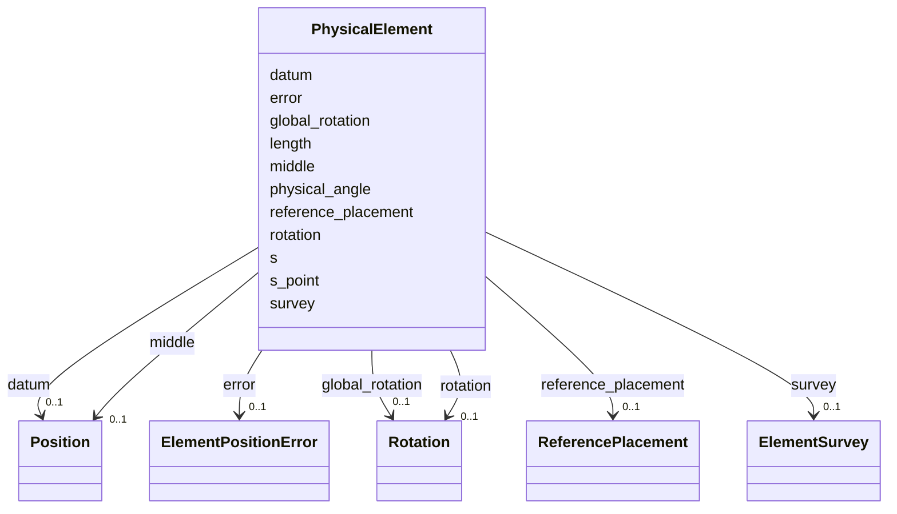

# Class: PhysicalElement 


_Physical placement data: position, rotation, length, and associated survey / alignment-error information._


<div data-search-exclude markdown="1">


URI: [laura:PhysicalElement](https://w3id.org/laura/PhysicalElement)





<!-- no inheritance hierarchy -->

## Class Properties

| Property | Value |
| --- | --- |
| Class URI | [laura:PhysicalElement](https://w3id.org/laura/PhysicalElement) |


## Slots

| Name | Cardinality and Range | Description | Inheritance |
| ---  | --- | --- | --- |
| [middle](middle.md) | 0..1 <br/> [Position](Position.md) | Longitudinal midpoint (centre) of the element | direct |
| [datum](datum.md) | 0..1 <br/> [Position](Position.md) | Datum reference position | direct |
| [rotation](rotation.md) | 0..1 <br/> [Rotation](Rotation.md) | Local rotation in the global frame | direct |
| [global_rotation](global_rotation.md) | 0..1 <br/> [Rotation](Rotation.md) | Accumulated global rotation including parent-frame contributions | direct |
| [error](error.md) | 0..1 <br/> [ElementPositionError](ElementPositionError.md) | Alignment errors | direct |
| [survey](survey.md) | 0..1 <br/> [ElementSurvey](ElementSurvey.md) | Survey-measured position and rotation | direct |
| [length](length.md) | 0..1 <br/> [Float](Float.md) | Effective length along the beam axis [m] | direct |
| [physical_angle](physical_angle.md) | 0..1 <br/> [Float](Float.md) | Bending angle in the horizontal plane [rad] | direct |
| [reference_placement](reference_placement.md) | 0..1 <br/> [ReferencePlacement](ReferencePlacement.md) | Place this element relative to another element's frame instead of using absol... | direct |
| [s](s.md) | 0..1 <br/> [Float](Float.md) | Arc-length position [m] along the design trajectory (s=0 at the global origin... | direct |
| [s_point](s_point.md) | 0..1 <br/> [String](String.md) | Which point of the element the ``s`` value refers to: ``start``, ``middle``, ... | direct |


## Usages

| used by | used in | type | used |
| ---  | --- | --- | --- |
| [PhysicalAcceleratorElement](PhysicalAcceleratorElement.md) | [physical](physical.md) | range | [PhysicalElement](PhysicalElement.md) |
| [TwissMatch](TwissMatch.md) | [physical](physical.md) | range | [PhysicalElement](PhysicalElement.md) |
| [MatrixTransform](MatrixTransform.md) | [physical](physical.md) | range | [PhysicalElement](PhysicalElement.md) |
| [ElectrostaticSeparator](ElectrostaticSeparator.md) | [physical](physical.md) | range | [PhysicalElement](PhysicalElement.md) |
| [ACDipole](ACDipole.md) | [physical](physical.md) | range | [PhysicalElement](PhysicalElement.md) |
| [HorizontalACDipole](HorizontalACDipole.md) | [physical](physical.md) | range | [PhysicalElement](PhysicalElement.md) |
| [VerticalACDipole](VerticalACDipole.md) | [physical](physical.md) | range | [PhysicalElement](PhysicalElement.md) |
| [Wire](Wire.md) | [physical](physical.md) | range | [PhysicalElement](PhysicalElement.md) |
| [BeamBeam](BeamBeam.md) | [physical](physical.md) | range | [PhysicalElement](PhysicalElement.md) |
| [RFMultipole](RFMultipole.md) | [physical](physical.md) | range | [PhysicalElement](PhysicalElement.md) |
| [Stage](Stage.md) | [physical](physical.md) | range | [PhysicalElement](PhysicalElement.md) |
| [VacuumGauge](VacuumGauge.md) | [physical](physical.md) | range | [PhysicalElement](PhysicalElement.md) |
| [Laser](Laser.md) | [physical](physical.md) | range | [PhysicalElement](PhysicalElement.md) |
| [Shutter](Shutter.md) | [physical](physical.md) | range | [PhysicalElement](PhysicalElement.md) |
| [Valve](Valve.md) | [physical](physical.md) | range | [PhysicalElement](PhysicalElement.md) |
| [Marker](Marker.md) | [physical](physical.md) | range | [PhysicalElement](PhysicalElement.md) |
| [Aperture](Aperture.md) | [physical](physical.md) | range | [PhysicalElement](PhysicalElement.md) |
| [Collimator](Collimator.md) | [physical](physical.md) | range | [PhysicalElement](PhysicalElement.md) |
| [Drift](Drift.md) | [physical](physical.md) | range | [PhysicalElement](PhysicalElement.md) |
| [Magnet](Magnet.md) | [physical](physical.md) | range | [PhysicalElement](PhysicalElement.md) |
| [RFCavity](RFCavity.md) | [physical](physical.md) | range | [PhysicalElement](PhysicalElement.md) |
| [RFDeflectingCavity](RFDeflectingCavity.md) | [physical](physical.md) | range | [PhysicalElement](PhysicalElement.md) |
| [CrabCavity](CrabCavity.md) | [physical](physical.md) | range | [PhysicalElement](PhysicalElement.md) |
| [Wakefield](Wakefield.md) | [physical](physical.md) | range | [PhysicalElement](PhysicalElement.md) |
| [Diagnostic](Diagnostic.md) | [physical](physical.md) | range | [PhysicalElement](PhysicalElement.md) |
| [BeamPositionMonitor](BeamPositionMonitor.md) | [physical](physical.md) | range | [PhysicalElement](PhysicalElement.md) |
| [BeamArrivalMonitor](BeamArrivalMonitor.md) | [physical](physical.md) | range | [PhysicalElement](PhysicalElement.md) |
| [BunchLengthMonitor](BunchLengthMonitor.md) | [physical](physical.md) | range | [PhysicalElement](PhysicalElement.md) |
| [Camera](Camera.md) | [physical](physical.md) | range | [PhysicalElement](PhysicalElement.md) |
| [Screen](Screen.md) | [physical](physical.md) | range | [PhysicalElement](PhysicalElement.md) |
| [WireScanner](WireScanner.md) | [physical](physical.md) | range | [PhysicalElement](PhysicalElement.md) |
| [ChargeDiagnostic](ChargeDiagnostic.md) | [physical](physical.md) | range | [PhysicalElement](PhysicalElement.md) |
| [WallCurrentMonitor](WallCurrentMonitor.md) | [physical](physical.md) | range | [PhysicalElement](PhysicalElement.md) |
| [FaradayCupMonitor](FaradayCupMonitor.md) | [physical](physical.md) | range | [PhysicalElement](PhysicalElement.md) |
| [IntegratedCurrentTransformer](IntegratedCurrentTransformer.md) | [physical](physical.md) | range | [PhysicalElement](PhysicalElement.md) |
| [PhotonMonitor](PhotonMonitor.md) | [physical](physical.md) | range | [PhysicalElement](PhysicalElement.md) |
| [Plasma](Plasma.md) | [physical](physical.md) | range | [PhysicalElement](PhysicalElement.md) |
| [Dipole](Dipole.md) | [physical](physical.md) | range | [PhysicalElement](PhysicalElement.md) |
| [Quadrupole](Quadrupole.md) | [physical](physical.md) | range | [PhysicalElement](PhysicalElement.md) |
| [Sextupole](Sextupole.md) | [physical](physical.md) | range | [PhysicalElement](PhysicalElement.md) |
| [Octupole](Octupole.md) | [physical](physical.md) | range | [PhysicalElement](PhysicalElement.md) |
| [Decapole](Decapole.md) | [physical](physical.md) | range | [PhysicalElement](PhysicalElement.md) |
| [HorizontalCorrector](HorizontalCorrector.md) | [physical](physical.md) | range | [PhysicalElement](PhysicalElement.md) |
| [VerticalCorrector](VerticalCorrector.md) | [physical](physical.md) | range | [PhysicalElement](PhysicalElement.md) |
| [CombinedCorrector](CombinedCorrector.md) | [physical](physical.md) | range | [PhysicalElement](PhysicalElement.md) |
| [Solenoid](Solenoid.md) | [physical](physical.md) | range | [PhysicalElement](PhysicalElement.md) |
| [CombinedSolenoidQuadrupole](CombinedSolenoidQuadrupole.md) | [physical](physical.md) | range | [PhysicalElement](PhysicalElement.md) |
| [Wiggler](Wiggler.md) | [physical](physical.md) | range | [PhysicalElement](PhysicalElement.md) |
| [NonLinearLens](NonLinearLens.md) | [physical](physical.md) | range | [PhysicalElement](PhysicalElement.md) |


## In Subsets


* [PhysicalProperties](PhysicalProperties.md)


## Identifier and Mapping Information


### Schema Source


* from schema: https://w3id.org/laura/schema


## Mappings

| Mapping Type | Mapped Value |
| ---  | ---  |
| self | laura:PhysicalElement |
| native | laura:PhysicalElement |


## LinkML Source

<!-- TODO: investigate https://stackoverflow.com/questions/37606292/how-to-create-tabbed-code-blocks-in-mkdocs-or-sphinx -->

### Direct

<details>
```yaml
name: PhysicalElement
description: 'Physical placement data: position, rotation, length, and associated
  survey / alignment-error information.'
in_subset:
- physical_properties
from_schema: https://w3id.org/laura/schema
attributes:
  middle:
    name: middle
    description: Longitudinal midpoint (centre) of the element. Also accepted as ``position``
      or ``centre`` in YAML.
    from_schema: https://w3id.org/laura/schema/geometry
    aliases:
    - position
    - centre
    rank: 1000
    domain_of:
    - PhysicalElement
    - CameraMask
    - CameraSensor
    range: Position
  datum:
    name: datum
    description: Datum reference position.
    from_schema: https://w3id.org/laura/schema/geometry
    rank: 1000
    domain_of:
    - PhysicalElement
    range: Position
  rotation:
    name: rotation
    description: Local rotation in the global frame.
    from_schema: https://w3id.org/laura/schema/geometry
    domain_of:
    - ElementPositionError
    - ElementSurvey
    - PhysicalElement
    - CameraDiagnosticElement
    range: Rotation
  global_rotation:
    name: global_rotation
    description: Accumulated global rotation including parent-frame contributions.
    from_schema: https://w3id.org/laura/schema/geometry
    rank: 1000
    domain_of:
    - PhysicalElement
    range: Rotation
  error:
    name: error
    description: Alignment errors.
    from_schema: https://w3id.org/laura/schema/geometry
    rank: 1000
    domain_of:
    - PhysicalElement
    range: ElementPositionError
  survey:
    name: survey
    description: Survey-measured position and rotation.
    from_schema: https://w3id.org/laura/schema/geometry
    rank: 1000
    domain_of:
    - PhysicalElement
    range: ElementSurvey
  length:
    name: length
    description: Effective length along the beam axis [m].
    from_schema: https://w3id.org/laura/schema/geometry
    rank: 1000
    ifabsent: float(0)
    domain_of:
    - PhysicalElement
    - MagneticElement
    - Corrector_Magnet
    - Solenoid_Magnet
    - Wiggler_Magnet
    - NonLinearLens_Magnet
    range: float
    minimum_value: 0.0
    unit:
      ucum_code: m
  physical_angle:
    name: physical_angle
    description: Bending angle in the horizontal plane [rad]. Derived from ``magnetic.angle``
      when available.
    from_schema: https://w3id.org/laura/schema/geometry
    rank: 1000
    ifabsent: float(0)
    domain_of:
    - PhysicalElement
    range: float
    unit:
      ucum_code: rad
  reference_placement:
    name: reference_placement
    description: Place this element relative to another element's frame instead of
      using absolute world coordinates.  Mutually exclusive with ``middle``/``position``/``centre``
      and ``s``.
    in_subset:
    - physical_properties
    from_schema: https://w3id.org/laura/schema/geometry
    rank: 1000
    domain_of:
    - PhysicalElement
    range: ReferencePlacement
  s:
    name: s
    description: Arc-length position [m] along the design trajectory (s=0 at the global
      origin along +Z).  Alternative to absolute world coordinates (``middle``/``position``/``centre``)
      and ``reference_placement``. Converted to {x,y,z} by LAURA during lattice assembly.
    from_schema: https://w3id.org/laura/schema/geometry
    rank: 1000
    domain_of:
    - PhysicalElement
    range: float
    unit:
      ucum_code: m
  s_point:
    name: s_point
    description: 'Which point of the element the ``s`` value refers to: ``start``,
      ``middle``, or ``end``.  Defaults to ``middle``.'
    from_schema: https://w3id.org/laura/schema/geometry
    rank: 1000
    ifabsent: string(middle)
    domain_of:
    - PhysicalElement
    range: string
class_uri: laura:PhysicalElement

```
</details>

### Induced

<details>
```yaml
name: PhysicalElement
description: 'Physical placement data: position, rotation, length, and associated
  survey / alignment-error information.'
in_subset:
- physical_properties
from_schema: https://w3id.org/laura/schema
attributes:
  middle:
    name: middle
    description: Longitudinal midpoint (centre) of the element. Also accepted as ``position``
      or ``centre`` in YAML.
    from_schema: https://w3id.org/laura/schema/geometry
    aliases:
    - position
    - centre
    rank: 1000
    owner: PhysicalElement
    domain_of:
    - PhysicalElement
    - CameraMask
    - CameraSensor
    range: Position
  datum:
    name: datum
    description: Datum reference position.
    from_schema: https://w3id.org/laura/schema/geometry
    rank: 1000
    owner: PhysicalElement
    domain_of:
    - PhysicalElement
    range: Position
  rotation:
    name: rotation
    description: Local rotation in the global frame.
    from_schema: https://w3id.org/laura/schema/geometry
    owner: PhysicalElement
    domain_of:
    - ElementPositionError
    - ElementSurvey
    - PhysicalElement
    - CameraDiagnosticElement
    range: Rotation
  global_rotation:
    name: global_rotation
    description: Accumulated global rotation including parent-frame contributions.
    from_schema: https://w3id.org/laura/schema/geometry
    rank: 1000
    owner: PhysicalElement
    domain_of:
    - PhysicalElement
    range: Rotation
  error:
    name: error
    description: Alignment errors.
    from_schema: https://w3id.org/laura/schema/geometry
    rank: 1000
    owner: PhysicalElement
    domain_of:
    - PhysicalElement
    range: ElementPositionError
  survey:
    name: survey
    description: Survey-measured position and rotation.
    from_schema: https://w3id.org/laura/schema/geometry
    rank: 1000
    owner: PhysicalElement
    domain_of:
    - PhysicalElement
    range: ElementSurvey
  length:
    name: length
    description: Effective length along the beam axis [m].
    from_schema: https://w3id.org/laura/schema/geometry
    rank: 1000
    ifabsent: float(0)
    owner: PhysicalElement
    domain_of:
    - PhysicalElement
    - MagneticElement
    - Corrector_Magnet
    - Solenoid_Magnet
    - Wiggler_Magnet
    - NonLinearLens_Magnet
    range: float
    minimum_value: 0.0
    unit:
      ucum_code: m
  physical_angle:
    name: physical_angle
    description: Bending angle in the horizontal plane [rad]. Derived from ``magnetic.angle``
      when available.
    from_schema: https://w3id.org/laura/schema/geometry
    rank: 1000
    ifabsent: float(0)
    owner: PhysicalElement
    domain_of:
    - PhysicalElement
    range: float
    unit:
      ucum_code: rad
  reference_placement:
    name: reference_placement
    description: Place this element relative to another element's frame instead of
      using absolute world coordinates.  Mutually exclusive with ``middle``/``position``/``centre``
      and ``s``.
    in_subset:
    - physical_properties
    from_schema: https://w3id.org/laura/schema/geometry
    rank: 1000
    owner: PhysicalElement
    domain_of:
    - PhysicalElement
    range: ReferencePlacement
  s:
    name: s
    description: Arc-length position [m] along the design trajectory (s=0 at the global
      origin along +Z).  Alternative to absolute world coordinates (``middle``/``position``/``centre``)
      and ``reference_placement``. Converted to {x,y,z} by LAURA during lattice assembly.
    from_schema: https://w3id.org/laura/schema/geometry
    rank: 1000
    owner: PhysicalElement
    domain_of:
    - PhysicalElement
    range: float
    unit:
      ucum_code: m
  s_point:
    name: s_point
    description: 'Which point of the element the ``s`` value refers to: ``start``,
      ``middle``, or ``end``.  Defaults to ``middle``.'
    from_schema: https://w3id.org/laura/schema/geometry
    rank: 1000
    ifabsent: string(middle)
    owner: PhysicalElement
    domain_of:
    - PhysicalElement
    range: string
class_uri: laura:PhysicalElement

```
</details></div>