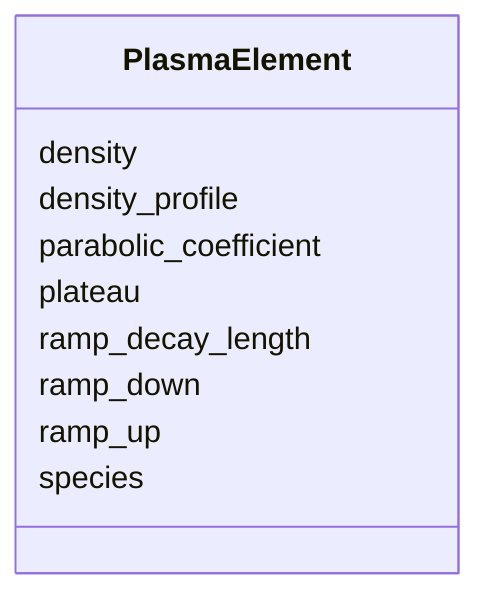

# Class: PlasmaElement 


_Plasma channel parameters for a laser-driven plasma-accelerator stage._


<div data-search-exclude markdown="1">


URI: [laura:PlasmaElement](https://w3id.org/laura/PlasmaElement)





<!-- no inheritance hierarchy -->

## Class Properties

| Property | Value |
| --- | --- |
| Class URI | [laura:PlasmaElement](https://w3id.org/laura/PlasmaElement) |


## Slots

| Name | Cardinality and Range | Description | Inheritance |
| ---  | --- | --- | --- |
| [density](density.md) | 0..1 <br/> [Double](Double.md) | Plasma (electron) number density [m^-^3] | direct |
| [species](species.md) | 0..1 <br/> [String](String.md) | Plasma species name (e | direct |
| [ramp_up](ramp_up.md) | 0..1 <br/> [Double](Double.md) | Entrance density-ramp length [m] | direct |
| [plateau](plateau.md) | 0..1 <br/> [Double](Double.md) | Flat-top plateau length [m] | direct |
| [ramp_down](ramp_down.md) | 0..1 <br/> [Double](Double.md) | Exit density-ramp length [m] | direct |
| [ramp_decay_length](ramp_decay_length.md) | 0..1 <br/> [Double](Double.md) | Exponential decay length of the density ramp [m] | direct |
| [density_profile](density_profile.md) | 0..1 <br/> [Boolean](Boolean.md) | If True, use a user-defined profile; if False, use a flat-top model | direct |
| [parabolic_coefficient](parabolic_coefficient.md) | 0..1 <br/> [Double](Double.md) | Parabolic coefficient for a transverse density profile | direct |


## Usages

| used by | used in | type | used |
| ---  | --- | --- | --- |
| [Plasma](Plasma.md) | [plasma](plasma.md) | range | [PlasmaElement](PlasmaElement.md) |


## Identifier and Mapping Information


### Schema Source


* from schema: https://w3id.org/laura/schema


## Mappings

| Mapping Type | Mapped Value |
| ---  | ---  |
| self | laura:PlasmaElement |
| native | laura:PlasmaElement |


## LinkML Source

<!-- TODO: investigate https://stackoverflow.com/questions/37606292/how-to-create-tabbed-code-blocks-in-mkdocs-or-sphinx -->

### Direct

<details>
```yaml
name: PlasmaElement
description: Plasma channel parameters for a laser-driven plasma-accelerator stage.
from_schema: https://w3id.org/laura/schema
attributes:
  density:
    name: density
    description: Plasma (electron) number density [m^-^3].
    from_schema: https://w3id.org/laura/schema/laser_plasma
    rank: 1000
    domain_of:
    - PlasmaElement
    range: double
    minimum_value: 0.0
    unit:
      ucum_code: m-3
  species:
    name: species
    description: Plasma species name (e.g., ``electron``).
    from_schema: https://w3id.org/laura/schema/laser_plasma
    rank: 1000
    ifabsent: string(electron)
    domain_of:
    - PlasmaElement
    range: string
  ramp_up:
    name: ramp_up
    description: Entrance density-ramp length [m].
    from_schema: https://w3id.org/laura/schema/laser_plasma
    rank: 1000
    ifabsent: float(0.001)
    domain_of:
    - PlasmaElement
    range: double
    minimum_value: 0.0
    unit:
      ucum_code: m
  plateau:
    name: plateau
    description: Flat-top plateau length [m].
    from_schema: https://w3id.org/laura/schema/laser_plasma
    rank: 1000
    ifabsent: float(0.001)
    domain_of:
    - PlasmaElement
    range: double
    minimum_value: 0.0
    unit:
      ucum_code: m
  ramp_down:
    name: ramp_down
    description: Exit density-ramp length [m].
    from_schema: https://w3id.org/laura/schema/laser_plasma
    rank: 1000
    ifabsent: float(0.001)
    domain_of:
    - PlasmaElement
    range: double
    minimum_value: 0.0
    unit:
      ucum_code: m
  ramp_decay_length:
    name: ramp_decay_length
    description: Exponential decay length of the density ramp [m].
    from_schema: https://w3id.org/laura/schema/laser_plasma
    rank: 1000
    ifabsent: float(0.001)
    domain_of:
    - PlasmaElement
    range: double
    minimum_value: 0.0
    unit:
      ucum_code: m
  density_profile:
    name: density_profile
    description: If True, use a user-defined profile; if False, use a flat-top model.
    from_schema: https://w3id.org/laura/schema/laser_plasma
    rank: 1000
    ifabsent: 'False'
    domain_of:
    - PlasmaElement
    range: boolean
  parabolic_coefficient:
    name: parabolic_coefficient
    description: Parabolic coefficient for a transverse density profile.
    from_schema: https://w3id.org/laura/schema/laser_plasma
    rank: 1000
    ifabsent: float(0)
    domain_of:
    - PlasmaElement
    range: double
class_uri: laura:PlasmaElement

```
</details>

### Induced

<details>
```yaml
name: PlasmaElement
description: Plasma channel parameters for a laser-driven plasma-accelerator stage.
from_schema: https://w3id.org/laura/schema
attributes:
  density:
    name: density
    description: Plasma (electron) number density [m^-^3].
    from_schema: https://w3id.org/laura/schema/laser_plasma
    rank: 1000
    owner: PlasmaElement
    domain_of:
    - PlasmaElement
    range: double
    minimum_value: 0.0
    unit:
      ucum_code: m-3
  species:
    name: species
    description: Plasma species name (e.g., ``electron``).
    from_schema: https://w3id.org/laura/schema/laser_plasma
    rank: 1000
    ifabsent: string(electron)
    owner: PlasmaElement
    domain_of:
    - PlasmaElement
    range: string
  ramp_up:
    name: ramp_up
    description: Entrance density-ramp length [m].
    from_schema: https://w3id.org/laura/schema/laser_plasma
    rank: 1000
    ifabsent: float(0.001)
    owner: PlasmaElement
    domain_of:
    - PlasmaElement
    range: double
    minimum_value: 0.0
    unit:
      ucum_code: m
  plateau:
    name: plateau
    description: Flat-top plateau length [m].
    from_schema: https://w3id.org/laura/schema/laser_plasma
    rank: 1000
    ifabsent: float(0.001)
    owner: PlasmaElement
    domain_of:
    - PlasmaElement
    range: double
    minimum_value: 0.0
    unit:
      ucum_code: m
  ramp_down:
    name: ramp_down
    description: Exit density-ramp length [m].
    from_schema: https://w3id.org/laura/schema/laser_plasma
    rank: 1000
    ifabsent: float(0.001)
    owner: PlasmaElement
    domain_of:
    - PlasmaElement
    range: double
    minimum_value: 0.0
    unit:
      ucum_code: m
  ramp_decay_length:
    name: ramp_decay_length
    description: Exponential decay length of the density ramp [m].
    from_schema: https://w3id.org/laura/schema/laser_plasma
    rank: 1000
    ifabsent: float(0.001)
    owner: PlasmaElement
    domain_of:
    - PlasmaElement
    range: double
    minimum_value: 0.0
    unit:
      ucum_code: m
  density_profile:
    name: density_profile
    description: If True, use a user-defined profile; if False, use a flat-top model.
    from_schema: https://w3id.org/laura/schema/laser_plasma
    rank: 1000
    ifabsent: 'False'
    owner: PlasmaElement
    domain_of:
    - PlasmaElement
    range: boolean
  parabolic_coefficient:
    name: parabolic_coefficient
    description: Parabolic coefficient for a transverse density profile.
    from_schema: https://w3id.org/laura/schema/laser_plasma
    rank: 1000
    ifabsent: float(0)
    owner: PlasmaElement
    domain_of:
    - PlasmaElement
    range: double
class_uri: laura:PlasmaElement

```
</details></div>