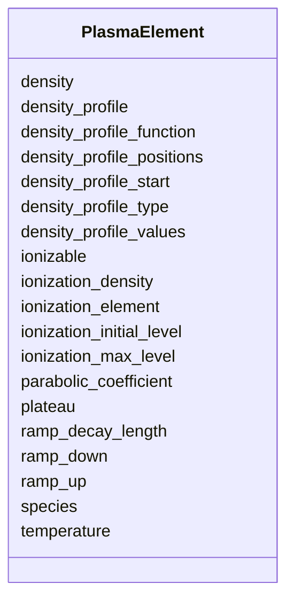

# Class: PlasmaElement 


_Plasma channel parameters for a laser-driven plasma-accelerator stage._


<div data-search-exclude markdown="1">


URI: [laura:PlasmaElement](https://w3id.org/laura/PlasmaElement)





<!-- no inheritance hierarchy -->

## Class Properties

| Property | Value |
| --- | --- |
| Class URI | [laura:PlasmaElement](https://w3id.org/laura/PlasmaElement) |


## Slots

| Name | Cardinality and Range | Description | Inheritance |
| ---  | --- | --- | --- |
| [density](density.md) | 0..1 <br/> [Float](Float.md) | Plasma (electron) number density [m^-^3] | direct |
| [species](species.md) | 0..1 <br/> [String](String.md) | Plasma species name (e | direct |
| [ramp_up](ramp_up.md) | 0..1 <br/> [Float](Float.md) | Entrance density-ramp length [m] | direct |
| [plateau](plateau.md) | 0..1 <br/> [Float](Float.md) | Flat-top plateau length [m] | direct |
| [ramp_down](ramp_down.md) | 0..1 <br/> [Float](Float.md) | Exit density-ramp length [m] | direct |
| [ramp_decay_length](ramp_decay_length.md) | 0..1 <br/> [Float](Float.md) | Exponential decay length of the density ramp [m] | direct |
| [density_profile](density_profile.md) | 0..1 <br/> [Boolean](Boolean.md) | If True, use a user-defined profile; if False, use a flat-top model | direct |
| [density_profile_start](density_profile_start.md) | 0..1 <br/> [Float](Float.md) | Longitudinal position at which the density profile begins [m] | direct |
| [density_profile_type](density_profile_type.md) | 0..1 <br/> [String](String.md) | Shape of the longitudinal density profile used when density_profile is True | direct |
| [density_profile_function](density_profile_function.md) | 0..1 <br/> [String](String.md) | Dotted path to a callable ``f(z, r) -> relative density``, written as ``packa... | direct |
| [density_profile_positions](density_profile_positions.md) | * <br/> [Float](Float.md) | Longitudinal positions [m] of a tabulated density profile, used when density_... | direct |
| [density_profile_values](density_profile_values.md) | * <br/> [Float](Float.md) | Density values at density_profile_positions, relative to density, used when d... | direct |
| [parabolic_coefficient](parabolic_coefficient.md) | 0..1 <br/> [Float](Float.md) | Parabolic coefficient of a transverse density channel [m^-^2] | direct |
| [temperature](temperature.md) | 0..1 <br/> [Float](Float.md) | Initial temperature of the plasma species [eV], assumed isotropic and Maxwell... | direct |
| [ionizable](ionizable.md) | 0..1 <br/> [Boolean](Boolean.md) | Whether a further, ionizable species is present alongside the plasma defined ... | direct |
| [ionization_element](ionization_element.md) | 0..1 <br/> [String](String.md) | Atomic symbol of the ionizable species, e | direct |
| [ionization_density](ionization_density.md) | 0..1 <br/> [Float](Float.md) | Number density of the ionizable species [m^-^3], counting atoms rather than e... | direct |
| [ionization_initial_level](ionization_initial_level.md) | 0..1 <br/> [Integer](Integer.md) | Ionization level the atoms start at; 0 for a neutral atom | direct |
| [ionization_max_level](ionization_max_level.md) | 0..1 <br/> [Integer](Integer.md) | Highest ionization level the atoms may reach | direct |


## Usages

| used by | used in | type | used |
| ---  | --- | --- | --- |
| [Plasma](Plasma.md) | [plasma](plasma.md) | range | [PlasmaElement](PlasmaElement.md) |


## Identifier and Mapping Information


### Schema Source


* from schema: https://w3id.org/laura/schema


## Mappings

| Mapping Type | Mapped Value |
| ---  | ---  |
| self | laura:PlasmaElement |
| native | laura:PlasmaElement |


## LinkML Source

<!-- TODO: investigate https://stackoverflow.com/questions/37606292/how-to-create-tabbed-code-blocks-in-mkdocs-or-sphinx -->

### Direct

<details>
```yaml
name: PlasmaElement
description: Plasma channel parameters for a laser-driven plasma-accelerator stage.
from_schema: https://w3id.org/laura/schema
attributes:
  density:
    name: density
    description: Plasma (electron) number density [m^-^3].
    from_schema: https://w3id.org/laura/schema/laser_plasma
    rank: 1000
    domain_of:
    - PlasmaElement
    range: float
    minimum_value: 0.0
    unit:
      ucum_code: m-3
  species:
    name: species
    description: Plasma species name (e.g., ``electron``).
    from_schema: https://w3id.org/laura/schema/laser_plasma
    ifabsent: string(electron)
    domain_of:
    - LaserElement
    - PlasmaElement
    range: string
  ramp_up:
    name: ramp_up
    description: Entrance density-ramp length [m].
    from_schema: https://w3id.org/laura/schema/laser_plasma
    rank: 1000
    ifabsent: float(0.001)
    domain_of:
    - PlasmaElement
    range: float
    minimum_value: 0.0
    unit:
      ucum_code: m
  plateau:
    name: plateau
    description: Flat-top plateau length [m].
    from_schema: https://w3id.org/laura/schema/laser_plasma
    rank: 1000
    ifabsent: float(0.001)
    domain_of:
    - PlasmaElement
    range: float
    minimum_value: 0.0
    unit:
      ucum_code: m
  ramp_down:
    name: ramp_down
    description: Exit density-ramp length [m].
    from_schema: https://w3id.org/laura/schema/laser_plasma
    rank: 1000
    ifabsent: float(0.001)
    domain_of:
    - PlasmaElement
    range: float
    minimum_value: 0.0
    unit:
      ucum_code: m
  ramp_decay_length:
    name: ramp_decay_length
    description: Exponential decay length of the density ramp [m].
    from_schema: https://w3id.org/laura/schema/laser_plasma
    rank: 1000
    ifabsent: float(0.001)
    domain_of:
    - PlasmaElement
    range: float
    minimum_value: 0.0
    unit:
      ucum_code: m
  density_profile:
    name: density_profile
    description: If True, use a user-defined profile; if False, use a flat-top model.
    from_schema: https://w3id.org/laura/schema/laser_plasma
    rank: 1000
    ifabsent: 'False'
    domain_of:
    - PlasmaElement
    range: boolean
  density_profile_start:
    name: density_profile_start
    description: Longitudinal position at which the density profile begins [m]. ramp_up,
      plateau and ramp_down are measured from here, and the density is zero upstream
      of it.
    from_schema: https://w3id.org/laura/schema/laser_plasma
    rank: 1000
    ifabsent: float(0)
    domain_of:
    - PlasmaElement
    range: float
    unit:
      ucum_code: m
  density_profile_type:
    name: density_profile_type
    description: Shape of the longitudinal density profile used when density_profile
      is True. ``decaying`` is a 1/(1 + dz/ramp_decay_length)^2 ramp either side of
      the plateau; ``linear`` ramps linearly over ramp_up and ramp_down; ``tabulated``
      interpolates density_profile_positions against density_profile_values; ``custom``
      calls density_profile_function.
    from_schema: https://w3id.org/laura/schema/laser_plasma
    rank: 1000
    ifabsent: string(decaying)
    domain_of:
    - PlasmaElement
    range: string
  density_profile_function:
    name: density_profile_function
    description: Dotted path to a callable ``f(z, r) -> relative density``, written
      as ``package.module:function`` or ``package.module.function``. Used when density_profile_type
      is ``custom``.
    from_schema: https://w3id.org/laura/schema/laser_plasma
    rank: 1000
    domain_of:
    - PlasmaElement
    range: string
  density_profile_positions:
    name: density_profile_positions
    description: Longitudinal positions [m] of a tabulated density profile, used when
      density_profile_type is ``tabulated``.
    from_schema: https://w3id.org/laura/schema/laser_plasma
    rank: 1000
    domain_of:
    - PlasmaElement
    range: float
    multivalued: true
    unit:
      ucum_code: m
  density_profile_values:
    name: density_profile_values
    description: Density values at density_profile_positions, relative to density,
      used when density_profile_type is ``tabulated``.
    from_schema: https://w3id.org/laura/schema/laser_plasma
    rank: 1000
    domain_of:
    - PlasmaElement
    range: float
    multivalued: true
  parabolic_coefficient:
    name: parabolic_coefficient
    description: Parabolic coefficient of a transverse density channel [m^-^2]. The
      longitudinal profile is multiplied by ``1 + parabolic_coefficient * r^2``.
    from_schema: https://w3id.org/laura/schema/laser_plasma
    rank: 1000
    ifabsent: float(0)
    domain_of:
    - PlasmaElement
    range: float
    unit:
      ucum_code: m-2
  temperature:
    name: temperature
    description: Initial temperature of the plasma species [eV], assumed isotropic
      and Maxwellian. Zero means a cold plasma, which is the usual assumption for
      a laser-wakefield stage; a finite value matters where the initial momentum spread
      competes with the wake, as in a plasma lens or a low-amplitude wake.
    from_schema: https://w3id.org/laura/schema/laser_plasma
    rank: 1000
    ifabsent: float(0)
    domain_of:
    - PlasmaElement
    range: float
    minimum_value: 0.0
    unit:
      ucum_code: eV
  ionizable:
    name: ionizable
    description: Whether a further, ionizable species is present alongside the plasma
      defined above, with electrons freed from it by the driver field as the stage
      is tracked. This is what makes ionization injection possible; the plasma above
      is then the pre-ionized background, and may have zero density if the whole gas
      is to be ionized by the driver. Only PIC codes that model ionization use it.
    from_schema: https://w3id.org/laura/schema/laser_plasma
    rank: 1000
    ifabsent: 'False'
    domain_of:
    - PlasmaElement
    range: boolean
  ionization_element:
    name: ionization_element
    description: Atomic symbol of the ionizable species, e.g. ``N`` or ``He`` (not
      ``Nitrogen``). Required when ionizable is True.
    from_schema: https://w3id.org/laura/schema/laser_plasma
    rank: 1000
    domain_of:
    - PlasmaElement
    range: string
  ionization_density:
    name: ionization_density
    description: Number density of the ionizable species [m^-^3], counting atoms rather
      than electrons. Defaults to density. A dopant is typically a small fraction
      of the background.
    from_schema: https://w3id.org/laura/schema/laser_plasma
    rank: 1000
    domain_of:
    - PlasmaElement
    range: float
    minimum_value: 0.0
    unit:
      ucum_code: m-3
  ionization_initial_level:
    name: ionization_initial_level
    description: Ionization level the atoms start at; 0 for a neutral atom. Starting
      part-way up avoids spending macroparticles on levels the driver ionizes far
      ahead of the wake, as with the first five levels of nitrogen.
    from_schema: https://w3id.org/laura/schema/laser_plasma
    rank: 1000
    ifabsent: int(0)
    domain_of:
    - PlasmaElement
    range: integer
    minimum_value: 0
  ionization_max_level:
    name: ionization_max_level
    description: Highest ionization level the atoms may reach. Defaults to the physical
      limit for the element.
    from_schema: https://w3id.org/laura/schema/laser_plasma
    rank: 1000
    domain_of:
    - PlasmaElement
    range: integer
    minimum_value: 0
class_uri: laura:PlasmaElement

```
</details>

### Induced

<details>
```yaml
name: PlasmaElement
description: Plasma channel parameters for a laser-driven plasma-accelerator stage.
from_schema: https://w3id.org/laura/schema
attributes:
  density:
    name: density
    description: Plasma (electron) number density [m^-^3].
    from_schema: https://w3id.org/laura/schema/laser_plasma
    rank: 1000
    owner: PlasmaElement
    domain_of:
    - PlasmaElement
    range: float
    minimum_value: 0.0
    unit:
      ucum_code: m-3
  species:
    name: species
    description: Plasma species name (e.g., ``electron``).
    from_schema: https://w3id.org/laura/schema/laser_plasma
    ifabsent: string(electron)
    owner: PlasmaElement
    domain_of:
    - LaserElement
    - PlasmaElement
    range: string
  ramp_up:
    name: ramp_up
    description: Entrance density-ramp length [m].
    from_schema: https://w3id.org/laura/schema/laser_plasma
    rank: 1000
    ifabsent: float(0.001)
    owner: PlasmaElement
    domain_of:
    - PlasmaElement
    range: float
    minimum_value: 0.0
    unit:
      ucum_code: m
  plateau:
    name: plateau
    description: Flat-top plateau length [m].
    from_schema: https://w3id.org/laura/schema/laser_plasma
    rank: 1000
    ifabsent: float(0.001)
    owner: PlasmaElement
    domain_of:
    - PlasmaElement
    range: float
    minimum_value: 0.0
    unit:
      ucum_code: m
  ramp_down:
    name: ramp_down
    description: Exit density-ramp length [m].
    from_schema: https://w3id.org/laura/schema/laser_plasma
    rank: 1000
    ifabsent: float(0.001)
    owner: PlasmaElement
    domain_of:
    - PlasmaElement
    range: float
    minimum_value: 0.0
    unit:
      ucum_code: m
  ramp_decay_length:
    name: ramp_decay_length
    description: Exponential decay length of the density ramp [m].
    from_schema: https://w3id.org/laura/schema/laser_plasma
    rank: 1000
    ifabsent: float(0.001)
    owner: PlasmaElement
    domain_of:
    - PlasmaElement
    range: float
    minimum_value: 0.0
    unit:
      ucum_code: m
  density_profile:
    name: density_profile
    description: If True, use a user-defined profile; if False, use a flat-top model.
    from_schema: https://w3id.org/laura/schema/laser_plasma
    rank: 1000
    ifabsent: 'False'
    owner: PlasmaElement
    domain_of:
    - PlasmaElement
    range: boolean
  density_profile_start:
    name: density_profile_start
    description: Longitudinal position at which the density profile begins [m]. ramp_up,
      plateau and ramp_down are measured from here, and the density is zero upstream
      of it.
    from_schema: https://w3id.org/laura/schema/laser_plasma
    rank: 1000
    ifabsent: float(0)
    owner: PlasmaElement
    domain_of:
    - PlasmaElement
    range: float
    unit:
      ucum_code: m
  density_profile_type:
    name: density_profile_type
    description: Shape of the longitudinal density profile used when density_profile
      is True. ``decaying`` is a 1/(1 + dz/ramp_decay_length)^2 ramp either side of
      the plateau; ``linear`` ramps linearly over ramp_up and ramp_down; ``tabulated``
      interpolates density_profile_positions against density_profile_values; ``custom``
      calls density_profile_function.
    from_schema: https://w3id.org/laura/schema/laser_plasma
    rank: 1000
    ifabsent: string(decaying)
    owner: PlasmaElement
    domain_of:
    - PlasmaElement
    range: string
  density_profile_function:
    name: density_profile_function
    description: Dotted path to a callable ``f(z, r) -> relative density``, written
      as ``package.module:function`` or ``package.module.function``. Used when density_profile_type
      is ``custom``.
    from_schema: https://w3id.org/laura/schema/laser_plasma
    rank: 1000
    owner: PlasmaElement
    domain_of:
    - PlasmaElement
    range: string
  density_profile_positions:
    name: density_profile_positions
    description: Longitudinal positions [m] of a tabulated density profile, used when
      density_profile_type is ``tabulated``.
    from_schema: https://w3id.org/laura/schema/laser_plasma
    rank: 1000
    owner: PlasmaElement
    domain_of:
    - PlasmaElement
    range: float
    multivalued: true
    unit:
      ucum_code: m
  density_profile_values:
    name: density_profile_values
    description: Density values at density_profile_positions, relative to density,
      used when density_profile_type is ``tabulated``.
    from_schema: https://w3id.org/laura/schema/laser_plasma
    rank: 1000
    owner: PlasmaElement
    domain_of:
    - PlasmaElement
    range: float
    multivalued: true
  parabolic_coefficient:
    name: parabolic_coefficient
    description: Parabolic coefficient of a transverse density channel [m^-^2]. The
      longitudinal profile is multiplied by ``1 + parabolic_coefficient * r^2``.
    from_schema: https://w3id.org/laura/schema/laser_plasma
    rank: 1000
    ifabsent: float(0)
    owner: PlasmaElement
    domain_of:
    - PlasmaElement
    range: float
    unit:
      ucum_code: m-2
  temperature:
    name: temperature
    description: Initial temperature of the plasma species [eV], assumed isotropic
      and Maxwellian. Zero means a cold plasma, which is the usual assumption for
      a laser-wakefield stage; a finite value matters where the initial momentum spread
      competes with the wake, as in a plasma lens or a low-amplitude wake.
    from_schema: https://w3id.org/laura/schema/laser_plasma
    rank: 1000
    ifabsent: float(0)
    owner: PlasmaElement
    domain_of:
    - PlasmaElement
    range: float
    minimum_value: 0.0
    unit:
      ucum_code: eV
  ionizable:
    name: ionizable
    description: Whether a further, ionizable species is present alongside the plasma
      defined above, with electrons freed from it by the driver field as the stage
      is tracked. This is what makes ionization injection possible; the plasma above
      is then the pre-ionized background, and may have zero density if the whole gas
      is to be ionized by the driver. Only PIC codes that model ionization use it.
    from_schema: https://w3id.org/laura/schema/laser_plasma
    rank: 1000
    ifabsent: 'False'
    owner: PlasmaElement
    domain_of:
    - PlasmaElement
    range: boolean
  ionization_element:
    name: ionization_element
    description: Atomic symbol of the ionizable species, e.g. ``N`` or ``He`` (not
      ``Nitrogen``). Required when ionizable is True.
    from_schema: https://w3id.org/laura/schema/laser_plasma
    rank: 1000
    owner: PlasmaElement
    domain_of:
    - PlasmaElement
    range: string
  ionization_density:
    name: ionization_density
    description: Number density of the ionizable species [m^-^3], counting atoms rather
      than electrons. Defaults to density. A dopant is typically a small fraction
      of the background.
    from_schema: https://w3id.org/laura/schema/laser_plasma
    rank: 1000
    owner: PlasmaElement
    domain_of:
    - PlasmaElement
    range: float
    minimum_value: 0.0
    unit:
      ucum_code: m-3
  ionization_initial_level:
    name: ionization_initial_level
    description: Ionization level the atoms start at; 0 for a neutral atom. Starting
      part-way up avoids spending macroparticles on levels the driver ionizes far
      ahead of the wake, as with the first five levels of nitrogen.
    from_schema: https://w3id.org/laura/schema/laser_plasma
    rank: 1000
    ifabsent: int(0)
    owner: PlasmaElement
    domain_of:
    - PlasmaElement
    range: integer
    minimum_value: 0
  ionization_max_level:
    name: ionization_max_level
    description: Highest ionization level the atoms may reach. Defaults to the physical
      limit for the element.
    from_schema: https://w3id.org/laura/schema/laser_plasma
    rank: 1000
    owner: PlasmaElement
    domain_of:
    - PlasmaElement
    range: integer
    minimum_value: 0
class_uri: laura:PlasmaElement

```
</details></div>