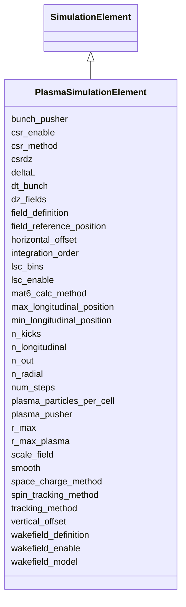

# Class: PlasmaSimulationElement 


_Simulation attributes for plasma-accelerator stages._


<div data-search-exclude markdown="1">


URI: [laura:PlasmaSimulationElement](https://w3id.org/laura/PlasmaSimulationElement)





## Inheritance
* [SimulationElement](SimulationElement.md)
    * **PlasmaSimulationElement**


## Class Properties

| Property | Value |
| --- | --- |
| Class URI | [laura:PlasmaSimulationElement](https://w3id.org/laura/PlasmaSimulationElement) |


## Slots

| Name | Cardinality and Range | Description | Inheritance |
| ---  | --- | --- | --- |
| [wakefield_model](wakefield_model.md) | 0..1 <br/> [String](String.md) | Wakefield model identifier | direct |
| [bunch_pusher](bunch_pusher.md) | 0..1 <br/> [String](String.md) | Pusher used to evolve bunch particles in time | direct |
| [dt_bunch](dt_bunch.md) | 0..1 <br/> [String](String.md) | Time-step control for bunch evolution (or 'auto') | direct |
| [n_out](n_out.md) | 0..1 <br/> [Integer](Integer.md) | Number of distribution dumps during the plasma stage | direct |
| [min_longitudinal_position](min_longitudinal_position.md) | 0..1 <br/> [Float](Float.md) | Minimum longitudinal position [m] | direct |
| [max_longitudinal_position](max_longitudinal_position.md) | 0..1 <br/> [Float](Float.md) | Maximum longitudinal position [m] | direct |
| [n_longitudinal](n_longitudinal.md) | 0..1 <br/> [Integer](Integer.md) | Number of grid points in the longitudinal direction | direct |
| [n_radial](n_radial.md) | 0..1 <br/> [Integer](Integer.md) | Number of grid points in the radial direction | direct |
| [plasma_particles_per_cell](plasma_particles_per_cell.md) | 0..1 <br/> [Integer](Integer.md) | Number of plasma particles per cell | direct |
| [r_max](r_max.md) | 0..1 <br/> [Float](Float.md) | Radial extent of the simulation box [m] | direct |
| [r_max_plasma](r_max_plasma.md) | 0..1 <br/> [Float](Float.md) | Maximum radial extension of the plasma column | direct |
| [dz_fields](dz_fields.md) | 0..1 <br/> [Float](Float.md) | Interval for plasma wakefield updates | direct |
| [plasma_pusher](plasma_pusher.md) | 0..1 <br/> [String](String.md) | Pusher used to evolve the plasma in time | direct |
| [n_kicks](n_kicks.md) | 0..1 <br/> [Integer](Integer.md) | Number of integration kicks | [SimulationElement](SimulationElement.md) |
| [lsc_bins](lsc_bins.md) | 0..1 <br/> [Integer](Integer.md) | Number of bins used in longitudinal space-charge calculations | [SimulationElement](SimulationElement.md) |
| [csr_enable](csr_enable.md) | 0..1 <br/> [Boolean](Boolean.md) | Whether coherent synchrotron radiation effects are enabled | [SimulationElement](SimulationElement.md) |
| [lsc_enable](lsc_enable.md) | 0..1 <br/> [Boolean](Boolean.md) | Whether longitudinal space-charge effects are enabled | [SimulationElement](SimulationElement.md) |
| [tracking_method](tracking_method.md) | 0..1 <br/> [String](String.md) | Phase-space tracking algorithm requested from the target code | [SimulationElement](SimulationElement.md) |
| [mat6_calc_method](mat6_calc_method.md) | 0..1 <br/> [String](String.md) | Method used to calculate the element's 6x6 transfer matrix | [SimulationElement](SimulationElement.md) |
| [spin_tracking_method](spin_tracking_method.md) | 0..1 <br/> [String](String.md) | Spin-tracking algorithm requested from the target code | [SimulationElement](SimulationElement.md) |
| [integration_order](integration_order.md) | 0..1 <br/> [Integer](Integer.md) | Order of the target code's integration formula | [SimulationElement](SimulationElement.md) |
| [num_steps](num_steps.md) | 0..1 <br/> [Integer](Integer.md) | Number of integration steps through the element | [SimulationElement](SimulationElement.md) |
| [deltaL](deltaL.md) | 0..1 <br/> [Float](Float.md) | Longitudinal integration step size [m] | [SimulationElement](SimulationElement.md) |
| [csr_method](csr_method.md) | 0..1 <br/> [String](String.md) | Coherent-synchrotron-radiation tracking method | [SimulationElement](SimulationElement.md) |
| [space_charge_method](space_charge_method.md) | 0..1 <br/> [String](String.md) | Space-charge tracking method | [SimulationElement](SimulationElement.md) |
| [csrdz](csrdz.md) | 0..1 <br/> [Float](Float.md) | Longitudinal step size between CSR kicks [m] | [SimulationElement](SimulationElement.md) |
| [smooth](smooth.md) | 0..1 <br/> [Float](Float.md)&nbsp;or&nbsp;<br />[Integer](Integer.md) | Smoothing control for field or wake interpolation | [SimulationElement](SimulationElement.md) |
| [horizontal_offset](horizontal_offset.md) | 0..1 <br/> [Float](Float.md) | Horizontal simulation offset from the reference orbit [m] | [SimulationElement](SimulationElement.md) |
| [vertical_offset](vertical_offset.md) | 0..1 <br/> [Float](Float.md) | Vertical simulation offset from the reference orbit [m] | [SimulationElement](SimulationElement.md) |
| [field_definition](field_definition.md) | 0..1 <br/> [String](String.md) | Path to the 3-D field-map file | [SimulationElement](SimulationElement.md) |
| [wakefield_definition](wakefield_definition.md) | 0..1 <br/> [String](String.md) | Path to the wakefield impedance file | [SimulationElement](SimulationElement.md) |
| [wakefield_enable](wakefield_enable.md) | 0..1 <br/> [Boolean](Boolean.md) | Whether the wakefield named by wakefield_definition is applied | [SimulationElement](SimulationElement.md) |
| [field_reference_position](field_reference_position.md) | 0..1 <br/> [String](String.md) | Longitudinal origin of the field map [m] | [SimulationElement](SimulationElement.md) |
| [scale_field](scale_field.md) | 0..1 <br/> [Float](Float.md) | Multiplicative scale factor applied to the field map | [SimulationElement](SimulationElement.md) |


## Usages

| used by | used in | type | used |
| ---  | --- | --- | --- |
| [Plasma](Plasma.md) | [simulation](simulation.md) | range | [PlasmaSimulationElement](PlasmaSimulationElement.md) |


## Identifier and Mapping Information


### Schema Source


* from schema: https://w3id.org/laura/schema


## Mappings

| Mapping Type | Mapped Value |
| ---  | ---  |
| self | laura:PlasmaSimulationElement |
| native | laura:PlasmaSimulationElement |


## LinkML Source

<!-- TODO: investigate https://stackoverflow.com/questions/37606292/how-to-create-tabbed-code-blocks-in-mkdocs-or-sphinx -->

### Direct

<details>
```yaml
name: PlasmaSimulationElement
description: Simulation attributes for plasma-accelerator stages.
from_schema: https://w3id.org/laura/schema
is_a: SimulationElement
attributes:
  wakefield_model:
    name: wakefield_model
    description: Wakefield model identifier.
    from_schema: https://w3id.org/laura/schema/simulation
    rank: 1000
    domain_of:
    - PlasmaSimulationElement
    range: string
  bunch_pusher:
    name: bunch_pusher
    description: Pusher used to evolve bunch particles in time.
    from_schema: https://w3id.org/laura/schema/simulation
    rank: 1000
    ifabsent: string(boris)
    domain_of:
    - PlasmaSimulationElement
    range: string
  dt_bunch:
    name: dt_bunch
    description: Time-step control for bunch evolution (or 'auto').
    from_schema: https://w3id.org/laura/schema/simulation
    rank: 1000
    ifabsent: string(auto)
    domain_of:
    - PlasmaSimulationElement
    range: string
  n_out:
    name: n_out
    description: Number of distribution dumps during the plasma stage.
    from_schema: https://w3id.org/laura/schema/simulation
    rank: 1000
    ifabsent: int(1)
    domain_of:
    - PlasmaSimulationElement
    range: integer
  min_longitudinal_position:
    name: min_longitudinal_position
    description: Minimum longitudinal position [m].
    from_schema: https://w3id.org/laura/schema/simulation
    rank: 1000
    ifabsent: float(0)
    domain_of:
    - PlasmaSimulationElement
    range: float
  max_longitudinal_position:
    name: max_longitudinal_position
    description: Maximum longitudinal position [m].
    from_schema: https://w3id.org/laura/schema/simulation
    rank: 1000
    ifabsent: float(0)
    domain_of:
    - PlasmaSimulationElement
    range: float
  n_longitudinal:
    name: n_longitudinal
    description: Number of grid points in the longitudinal direction.
    from_schema: https://w3id.org/laura/schema/simulation
    rank: 1000
    ifabsent: int(0)
    domain_of:
    - PlasmaSimulationElement
    range: integer
  n_radial:
    name: n_radial
    description: Number of grid points in the radial direction.
    from_schema: https://w3id.org/laura/schema/simulation
    rank: 1000
    ifabsent: int(0)
    domain_of:
    - PlasmaSimulationElement
    range: integer
  plasma_particles_per_cell:
    name: plasma_particles_per_cell
    description: Number of plasma particles per cell.
    from_schema: https://w3id.org/laura/schema/simulation
    rank: 1000
    ifabsent: int(2)
    domain_of:
    - PlasmaSimulationElement
    range: integer
  r_max:
    name: r_max
    description: Radial extent of the simulation box [m].
    from_schema: https://w3id.org/laura/schema/simulation
    rank: 1000
    ifabsent: float(0)
    domain_of:
    - PlasmaSimulationElement
    range: float
  r_max_plasma:
    name: r_max_plasma
    description: Maximum radial extension of the plasma column.
    from_schema: https://w3id.org/laura/schema/simulation
    rank: 1000
    domain_of:
    - PlasmaSimulationElement
    range: float
  dz_fields:
    name: dz_fields
    description: Interval for plasma wakefield updates.
    from_schema: https://w3id.org/laura/schema/simulation
    rank: 1000
    domain_of:
    - PlasmaSimulationElement
    range: float
  plasma_pusher:
    name: plasma_pusher
    description: Pusher used to evolve the plasma in time.
    from_schema: https://w3id.org/laura/schema/simulation
    rank: 1000
    ifabsent: string(boris)
    domain_of:
    - PlasmaSimulationElement
    range: string
class_uri: laura:PlasmaSimulationElement

```
</details>

### Induced

<details>
```yaml
name: PlasmaSimulationElement
description: Simulation attributes for plasma-accelerator stages.
from_schema: https://w3id.org/laura/schema
is_a: SimulationElement
attributes:
  wakefield_model:
    name: wakefield_model
    description: Wakefield model identifier.
    from_schema: https://w3id.org/laura/schema/simulation
    rank: 1000
    owner: PlasmaSimulationElement
    domain_of:
    - PlasmaSimulationElement
    range: string
  bunch_pusher:
    name: bunch_pusher
    description: Pusher used to evolve bunch particles in time.
    from_schema: https://w3id.org/laura/schema/simulation
    rank: 1000
    ifabsent: string(boris)
    owner: PlasmaSimulationElement
    domain_of:
    - PlasmaSimulationElement
    range: string
  dt_bunch:
    name: dt_bunch
    description: Time-step control for bunch evolution (or 'auto').
    from_schema: https://w3id.org/laura/schema/simulation
    rank: 1000
    ifabsent: string(auto)
    owner: PlasmaSimulationElement
    domain_of:
    - PlasmaSimulationElement
    range: string
  n_out:
    name: n_out
    description: Number of distribution dumps during the plasma stage.
    from_schema: https://w3id.org/laura/schema/simulation
    rank: 1000
    ifabsent: int(1)
    owner: PlasmaSimulationElement
    domain_of:
    - PlasmaSimulationElement
    range: integer
  min_longitudinal_position:
    name: min_longitudinal_position
    description: Minimum longitudinal position [m].
    from_schema: https://w3id.org/laura/schema/simulation
    rank: 1000
    ifabsent: float(0)
    owner: PlasmaSimulationElement
    domain_of:
    - PlasmaSimulationElement
    range: float
  max_longitudinal_position:
    name: max_longitudinal_position
    description: Maximum longitudinal position [m].
    from_schema: https://w3id.org/laura/schema/simulation
    rank: 1000
    ifabsent: float(0)
    owner: PlasmaSimulationElement
    domain_of:
    - PlasmaSimulationElement
    range: float
  n_longitudinal:
    name: n_longitudinal
    description: Number of grid points in the longitudinal direction.
    from_schema: https://w3id.org/laura/schema/simulation
    rank: 1000
    ifabsent: int(0)
    owner: PlasmaSimulationElement
    domain_of:
    - PlasmaSimulationElement
    range: integer
  n_radial:
    name: n_radial
    description: Number of grid points in the radial direction.
    from_schema: https://w3id.org/laura/schema/simulation
    rank: 1000
    ifabsent: int(0)
    owner: PlasmaSimulationElement
    domain_of:
    - PlasmaSimulationElement
    range: integer
  plasma_particles_per_cell:
    name: plasma_particles_per_cell
    description: Number of plasma particles per cell.
    from_schema: https://w3id.org/laura/schema/simulation
    rank: 1000
    ifabsent: int(2)
    owner: PlasmaSimulationElement
    domain_of:
    - PlasmaSimulationElement
    range: integer
  r_max:
    name: r_max
    description: Radial extent of the simulation box [m].
    from_schema: https://w3id.org/laura/schema/simulation
    rank: 1000
    ifabsent: float(0)
    owner: PlasmaSimulationElement
    domain_of:
    - PlasmaSimulationElement
    range: float
  r_max_plasma:
    name: r_max_plasma
    description: Maximum radial extension of the plasma column.
    from_schema: https://w3id.org/laura/schema/simulation
    rank: 1000
    owner: PlasmaSimulationElement
    domain_of:
    - PlasmaSimulationElement
    range: float
  dz_fields:
    name: dz_fields
    description: Interval for plasma wakefield updates.
    from_schema: https://w3id.org/laura/schema/simulation
    rank: 1000
    owner: PlasmaSimulationElement
    domain_of:
    - PlasmaSimulationElement
    range: float
  plasma_pusher:
    name: plasma_pusher
    description: Pusher used to evolve the plasma in time.
    from_schema: https://w3id.org/laura/schema/simulation
    rank: 1000
    ifabsent: string(boris)
    owner: PlasmaSimulationElement
    domain_of:
    - PlasmaSimulationElement
    range: string
  n_kicks:
    name: n_kicks
    description: Number of integration kicks.
    from_schema: https://w3id.org/laura/schema
    rank: 1000
    owner: PlasmaSimulationElement
    domain_of:
    - SimulationElement
    range: integer
  lsc_bins:
    name: lsc_bins
    description: Number of bins used in longitudinal space-charge calculations.
    from_schema: https://w3id.org/laura/schema
    rank: 1000
    owner: PlasmaSimulationElement
    domain_of:
    - SimulationElement
    range: integer
  csr_enable:
    name: csr_enable
    description: Whether coherent synchrotron radiation effects are enabled.
    from_schema: https://w3id.org/laura/schema
    rank: 1000
    ifabsent: 'true'
    owner: PlasmaSimulationElement
    domain_of:
    - SimulationElement
    range: boolean
  lsc_enable:
    name: lsc_enable
    description: Whether longitudinal space-charge effects are enabled.
    from_schema: https://w3id.org/laura/schema
    rank: 1000
    ifabsent: 'true'
    owner: PlasmaSimulationElement
    domain_of:
    - SimulationElement
    range: boolean
  tracking_method:
    name: tracking_method
    description: Phase-space tracking algorithm requested from the target code.
    from_schema: https://w3id.org/laura/schema
    rank: 1000
    owner: PlasmaSimulationElement
    domain_of:
    - SimulationElement
    range: string
  mat6_calc_method:
    name: mat6_calc_method
    description: Method used to calculate the element's 6x6 transfer matrix.
    from_schema: https://w3id.org/laura/schema
    rank: 1000
    owner: PlasmaSimulationElement
    domain_of:
    - SimulationElement
    range: string
  spin_tracking_method:
    name: spin_tracking_method
    description: Spin-tracking algorithm requested from the target code.
    from_schema: https://w3id.org/laura/schema
    rank: 1000
    owner: PlasmaSimulationElement
    domain_of:
    - SimulationElement
    range: string
  integration_order:
    name: integration_order
    description: Order of the target code's integration formula.
    from_schema: https://w3id.org/laura/schema
    aliases:
    - integrator_order
    rank: 1000
    owner: PlasmaSimulationElement
    domain_of:
    - SimulationElement
    range: integer
    minimum_value: 1
  num_steps:
    name: num_steps
    description: Number of integration steps through the element.
    from_schema: https://w3id.org/laura/schema
    rank: 1000
    owner: PlasmaSimulationElement
    domain_of:
    - SimulationElement
    range: integer
    minimum_value: 1
  deltaL:
    name: deltaL
    description: Longitudinal integration step size [m].
    from_schema: https://w3id.org/laura/schema
    aliases:
    - ds_step
    rank: 1000
    owner: PlasmaSimulationElement
    domain_of:
    - SimulationElement
    range: float
    minimum_value: 0
    unit:
      ucum_code: m
  csr_method:
    name: csr_method
    description: Coherent-synchrotron-radiation tracking method.
    from_schema: https://w3id.org/laura/schema
    rank: 1000
    owner: PlasmaSimulationElement
    domain_of:
    - SimulationElement
    range: string
  space_charge_method:
    name: space_charge_method
    description: Space-charge tracking method.
    from_schema: https://w3id.org/laura/schema
    rank: 1000
    owner: PlasmaSimulationElement
    domain_of:
    - SimulationElement
    range: string
  csrdz:
    name: csrdz
    description: Longitudinal step size between CSR kicks [m].
    from_schema: https://w3id.org/laura/schema
    aliases:
    - csr_ds_step
    rank: 1000
    owner: PlasmaSimulationElement
    domain_of:
    - SimulationElement
    range: float
    minimum_value: 0
    unit:
      ucum_code: m
  smooth:
    name: smooth
    description: Smoothing control for field or wake interpolation.
    from_schema: https://w3id.org/laura/schema
    rank: 1000
    owner: PlasmaSimulationElement
    domain_of:
    - SimulationElement
    range: float
    any_of:
    - range: integer
    - range: float
  horizontal_offset:
    name: horizontal_offset
    description: Horizontal simulation offset from the reference orbit [m].
    from_schema: https://w3id.org/laura/schema
    rank: 1000
    ifabsent: float(0.0)
    owner: PlasmaSimulationElement
    domain_of:
    - SimulationElement
    range: float
    unit:
      ucum_code: m
  vertical_offset:
    name: vertical_offset
    description: Vertical simulation offset from the reference orbit [m].
    from_schema: https://w3id.org/laura/schema
    rank: 1000
    ifabsent: float(0.0)
    owner: PlasmaSimulationElement
    domain_of:
    - SimulationElement
    range: float
    unit:
      ucum_code: m
  field_definition:
    name: field_definition
    description: Path to the 3-D field-map file.
    from_schema: https://w3id.org/laura/schema/simulation
    rank: 1000
    owner: PlasmaSimulationElement
    domain_of:
    - SimulationElement
    range: string
  wakefield_definition:
    name: wakefield_definition
    description: Path to the wakefield impedance file.
    from_schema: https://w3id.org/laura/schema/simulation
    rank: 1000
    owner: PlasmaSimulationElement
    domain_of:
    - SimulationElement
    range: string
  wakefield_enable:
    name: wakefield_enable
    description: Whether the wakefield named by wakefield_definition is applied. Set
      false to track the element without its wakefield while keeping the definition
      itself.
    from_schema: https://w3id.org/laura/schema/simulation
    rank: 1000
    ifabsent: 'true'
    owner: PlasmaSimulationElement
    domain_of:
    - SimulationElement
    range: boolean
  field_reference_position:
    name: field_reference_position
    description: Longitudinal origin of the field map [m].
    from_schema: https://w3id.org/laura/schema/simulation
    rank: 1000
    owner: PlasmaSimulationElement
    domain_of:
    - SimulationElement
    range: string
  scale_field:
    name: scale_field
    description: Multiplicative scale factor applied to the field map.
    from_schema: https://w3id.org/laura/schema/simulation
    rank: 1000
    ifabsent: float(1)
    owner: PlasmaSimulationElement
    domain_of:
    - SimulationElement
    range: float
class_uri: laura:PlasmaSimulationElement

```
</details></div>