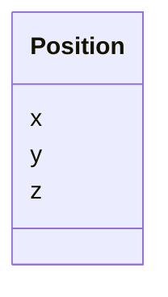

# Class: Position 


_Cartesian position in the global accelerator coordinate system. All components are in metres._


<div data-search-exclude markdown="1">


URI: [laura:Position](https://w3id.org/laura/Position)





<!-- no inheritance hierarchy -->

## Class Properties

| Property | Value |
| --- | --- |
| Class URI | [laura:Position](https://w3id.org/laura/Position) |


## Slots

| Name | Cardinality and Range | Description | Inheritance |
| ---  | --- | --- | --- |
| [x](x.md) | 0..1 <br/> [Double](Double.md) | Horizontal component [m] | direct |
| [y](y.md) | 0..1 <br/> [Double](Double.md) | Vertical component [m] | direct |
| [z](z.md) | 0..1 <br/> [Double](Double.md) | Longitudinal (beam-direction) component [m] | direct |


## Usages

| used by | used in | type | used |
| ---  | --- | --- | --- |
| [ElementPositionError](ElementPositionError.md) | [position](position.md) | range | [Position](Position.md) |
| [ElementSurvey](ElementSurvey.md) | [position](position.md) | range | [Position](Position.md) |
| [ReferencePlacement](ReferencePlacement.md) | [offset](offset.md) | range | [Position](Position.md) |
| [ReferencePlacement](ReferencePlacement.md) | [world_offset](world_offset.md) | range | [Position](Position.md) |
| [PhysicalElement](PhysicalElement.md) | [middle](middle.md) | range | [Position](Position.md) |
| [PhysicalElement](PhysicalElement.md) | [datum](datum.md) | range | [Position](Position.md) |


## In Subsets


* [PhysicalProperties](PhysicalProperties.md)


## Identifier and Mapping Information


### Schema Source


* from schema: https://w3id.org/laura/schema


## Mappings

| Mapping Type | Mapped Value |
| ---  | ---  |
| self | laura:Position |
| native | laura:Position |


## LinkML Source

<!-- TODO: investigate https://stackoverflow.com/questions/37606292/how-to-create-tabbed-code-blocks-in-mkdocs-or-sphinx -->

### Direct

<details>
```yaml
name: Position
description: Cartesian position in the global accelerator coordinate system. All components
  are in metres.
in_subset:
- physical_properties
from_schema: https://w3id.org/laura/schema
attributes:
  x:
    name: x
    description: Horizontal component [m].
    from_schema: https://w3id.org/laura/schema/geometry
    rank: 1000
    ifabsent: float(0)
    domain_of:
    - Position
    - CameraPixelResultsIndices
    - CameraPixelResultsNames
    range: double
    unit:
      ucum_code: m
  y:
    name: y
    description: Vertical component [m].
    from_schema: https://w3id.org/laura/schema/geometry
    rank: 1000
    ifabsent: float(0)
    domain_of:
    - Position
    - CameraPixelResultsIndices
    - CameraPixelResultsNames
    range: double
    unit:
      ucum_code: m
  z:
    name: z
    description: Longitudinal (beam-direction) component [m].
    from_schema: https://w3id.org/laura/schema/geometry
    rank: 1000
    ifabsent: float(0)
    domain_of:
    - Position
    range: double
    unit:
      ucum_code: m
class_uri: laura:Position

```
</details>

### Induced

<details>
```yaml
name: Position
description: Cartesian position in the global accelerator coordinate system. All components
  are in metres.
in_subset:
- physical_properties
from_schema: https://w3id.org/laura/schema
attributes:
  x:
    name: x
    description: Horizontal component [m].
    from_schema: https://w3id.org/laura/schema/geometry
    rank: 1000
    ifabsent: float(0)
    owner: Position
    domain_of:
    - Position
    - CameraPixelResultsIndices
    - CameraPixelResultsNames
    range: double
    unit:
      ucum_code: m
  y:
    name: y
    description: Vertical component [m].
    from_schema: https://w3id.org/laura/schema/geometry
    rank: 1000
    ifabsent: float(0)
    owner: Position
    domain_of:
    - Position
    - CameraPixelResultsIndices
    - CameraPixelResultsNames
    range: double
    unit:
      ucum_code: m
  z:
    name: z
    description: Longitudinal (beam-direction) component [m].
    from_schema: https://w3id.org/laura/schema/geometry
    rank: 1000
    ifabsent: float(0)
    owner: Position
    domain_of:
    - Position
    range: double
    unit:
      ucum_code: m
class_uri: laura:Position

```
</details></div>