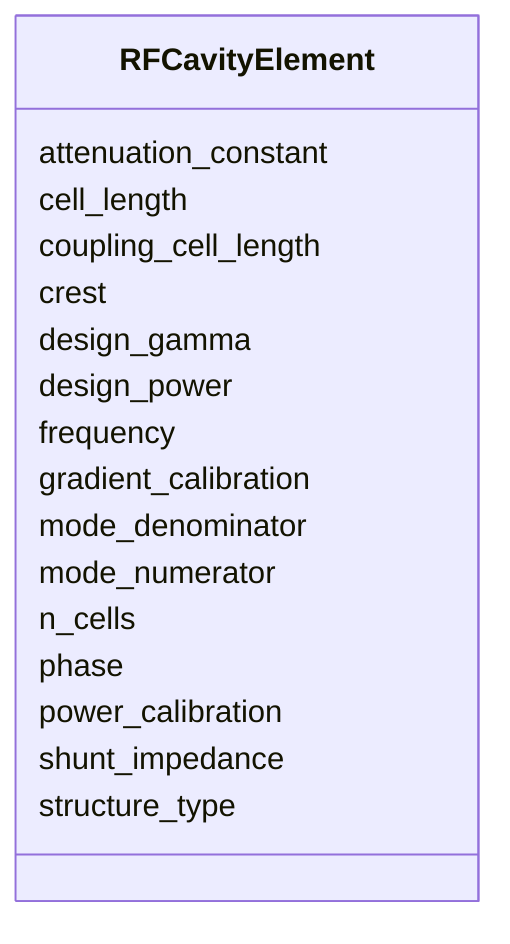

---
search:
  boost: 10.0
---

# Class: RFCavityElement 


_RF cavity accelerating-structure parameters._


<div data-search-exclude markdown="1">


URI: [laura:RFCavityElement](https://w3id.org/laura/RFCavityElement)





<!-- no inheritance hierarchy -->

## Class Properties

| Property | Value |
| --- | --- |
| Class URI | [laura:RFCavityElement](https://w3id.org/laura/RFCavityElement) |


## Slots

| Name | Cardinality and Range | Description | Inheritance |
| ---  | --- | --- | --- |
| [cell_length](cell_length.md) | 0..1 <br/> [Float](Float.md) | Length of a single cell [m] | direct |
| [coupling_cell_length](coupling_cell_length.md) | 0..1 <br/> [Float](Float.md) | Length of the coupling cell [m] | direct |
| [design_gamma](design_gamma.md) | 0..1 <br/> [Float](Float.md) | Design Lorentz factor | direct |
| [design_power](design_power.md) | 0..1 <br/> [Float](Float.md) | Design peak power [W] | direct |
| [frequency](frequency.md) | 0..1 <br/> [Float](Float.md) | Operating frequency [Hz] | direct |
| [n_cells](n_cells.md) | 0..1 <br/> [Float](Float.md) | Number of cells | direct |
| [crest](crest.md) | 0..1 <br/> [Float](Float.md) | On-crest phase offset providing maximum energy gain [deg] | direct |
| [phase](phase.md) | 0..1 <br/> [Float](Float.md)&nbsp;or&nbsp;<br />[String](String.md) | Operating phase offset [deg] | direct |
| [shunt_impedance](shunt_impedance.md) | 0..1 <br/> [Float](Float.md) | Shunt impedance [M?/m] | direct |
| [mode_numerator](mode_numerator.md) | 0..1 <br/> [Float](Float.md) | Mode fraction numerator | direct |
| [mode_denominator](mode_denominator.md) | 0..1 <br/> [Integer](Integer.md) | Mode fraction denominator | direct |
| [structure_type](structure_type.md) | 0..1 <br/> [String](String.md) | RF structure type (e | direct |
| [attenuation_constant](attenuation_constant.md) | 0..1 <br/> [Float](Float.md) | Attenuation constant ? of a travelling-wave structure [Np/m] | direct |
| [power_calibration](power_calibration.md) | * <br/> [Float](Float.md) | Calibration constant relating measured power to cavity gradient | direct |
| [gradient_calibration](gradient_calibration.md) | * <br/> [Float](Float.md) | Calibration relating measured signal to gradient [MV/m per a | direct |


## Usages

| used by | used in | type | used |
| ---  | --- | --- | --- |
| [RFCavity](RFCavity.md) | [cavity](cavity.md) | range | [RFCavityElement](RFCavityElement.md) |


## In Subsets


* [RfProperties](RfProperties.md)


## Identifier and Mapping Information


### Schema Source


* from schema: https://w3id.org/laura/schema


## Mappings

| Mapping Type | Mapped Value |
| ---  | ---  |
| self | laura:RFCavityElement |
| native | laura:RFCavityElement |


## LinkML Source

<!-- TODO: investigate https://stackoverflow.com/questions/37606292/how-to-create-tabbed-code-blocks-in-mkdocs-or-sphinx -->

### Direct

<details>
```yaml
name: RFCavityElement
description: RF cavity accelerating-structure parameters.
in_subset:
- rf_properties
from_schema: https://w3id.org/laura/schema
slots:
- cell_length
- coupling_cell_length
- design_gamma
- design_power
- frequency
- n_cells
- crest
- phase
- shunt_impedance
- mode_numerator
- mode_denominator
attributes:
  structure_type:
    name: structure_type
    description: RF structure type (e.g., ``SW`` standing-wave, ``TW`` travelling-wave).
    from_schema: https://w3id.org/laura/schema/rf
    aliases:
    - structure_Type
    rank: 1000
    ifabsent: string(StandingWave)
    domain_of:
    - RFCavityElement
    range: string
  attenuation_constant:
    name: attenuation_constant
    description: Attenuation constant ? of a travelling-wave structure [Np/m].
    from_schema: https://w3id.org/laura/schema/rf
    rank: 1000
    ifabsent: float(0)
    domain_of:
    - RFCavityElement
    range: float
  power_calibration:
    name: power_calibration
    description: Calibration constant relating measured power to cavity gradient.
    from_schema: https://w3id.org/laura/schema/rf
    rank: 1000
    domain_of:
    - RFCavityElement
    range: float
    multivalued: true
  gradient_calibration:
    name: gradient_calibration
    description: Calibration relating measured signal to gradient [MV/m per a.u.].
    from_schema: https://w3id.org/laura/schema/rf
    rank: 1000
    domain_of:
    - RFCavityElement
    range: float
    multivalued: true
class_uri: laura:RFCavityElement

```
</details>

### Induced

<details>
```yaml
name: RFCavityElement
description: RF cavity accelerating-structure parameters.
in_subset:
- rf_properties
from_schema: https://w3id.org/laura/schema
attributes:
  structure_type:
    name: structure_type
    description: RF structure type (e.g., ``SW`` standing-wave, ``TW`` travelling-wave).
    from_schema: https://w3id.org/laura/schema/rf
    aliases:
    - structure_Type
    rank: 1000
    ifabsent: string(StandingWave)
    owner: RFCavityElement
    domain_of:
    - RFCavityElement
    range: string
  attenuation_constant:
    name: attenuation_constant
    description: Attenuation constant ? of a travelling-wave structure [Np/m].
    from_schema: https://w3id.org/laura/schema/rf
    rank: 1000
    ifabsent: float(0)
    owner: RFCavityElement
    domain_of:
    - RFCavityElement
    range: float
  power_calibration:
    name: power_calibration
    description: Calibration constant relating measured power to cavity gradient.
    from_schema: https://w3id.org/laura/schema/rf
    rank: 1000
    owner: RFCavityElement
    domain_of:
    - RFCavityElement
    range: float
    multivalued: true
  gradient_calibration:
    name: gradient_calibration
    description: Calibration relating measured signal to gradient [MV/m per a.u.].
    from_schema: https://w3id.org/laura/schema/rf
    rank: 1000
    owner: RFCavityElement
    domain_of:
    - RFCavityElement
    range: float
    multivalued: true
  cell_length:
    name: cell_length
    description: Length of a single cell [m].
    from_schema: https://w3id.org/laura/schema
    rank: 1000
    ifabsent: float(0.03333333333333333)
    owner: RFCavityElement
    domain_of:
    - RFCavityElement
    - WakefieldElement
    - RFDeflectingCavityElement
    range: float
    minimum_value: 0.0
    unit:
      ucum_code: m
  coupling_cell_length:
    name: coupling_cell_length
    description: Length of the coupling cell [m].
    from_schema: https://w3id.org/laura/schema
    rank: 1000
    ifabsent: float(0.0)
    owner: RFCavityElement
    domain_of:
    - RFCavityElement
    - WakefieldElement
    - RFDeflectingCavityElement
    range: float
    minimum_value: 0.0
    unit:
      ucum_code: m
  design_gamma:
    name: design_gamma
    description: Design Lorentz factor.
    from_schema: https://w3id.org/laura/schema
    rank: 1000
    owner: RFCavityElement
    domain_of:
    - RFCavityElement
    - RFDeflectingCavityElement
    range: float
    minimum_value: 1.0
  design_power:
    name: design_power
    description: Design peak power [W].
    from_schema: https://w3id.org/laura/schema
    rank: 1000
    ifabsent: float(25000000)
    owner: RFCavityElement
    domain_of:
    - RFCavityElement
    - RFDeflectingCavityElement
    range: float
    minimum_value: 0.0
    unit:
      ucum_code: W
  frequency:
    name: frequency
    description: Operating frequency [Hz].
    from_schema: https://w3id.org/laura/schema
    rank: 1000
    ifabsent: float(2998500000.0)
    owner: RFCavityElement
    domain_of:
    - RFCavityElement
    - RFDeflectingCavityElement
    range: float
    minimum_value: 0.0
    unit:
      ucum_code: Hz
  n_cells:
    name: n_cells
    description: Number of cells.
    from_schema: https://w3id.org/laura/schema
    rank: 1000
    ifabsent: float(1)
    owner: RFCavityElement
    domain_of:
    - RFCavityElement
    - WakefieldElement
    - RFDeflectingCavityElement
    range: float
    minimum_value: 0
  crest:
    name: crest
    description: On-crest phase offset providing maximum energy gain [deg].
    from_schema: https://w3id.org/laura/schema
    rank: 1000
    ifabsent: float(0)
    owner: RFCavityElement
    domain_of:
    - RFCavityElement
    - RFDeflectingCavityElement
    range: float
    unit:
      ucum_code: deg
  phase:
    name: phase
    description: Operating phase offset [deg].
    in_subset:
    - functional_parameters
    from_schema: https://w3id.org/laura/schema
    rank: 1000
    ifabsent: float(0.0)
    owner: RFCavityElement
    domain_of:
    - RFCavityElement
    - RFDeflectingCavityElement
    range: float
    unit:
      ucum_code: deg
    any_of:
    - range: float
    - range: string
  shunt_impedance:
    name: shunt_impedance
    description: Shunt impedance [M?/m].
    from_schema: https://w3id.org/laura/schema
    rank: 1000
    owner: RFCavityElement
    domain_of:
    - RFCavityElement
    - RFDeflectingCavityElement
    range: float
  mode_numerator:
    name: mode_numerator
    description: Mode fraction numerator.
    from_schema: https://w3id.org/laura/schema
    rank: 1000
    owner: RFCavityElement
    domain_of:
    - RFCavityElement
    - RFDeflectingCavityElement
    range: float
  mode_denominator:
    name: mode_denominator
    description: Mode fraction denominator.
    from_schema: https://w3id.org/laura/schema
    rank: 1000
    owner: RFCavityElement
    domain_of:
    - RFCavityElement
    - RFDeflectingCavityElement
    range: integer
class_uri: laura:RFCavityElement

```
</details></div>