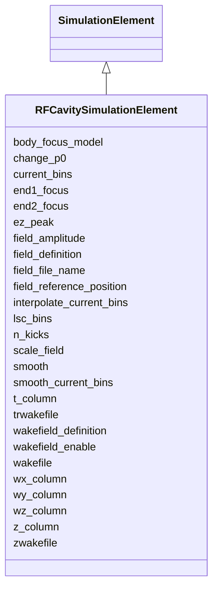

# Class: RFCavitySimulationElement 


_Simulation attributes for RF cavity elements._


<div data-search-exclude markdown="1">


URI: [laura:RFCavitySimulationElement](https://w3id.org/laura/RFCavitySimulationElement)





## Inheritance
* [SimulationElement](SimulationElement.md)
    * **RFCavitySimulationElement**


## Class Properties

| Property | Value |
| --- | --- |
| Class URI | [laura:RFCavitySimulationElement](https://w3id.org/laura/RFCavitySimulationElement) |


## Slots

| Name | Cardinality and Range | Description | Inheritance |
| ---  | --- | --- | --- |
| [t_column](t_column.md) | 0..1 <br/> [String](String.md) | Time column in the wake file | direct |
| [z_column](z_column.md) | 0..1 <br/> [String](String.md) | Longitudinal position column in the wake file | direct |
| [wx_column](wx_column.md) | 0..1 <br/> [String](String.md) | Horizontal wake column in the wake file | direct |
| [wy_column](wy_column.md) | 0..1 <br/> [String](String.md) | Vertical wake column in the wake file | direct |
| [wz_column](wz_column.md) | 0..1 <br/> [String](String.md) | Longitudinal wake column in the wake file | direct |
| [n_kicks](n_kicks.md) | 0..1 <br/> [Integer](Integer.md) | Number of cavity kicks to apply | direct |
| [lsc_bins](lsc_bins.md) | 0..1 <br/> [Integer](Integer.md) | Number of longitudinal space-charge bins | direct |
| [change_p0](change_p0.md) | 0..1 <br/> [Integer](Integer.md) | Flag indicating whether the cavity changes reference momentum | direct |
| [end1_focus](end1_focus.md) | 0..1 <br/> [Integer](Integer.md) | Apply entrance focusing | direct |
| [end2_focus](end2_focus.md) | 0..1 <br/> [Integer](Integer.md) | Apply exit focusing | direct |
| [body_focus_model](body_focus_model.md) | 0..1 <br/> [String](String.md) | Cavity body focusing model | direct |
| [current_bins](current_bins.md) | 0..1 <br/> [Integer](Integer.md) | Number of current bins | direct |
| [interpolate_current_bins](interpolate_current_bins.md) | 0..1 <br/> [Integer](Integer.md) | Flag indicating current-bin interpolation | direct |
| [smooth_current_bins](smooth_current_bins.md) | 0..1 <br/> [Integer](Integer.md) | Flag indicating current-bin smoothing | direct |
| [smooth](smooth.md) | 0..1 <br/> [Integer](Integer.md) | Cavity smoothing parameter | direct |
| [ez_peak](ez_peak.md) | 0..1 <br/> [Double](Double.md) | Peak longitudinal electric field | direct |
| [field_file_name](field_file_name.md) | 0..1 <br/> [String](String.md) | Cavity field file name | direct |
| [wakefile](wakefile.md) | 0..1 <br/> [String](String.md) | Wake file name | direct |
| [zwakefile](zwakefile.md) | 0..1 <br/> [String](String.md) | Longitudinal wake file name | direct |
| [trwakefile](trwakefile.md) | 0..1 <br/> [String](String.md) | Transverse wake file name | direct |
| [field_amplitude](field_amplitude.md) | 1 <br/> [Double](Double.md)&nbsp;or&nbsp;<br />[String](String.md) | Cavity field amplitude | direct |
| [field_definition](field_definition.md) | 0..1 <br/> [String](String.md) | Path to the 3-D field-map file | [SimulationElement](SimulationElement.md) |
| [wakefield_definition](wakefield_definition.md) | 0..1 <br/> [String](String.md) | Path to the wakefield impedance file | [SimulationElement](SimulationElement.md) |
| [wakefield_enable](wakefield_enable.md) | 0..1 <br/> [Boolean](Boolean.md) | Whether the wakefield named by wakefield_definition is applied | [SimulationElement](SimulationElement.md) |
| [field_reference_position](field_reference_position.md) | 0..1 <br/> [String](String.md) | Longitudinal origin of the field map [m] | [SimulationElement](SimulationElement.md) |
| [scale_field](scale_field.md) | 0..1 <br/> [Double](Double.md) | Multiplicative scale factor applied to the field map | [SimulationElement](SimulationElement.md) |


## Usages

| used by | used in | type | used |
| ---  | --- | --- | --- |
| [RFCavity](RFCavity.md) | [simulation](simulation.md) | range | [RFCavitySimulationElement](RFCavitySimulationElement.md) |
| [RFDeflectingCavity](RFDeflectingCavity.md) | [simulation](simulation.md) | range | [RFCavitySimulationElement](RFCavitySimulationElement.md) |
| [CrabCavity](CrabCavity.md) | [simulation](simulation.md) | range | [RFCavitySimulationElement](RFCavitySimulationElement.md) |


## Identifier and Mapping Information


### Schema Source


* from schema: https://w3id.org/laura/schema


## Mappings

| Mapping Type | Mapped Value |
| ---  | ---  |
| self | laura:RFCavitySimulationElement |
| native | laura:RFCavitySimulationElement |


## LinkML Source

<!-- TODO: investigate https://stackoverflow.com/questions/37606292/how-to-create-tabbed-code-blocks-in-mkdocs-or-sphinx -->

### Direct

<details>
```yaml
name: RFCavitySimulationElement
description: Simulation attributes for RF cavity elements.
from_schema: https://w3id.org/laura/schema
is_a: SimulationElement
slots:
- t_column
- z_column
- wx_column
- wy_column
- wz_column
- n_kicks
- lsc_bins
slot_usage:
  n_kicks:
    name: n_kicks
    description: Number of cavity kicks to apply.
    ifabsent: int(0)
  lsc_bins:
    name: lsc_bins
    description: Number of longitudinal space-charge bins.
    ifabsent: int(100)
attributes:
  change_p0:
    name: change_p0
    description: Flag indicating whether the cavity changes reference momentum.
    from_schema: https://w3id.org/laura/schema/simulation
    rank: 1000
    ifabsent: int(1)
    domain_of:
    - RFCavitySimulationElement
    range: integer
  end1_focus:
    name: end1_focus
    description: Apply entrance focusing.
    from_schema: https://w3id.org/laura/schema/simulation
    rank: 1000
    ifabsent: int(1)
    domain_of:
    - RFCavitySimulationElement
    range: integer
  end2_focus:
    name: end2_focus
    description: Apply exit focusing.
    from_schema: https://w3id.org/laura/schema/simulation
    rank: 1000
    ifabsent: int(1)
    domain_of:
    - RFCavitySimulationElement
    range: integer
  body_focus_model:
    name: body_focus_model
    description: Cavity body focusing model.
    from_schema: https://w3id.org/laura/schema/simulation
    rank: 1000
    ifabsent: string(SRS)
    domain_of:
    - RFCavitySimulationElement
    range: string
  current_bins:
    name: current_bins
    description: Number of current bins.
    from_schema: https://w3id.org/laura/schema/simulation
    rank: 1000
    ifabsent: int(0)
    domain_of:
    - RFCavitySimulationElement
    range: integer
  interpolate_current_bins:
    name: interpolate_current_bins
    description: Flag indicating current-bin interpolation.
    from_schema: https://w3id.org/laura/schema/simulation
    rank: 1000
    ifabsent: int(1)
    domain_of:
    - RFCavitySimulationElement
    range: integer
  smooth_current_bins:
    name: smooth_current_bins
    description: Flag indicating current-bin smoothing.
    from_schema: https://w3id.org/laura/schema/simulation
    rank: 1000
    ifabsent: int(1)
    domain_of:
    - RFCavitySimulationElement
    range: integer
  smooth:
    name: smooth
    description: Cavity smoothing parameter.
    from_schema: https://w3id.org/laura/schema/simulation
    domain_of:
    - MagnetSimulationElement
    - RFCavitySimulationElement
    - WakefieldSimulationElement
    range: integer
  ez_peak:
    name: ez_peak
    description: Peak longitudinal electric field.
    from_schema: https://w3id.org/laura/schema/simulation
    rank: 1000
    domain_of:
    - RFCavitySimulationElement
    range: double
  field_file_name:
    name: field_file_name
    description: Cavity field file name.
    from_schema: https://w3id.org/laura/schema/simulation
    rank: 1000
    domain_of:
    - RFCavitySimulationElement
    range: string
  wakefile:
    name: wakefile
    description: Wake file name.
    from_schema: https://w3id.org/laura/schema/simulation
    rank: 1000
    domain_of:
    - RFCavitySimulationElement
    range: string
  zwakefile:
    name: zwakefile
    description: Longitudinal wake file name.
    from_schema: https://w3id.org/laura/schema/simulation
    rank: 1000
    domain_of:
    - RFCavitySimulationElement
    range: string
  trwakefile:
    name: trwakefile
    description: Transverse wake file name.
    from_schema: https://w3id.org/laura/schema/simulation
    rank: 1000
    domain_of:
    - RFCavitySimulationElement
    range: string
  field_amplitude:
    name: field_amplitude
    description: Cavity field amplitude.
    in_subset:
    - functional_parameters
    from_schema: https://w3id.org/laura/schema/simulation
    domain_of:
    - MagnetSimulationElement
    - RFCavitySimulationElement
    - ACDipoleSimulationElement
    - RFMultipoleSimulationElement
    range: double
    required: true
    any_of:
    - range: double
    - range: string
class_uri: laura:RFCavitySimulationElement

```
</details>

### Induced

<details>
```yaml
name: RFCavitySimulationElement
description: Simulation attributes for RF cavity elements.
from_schema: https://w3id.org/laura/schema
is_a: SimulationElement
slot_usage:
  n_kicks:
    name: n_kicks
    description: Number of cavity kicks to apply.
    ifabsent: int(0)
  lsc_bins:
    name: lsc_bins
    description: Number of longitudinal space-charge bins.
    ifabsent: int(100)
attributes:
  change_p0:
    name: change_p0
    description: Flag indicating whether the cavity changes reference momentum.
    from_schema: https://w3id.org/laura/schema/simulation
    rank: 1000
    ifabsent: int(1)
    owner: RFCavitySimulationElement
    domain_of:
    - RFCavitySimulationElement
    range: integer
  end1_focus:
    name: end1_focus
    description: Apply entrance focusing.
    from_schema: https://w3id.org/laura/schema/simulation
    rank: 1000
    ifabsent: int(1)
    owner: RFCavitySimulationElement
    domain_of:
    - RFCavitySimulationElement
    range: integer
  end2_focus:
    name: end2_focus
    description: Apply exit focusing.
    from_schema: https://w3id.org/laura/schema/simulation
    rank: 1000
    ifabsent: int(1)
    owner: RFCavitySimulationElement
    domain_of:
    - RFCavitySimulationElement
    range: integer
  body_focus_model:
    name: body_focus_model
    description: Cavity body focusing model.
    from_schema: https://w3id.org/laura/schema/simulation
    rank: 1000
    ifabsent: string(SRS)
    owner: RFCavitySimulationElement
    domain_of:
    - RFCavitySimulationElement
    range: string
  current_bins:
    name: current_bins
    description: Number of current bins.
    from_schema: https://w3id.org/laura/schema/simulation
    rank: 1000
    ifabsent: int(0)
    owner: RFCavitySimulationElement
    domain_of:
    - RFCavitySimulationElement
    range: integer
  interpolate_current_bins:
    name: interpolate_current_bins
    description: Flag indicating current-bin interpolation.
    from_schema: https://w3id.org/laura/schema/simulation
    rank: 1000
    ifabsent: int(1)
    owner: RFCavitySimulationElement
    domain_of:
    - RFCavitySimulationElement
    range: integer
  smooth_current_bins:
    name: smooth_current_bins
    description: Flag indicating current-bin smoothing.
    from_schema: https://w3id.org/laura/schema/simulation
    rank: 1000
    ifabsent: int(1)
    owner: RFCavitySimulationElement
    domain_of:
    - RFCavitySimulationElement
    range: integer
  smooth:
    name: smooth
    description: Cavity smoothing parameter.
    from_schema: https://w3id.org/laura/schema/simulation
    owner: RFCavitySimulationElement
    domain_of:
    - MagnetSimulationElement
    - RFCavitySimulationElement
    - WakefieldSimulationElement
    range: integer
  ez_peak:
    name: ez_peak
    description: Peak longitudinal electric field.
    from_schema: https://w3id.org/laura/schema/simulation
    rank: 1000
    owner: RFCavitySimulationElement
    domain_of:
    - RFCavitySimulationElement
    range: double
  field_file_name:
    name: field_file_name
    description: Cavity field file name.
    from_schema: https://w3id.org/laura/schema/simulation
    rank: 1000
    owner: RFCavitySimulationElement
    domain_of:
    - RFCavitySimulationElement
    range: string
  wakefile:
    name: wakefile
    description: Wake file name.
    from_schema: https://w3id.org/laura/schema/simulation
    rank: 1000
    owner: RFCavitySimulationElement
    domain_of:
    - RFCavitySimulationElement
    range: string
  zwakefile:
    name: zwakefile
    description: Longitudinal wake file name.
    from_schema: https://w3id.org/laura/schema/simulation
    rank: 1000
    owner: RFCavitySimulationElement
    domain_of:
    - RFCavitySimulationElement
    range: string
  trwakefile:
    name: trwakefile
    description: Transverse wake file name.
    from_schema: https://w3id.org/laura/schema/simulation
    rank: 1000
    owner: RFCavitySimulationElement
    domain_of:
    - RFCavitySimulationElement
    range: string
  field_amplitude:
    name: field_amplitude
    description: Cavity field amplitude.
    in_subset:
    - functional_parameters
    from_schema: https://w3id.org/laura/schema/simulation
    owner: RFCavitySimulationElement
    domain_of:
    - MagnetSimulationElement
    - RFCavitySimulationElement
    - ACDipoleSimulationElement
    - RFMultipoleSimulationElement
    range: double
    required: true
    any_of:
    - range: double
    - range: string
  t_column:
    name: t_column
    description: Time column in the wake file.
    from_schema: https://w3id.org/laura/schema
    rank: 1000
    owner: RFCavitySimulationElement
    domain_of:
    - RFCavitySimulationElement
    - WakefieldSimulationElement
    range: string
  z_column:
    name: z_column
    description: Longitudinal position column in the wake file.
    from_schema: https://w3id.org/laura/schema
    rank: 1000
    owner: RFCavitySimulationElement
    domain_of:
    - RFCavitySimulationElement
    - WakefieldSimulationElement
    range: string
  wx_column:
    name: wx_column
    description: Horizontal wake column in the wake file.
    from_schema: https://w3id.org/laura/schema
    rank: 1000
    owner: RFCavitySimulationElement
    domain_of:
    - RFCavitySimulationElement
    - WakefieldSimulationElement
    range: string
  wy_column:
    name: wy_column
    description: Vertical wake column in the wake file.
    from_schema: https://w3id.org/laura/schema
    rank: 1000
    owner: RFCavitySimulationElement
    domain_of:
    - RFCavitySimulationElement
    - WakefieldSimulationElement
    range: string
  wz_column:
    name: wz_column
    description: Longitudinal wake column in the wake file.
    from_schema: https://w3id.org/laura/schema
    rank: 1000
    owner: RFCavitySimulationElement
    domain_of:
    - RFCavitySimulationElement
    - WakefieldSimulationElement
    range: string
  n_kicks:
    name: n_kicks
    description: Number of cavity kicks to apply.
    from_schema: https://w3id.org/laura/schema
    rank: 1000
    ifabsent: int(0)
    owner: RFCavitySimulationElement
    domain_of:
    - MagnetSimulationElement
    - RFCavitySimulationElement
    range: integer
  lsc_bins:
    name: lsc_bins
    description: Number of longitudinal space-charge bins.
    from_schema: https://w3id.org/laura/schema
    rank: 1000
    ifabsent: int(100)
    owner: RFCavitySimulationElement
    domain_of:
    - RFCavitySimulationElement
    - DriftSimulationElement
    range: integer
  field_definition:
    name: field_definition
    description: Path to the 3-D field-map file.
    from_schema: https://w3id.org/laura/schema/simulation
    rank: 1000
    owner: RFCavitySimulationElement
    domain_of:
    - SimulationElement
    range: string
  wakefield_definition:
    name: wakefield_definition
    description: Path to the wakefield impedance file.
    from_schema: https://w3id.org/laura/schema/simulation
    rank: 1000
    owner: RFCavitySimulationElement
    domain_of:
    - SimulationElement
    range: string
  wakefield_enable:
    name: wakefield_enable
    description: Whether the wakefield named by wakefield_definition is applied. Set
      false to track the element without its wakefield while keeping the definition
      itself.
    from_schema: https://w3id.org/laura/schema/simulation
    rank: 1000
    ifabsent: 'true'
    owner: RFCavitySimulationElement
    domain_of:
    - SimulationElement
    range: boolean
  field_reference_position:
    name: field_reference_position
    description: Longitudinal origin of the field map [m].
    from_schema: https://w3id.org/laura/schema/simulation
    rank: 1000
    owner: RFCavitySimulationElement
    domain_of:
    - SimulationElement
    range: string
  scale_field:
    name: scale_field
    description: Multiplicative scale factor applied to the field map.
    from_schema: https://w3id.org/laura/schema/simulation
    rank: 1000
    ifabsent: float(1)
    owner: RFCavitySimulationElement
    domain_of:
    - SimulationElement
    range: double
class_uri: laura:RFCavitySimulationElement

```
</details></div>