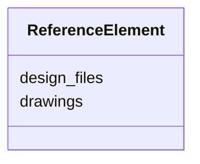

---
search:
  boost: 10.0
---

# Class: ReferenceElement 


_Links to engineering drawings and design files._


<div data-search-exclude markdown="1">


URI: [laura:ReferenceElement](https://w3id.org/laura/ReferenceElement)





<!-- no inheritance hierarchy -->

## Class Properties

| Property | Value |
| --- | --- |
| Class URI | [laura:ReferenceElement](https://w3id.org/laura/ReferenceElement) |


## Slots

| Name | Cardinality and Range | Description | Inheritance |
| ---  | --- | --- | --- |
| [drawings](drawings.md) | * <br/> [String](String.md) | Engineering-drawing identifiers or URIs | direct |
| [design_files](design_files.md) | * <br/> [String](String.md) | Design-file paths or URIs | direct |


## Usages

| used by | used in | type | used |
| ---  | --- | --- | --- |
| [StandardElement](StandardElement.md) | [reference](reference.md) | range | [ReferenceElement](ReferenceElement.md) |
| [Element](Element.md) | [reference](reference.md) | range | [ReferenceElement](ReferenceElement.md) |
| [PhysicalAcceleratorElement](PhysicalAcceleratorElement.md) | [reference](reference.md) | range | [ReferenceElement](ReferenceElement.md) |
| [TwissMatch](TwissMatch.md) | [reference](reference.md) | range | [ReferenceElement](ReferenceElement.md) |
| [Stage](Stage.md) | [reference](reference.md) | range | [ReferenceElement](ReferenceElement.md) |
| [VacuumGauge](VacuumGauge.md) | [reference](reference.md) | range | [ReferenceElement](ReferenceElement.md) |
| [Laser](Laser.md) | [reference](reference.md) | range | [ReferenceElement](ReferenceElement.md) |
| [Shutter](Shutter.md) | [reference](reference.md) | range | [ReferenceElement](ReferenceElement.md) |
| [Valve](Valve.md) | [reference](reference.md) | range | [ReferenceElement](ReferenceElement.md) |
| [Marker](Marker.md) | [reference](reference.md) | range | [ReferenceElement](ReferenceElement.md) |
| [Aperture](Aperture.md) | [reference](reference.md) | range | [ReferenceElement](ReferenceElement.md) |
| [Collimator](Collimator.md) | [reference](reference.md) | range | [ReferenceElement](ReferenceElement.md) |
| [Drift](Drift.md) | [reference](reference.md) | range | [ReferenceElement](ReferenceElement.md) |
| [Lighting](Lighting.md) | [reference](reference.md) | range | [ReferenceElement](ReferenceElement.md) |
| [PowerSupply](PowerSupply.md) | [reference](reference.md) | range | [ReferenceElement](ReferenceElement.md) |
| [Magnet](Magnet.md) | [reference](reference.md) | range | [ReferenceElement](ReferenceElement.md) |
| [RFCavity](RFCavity.md) | [reference](reference.md) | range | [ReferenceElement](ReferenceElement.md) |
| [RFDeflectingCavity](RFDeflectingCavity.md) | [reference](reference.md) | range | [ReferenceElement](ReferenceElement.md) |
| [Wakefield](Wakefield.md) | [reference](reference.md) | range | [ReferenceElement](ReferenceElement.md) |
| [LowLevelRF](LowLevelRF.md) | [reference](reference.md) | range | [ReferenceElement](ReferenceElement.md) |
| [RFModulator](RFModulator.md) | [reference](reference.md) | range | [ReferenceElement](ReferenceElement.md) |
| [RFProtection](RFProtection.md) | [reference](reference.md) | range | [ReferenceElement](ReferenceElement.md) |
| [RFHeartbeat](RFHeartbeat.md) | [reference](reference.md) | range | [ReferenceElement](ReferenceElement.md) |
| [PID](PID.md) | [reference](reference.md) | range | [ReferenceElement](ReferenceElement.md) |
| [Diagnostic](Diagnostic.md) | [reference](reference.md) | range | [ReferenceElement](ReferenceElement.md) |
| [BeamPositionMonitor](BeamPositionMonitor.md) | [reference](reference.md) | range | [ReferenceElement](ReferenceElement.md) |
| [BeamArrivalMonitor](BeamArrivalMonitor.md) | [reference](reference.md) | range | [ReferenceElement](ReferenceElement.md) |
| [BunchLengthMonitor](BunchLengthMonitor.md) | [reference](reference.md) | range | [ReferenceElement](ReferenceElement.md) |
| [Camera](Camera.md) | [reference](reference.md) | range | [ReferenceElement](ReferenceElement.md) |
| [Screen](Screen.md) | [reference](reference.md) | range | [ReferenceElement](ReferenceElement.md) |
| [ChargeDiagnostic](ChargeDiagnostic.md) | [reference](reference.md) | range | [ReferenceElement](ReferenceElement.md) |
| [WallCurrentMonitor](WallCurrentMonitor.md) | [reference](reference.md) | range | [ReferenceElement](ReferenceElement.md) |
| [FaradayCupMonitor](FaradayCupMonitor.md) | [reference](reference.md) | range | [ReferenceElement](ReferenceElement.md) |
| [IntegratedCurrentTransformer](IntegratedCurrentTransformer.md) | [reference](reference.md) | range | [ReferenceElement](ReferenceElement.md) |
| [Plasma](Plasma.md) | [reference](reference.md) | range | [ReferenceElement](ReferenceElement.md) |
| [LaserEnergyMeter](LaserEnergyMeter.md) | [reference](reference.md) | range | [ReferenceElement](ReferenceElement.md) |
| [LaserHalfWavePlate](LaserHalfWavePlate.md) | [reference](reference.md) | range | [ReferenceElement](ReferenceElement.md) |
| [LaserMirror](LaserMirror.md) | [reference](reference.md) | range | [ReferenceElement](ReferenceElement.md) |
| [LaserAttenuator](LaserAttenuator.md) | [reference](reference.md) | range | [ReferenceElement](ReferenceElement.md) |
| [Dipole](Dipole.md) | [reference](reference.md) | range | [ReferenceElement](ReferenceElement.md) |
| [Quadrupole](Quadrupole.md) | [reference](reference.md) | range | [ReferenceElement](ReferenceElement.md) |


## Identifier and Mapping Information


### Schema Source


* from schema: https://w3id.org/laura/schema


## Mappings

| Mapping Type | Mapped Value |
| ---  | ---  |
| self | laura:ReferenceElement |
| native | laura:ReferenceElement |


## LinkML Source

<!-- TODO: investigate https://stackoverflow.com/questions/37606292/how-to-create-tabbed-code-blocks-in-mkdocs-or-sphinx -->

### Direct

<details>
```yaml
name: ReferenceElement
description: Links to engineering drawings and design files.
from_schema: https://w3id.org/laura/schema
attributes:
  drawings:
    name: drawings
    description: Engineering-drawing identifiers or URIs.
    from_schema: https://w3id.org/laura/schema
    rank: 1000
    domain_of:
    - ReferenceElement
    range: string
    multivalued: true
  design_files:
    name: design_files
    description: Design-file paths or URIs.
    from_schema: https://w3id.org/laura/schema
    rank: 1000
    domain_of:
    - ReferenceElement
    range: string
    multivalued: true
class_uri: laura:ReferenceElement

```
</details>

### Induced

<details>
```yaml
name: ReferenceElement
description: Links to engineering drawings and design files.
from_schema: https://w3id.org/laura/schema
attributes:
  drawings:
    name: drawings
    description: Engineering-drawing identifiers or URIs.
    from_schema: https://w3id.org/laura/schema
    rank: 1000
    owner: ReferenceElement
    domain_of:
    - ReferenceElement
    range: string
    multivalued: true
  design_files:
    name: design_files
    description: Design-file paths or URIs.
    from_schema: https://w3id.org/laura/schema
    rank: 1000
    owner: ReferenceElement
    domain_of:
    - ReferenceElement
    range: string
    multivalued: true
class_uri: laura:ReferenceElement

```
</details></div>