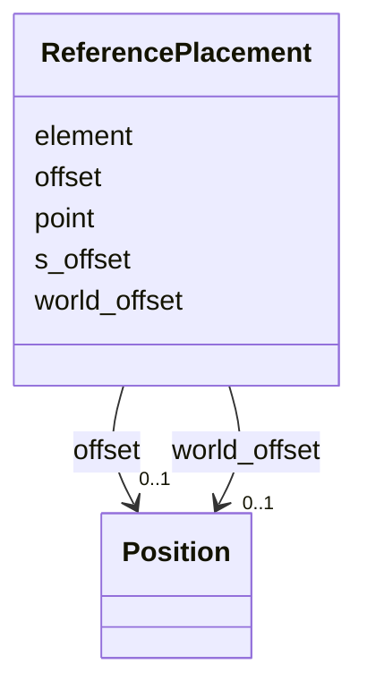

---
search:
  boost: 10.0
---

# Class: ReferencePlacement 


_Positions an element relative to a named reference element's local frame. The ``offset`` field is expressed in the reference element's local frame at the chosen ``point`` (start / middle / end).  Use ``world_offset`` instead to supply an offset already in global world coordinates._


<div data-search-exclude markdown="1">


URI: [laura:ReferencePlacement](https://w3id.org/laura/ReferencePlacement)





<!-- no inheritance hierarchy -->

## Class Properties

| Property | Value |
| --- | --- |
| Class URI | [laura:ReferencePlacement](https://w3id.org/laura/ReferencePlacement) |


## Slots

| Name | Cardinality and Range | Description | Inheritance |
| ---  | --- | --- | --- |
| [element](element.md) | 1 <br/> [String](String.md) | Name of the reference element | direct |
| [point](point.md) | 0..1 <br/> [String](String.md) | Which point on the reference element to use as the origin frame: 'start', 'mi... | direct |
| [offset](offset.md) | 0..1 <br/> [Position](Position.md) | Offset expressed in the reference element's local frame at the chosen point | direct |
| [world_offset](world_offset.md) | 0..1 <br/> [Position](Position.md) | Offset already expressed in global world coordinates | direct |
| [s_offset](s_offset.md) | 0..1 <br/> [Float](Float.md) | Scalar offset [m] along the local beam direction (s-axis) from the reference ... | direct |


## Usages

| used by | used in | type | used |
| ---  | --- | --- | --- |
| [PhysicalElement](PhysicalElement.md) | [reference_placement](reference_placement.md) | range | [ReferencePlacement](ReferencePlacement.md) |


## In Subsets


* [PhysicalProperties](PhysicalProperties.md)


## Identifier and Mapping Information


### Schema Source


* from schema: https://w3id.org/laura/schema


## Mappings

| Mapping Type | Mapped Value |
| ---  | ---  |
| self | laura:ReferencePlacement |
| native | laura:ReferencePlacement |


## LinkML Source

<!-- TODO: investigate https://stackoverflow.com/questions/37606292/how-to-create-tabbed-code-blocks-in-mkdocs-or-sphinx -->

### Direct

<details>
```yaml
name: ReferencePlacement
description: Positions an element relative to a named reference element's local frame.
  The ``offset`` field is expressed in the reference element's local frame at the
  chosen ``point`` (start / middle / end).  Use ``world_offset`` instead to supply
  an offset already in global world coordinates.
in_subset:
- physical_properties
from_schema: https://w3id.org/laura/schema
attributes:
  element:
    name: element
    description: Name of the reference element.
    from_schema: https://w3id.org/laura/schema
    rank: 1000
    domain_of:
    - ReferencePlacement
    range: string
    required: true
  point:
    name: point
    description: 'Which point on the reference element to use as the origin frame:
      ''start'', ''middle'', or ''end''.'
    from_schema: https://w3id.org/laura/schema
    rank: 1000
    ifabsent: string(end)
    domain_of:
    - ReferencePlacement
    range: string
  offset:
    name: offset
    description: Offset expressed in the reference element's local frame at the chosen
      point.
    from_schema: https://w3id.org/laura/schema
    rank: 1000
    domain_of:
    - ReferencePlacement
    range: Position
  world_offset:
    name: world_offset
    description: Offset already expressed in global world coordinates.
    from_schema: https://w3id.org/laura/schema
    rank: 1000
    domain_of:
    - ReferencePlacement
    range: Position
  s_offset:
    name: s_offset
    description: 'Scalar offset [m] along the local beam direction (s-axis) from the
      reference point.  Equivalent to ``offset: [0, 0, s_offset]`` but expressed as
      a single number.  Mutually exclusive with ``offset`` and ``world_offset``.'
    from_schema: https://w3id.org/laura/schema
    rank: 1000
    domain_of:
    - ReferencePlacement
    range: float
    unit:
      ucum_code: m
class_uri: laura:ReferencePlacement

```
</details>

### Induced

<details>
```yaml
name: ReferencePlacement
description: Positions an element relative to a named reference element's local frame.
  The ``offset`` field is expressed in the reference element's local frame at the
  chosen ``point`` (start / middle / end).  Use ``world_offset`` instead to supply
  an offset already in global world coordinates.
in_subset:
- physical_properties
from_schema: https://w3id.org/laura/schema
attributes:
  element:
    name: element
    description: Name of the reference element.
    from_schema: https://w3id.org/laura/schema
    rank: 1000
    owner: ReferencePlacement
    domain_of:
    - ReferencePlacement
    range: string
    required: true
  point:
    name: point
    description: 'Which point on the reference element to use as the origin frame:
      ''start'', ''middle'', or ''end''.'
    from_schema: https://w3id.org/laura/schema
    rank: 1000
    ifabsent: string(end)
    owner: ReferencePlacement
    domain_of:
    - ReferencePlacement
    range: string
  offset:
    name: offset
    description: Offset expressed in the reference element's local frame at the chosen
      point.
    from_schema: https://w3id.org/laura/schema
    rank: 1000
    owner: ReferencePlacement
    domain_of:
    - ReferencePlacement
    range: Position
  world_offset:
    name: world_offset
    description: Offset already expressed in global world coordinates.
    from_schema: https://w3id.org/laura/schema
    rank: 1000
    owner: ReferencePlacement
    domain_of:
    - ReferencePlacement
    range: Position
  s_offset:
    name: s_offset
    description: 'Scalar offset [m] along the local beam direction (s-axis) from the
      reference point.  Equivalent to ``offset: [0, 0, s_offset]`` but expressed as
      a single number.  Mutually exclusive with ``offset`` and ``world_offset``.'
    from_schema: https://w3id.org/laura/schema
    rank: 1000
    owner: ReferencePlacement
    domain_of:
    - ReferencePlacement
    range: float
    unit:
      ucum_code: m
class_uri: laura:ReferencePlacement

```
</details></div>