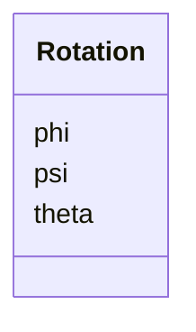

# Class: Rotation 


_Euler-angle rotation relative to the global coordinate system. All angles are in radians, bounded to [-pi, pi]._


<div data-search-exclude markdown="1">


URI: [laura:Rotation](https://w3id.org/laura/Rotation)





<!-- no inheritance hierarchy -->

## Class Properties

| Property | Value |
| --- | --- |
| Class URI | [laura:Rotation](https://w3id.org/laura/Rotation) |


## Slots

| Name | Cardinality and Range | Description | Inheritance |
| ---  | --- | --- | --- |
| [phi](phi.md) | 0..1 <br/> [Double](Double.md) | Rotation about the horizontal (x) axis [rad] | direct |
| [psi](psi.md) | 0..1 <br/> [Double](Double.md) | Rotation about the vertical (y) axis [rad] | direct |
| [theta](theta.md) | 0..1 <br/> [Double](Double.md) | Rotation about the longitudinal (z) axis [rad] | direct |


## Usages

| used by | used in | type | used |
| ---  | --- | --- | --- |
| [ElementPositionError](ElementPositionError.md) | [rotation](rotation.md) | range | [Rotation](Rotation.md) |
| [ElementSurvey](ElementSurvey.md) | [rotation](rotation.md) | range | [Rotation](Rotation.md) |
| [PhysicalElement](PhysicalElement.md) | [rotation](rotation.md) | range | [Rotation](Rotation.md) |
| [PhysicalElement](PhysicalElement.md) | [global_rotation](global_rotation.md) | range | [Rotation](Rotation.md) |


## In Subsets


* [PhysicalProperties](PhysicalProperties.md)


## Identifier and Mapping Information


### Schema Source


* from schema: https://w3id.org/laura/schema


## Mappings

| Mapping Type | Mapped Value |
| ---  | ---  |
| self | laura:Rotation |
| native | laura:Rotation |


## LinkML Source

<!-- TODO: investigate https://stackoverflow.com/questions/37606292/how-to-create-tabbed-code-blocks-in-mkdocs-or-sphinx -->

### Direct

<details>
```yaml
name: Rotation
description: Euler-angle rotation relative to the global coordinate system. All angles
  are in radians, bounded to [-pi, pi].
in_subset:
- physical_properties
from_schema: https://w3id.org/laura/schema
attributes:
  phi:
    name: phi
    description: Rotation about the horizontal (x) axis [rad].
    from_schema: https://w3id.org/laura/schema/geometry
    rank: 1000
    ifabsent: float(0)
    domain_of:
    - Rotation
    range: double
    minimum_value: -3.141592653589793
    maximum_value: 3.141592653589793
    unit:
      ucum_code: rad
  psi:
    name: psi
    description: Rotation about the vertical (y) axis [rad].
    from_schema: https://w3id.org/laura/schema/geometry
    rank: 1000
    ifabsent: float(0)
    domain_of:
    - Rotation
    range: double
    minimum_value: -3.141592653589793
    maximum_value: 3.141592653589793
    unit:
      ucum_code: rad
  theta:
    name: theta
    description: Rotation about the longitudinal (z) axis [rad].
    from_schema: https://w3id.org/laura/schema/geometry
    rank: 1000
    ifabsent: float(0)
    domain_of:
    - Rotation
    range: double
    minimum_value: -3.141592653589793
    maximum_value: 3.141592653589793
    unit:
      ucum_code: rad
class_uri: laura:Rotation

```
</details>

### Induced

<details>
```yaml
name: Rotation
description: Euler-angle rotation relative to the global coordinate system. All angles
  are in radians, bounded to [-pi, pi].
in_subset:
- physical_properties
from_schema: https://w3id.org/laura/schema
attributes:
  phi:
    name: phi
    description: Rotation about the horizontal (x) axis [rad].
    from_schema: https://w3id.org/laura/schema/geometry
    rank: 1000
    ifabsent: float(0)
    owner: Rotation
    domain_of:
    - Rotation
    range: double
    minimum_value: -3.141592653589793
    maximum_value: 3.141592653589793
    unit:
      ucum_code: rad
  psi:
    name: psi
    description: Rotation about the vertical (y) axis [rad].
    from_schema: https://w3id.org/laura/schema/geometry
    rank: 1000
    ifabsent: float(0)
    owner: Rotation
    domain_of:
    - Rotation
    range: double
    minimum_value: -3.141592653589793
    maximum_value: 3.141592653589793
    unit:
      ucum_code: rad
  theta:
    name: theta
    description: Rotation about the longitudinal (z) axis [rad].
    from_schema: https://w3id.org/laura/schema/geometry
    rank: 1000
    ifabsent: float(0)
    owner: Rotation
    domain_of:
    - Rotation
    range: double
    minimum_value: -3.141592653589793
    maximum_value: 3.141592653589793
    unit:
      ucum_code: rad
class_uri: laura:Rotation

```
</details></div>