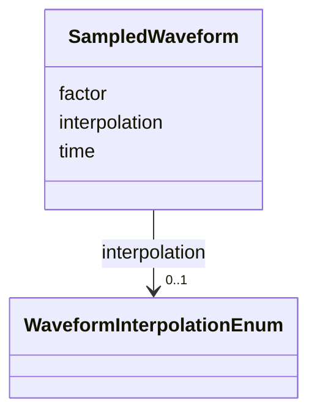

# Class: SampledWaveform 


_A pulse shape sampled at a sparse set of points, for a device whose strength is a program rather than a constant: an injection kicker, an extraction septum, a tune exciter driven from a measured trace. Only the knots are stored, and the value between them follows `interpolation`. That is the common denominator of what the tracking codes accept -- MAD-X `ramp1`-`ramp4`, Bmad `x_knot`/`y_knot` on a ramper, elegant `WAVEFORM` (an SDDS file of `(t, factor)`) and Xsuite `FunctionPieceWiseLinear` are each sparse knots plus a rule. The waveform is the device's own shape, held relative to the moment it fires and to its nominal strength. *When* it fires, and at what absolute strength, is a property of the study rather than of the machine, and is set in the tracking code's run settings instead._


<div data-search-exclude markdown="1">


URI: [laura:SampledWaveform](https://w3id.org/laura/SampledWaveform)





<!-- no inheritance hierarchy -->

## Class Properties

| Property | Value |
| --- | --- |
| Class URI | [laura:SampledWaveform](https://w3id.org/laura/SampledWaveform) |


## Slots

| Name | Cardinality and Range | Description | Inheritance |
| ---  | --- | --- | --- |
| [time](time.md) | * <br/> [Float](Float.md) | Sample times, measured from the moment the device fires [s] | direct |
| [factor](factor.md) | * <br/> [Float](Float.md) | Strength at each of the times in `time`, as a fraction of the element's nomin... | direct |
| [interpolation](interpolation.md) | 0..1 <br/> [WaveformInterpolationEnum](WaveformInterpolationEnum.md) | How the strength behaves between the sampled knots | direct |


## Usages

| used by | used in | type | used |
| ---  | --- | --- | --- |
| [ACDipoleSimulationElement](ACDipoleSimulationElement.md) | [waveform](waveform.md) | range | [SampledWaveform](SampledWaveform.md) |


## Identifier and Mapping Information


### Schema Source


* from schema: https://w3id.org/laura/schema


## Mappings

| Mapping Type | Mapped Value |
| ---  | ---  |
| self | laura:SampledWaveform |
| native | laura:SampledWaveform |


## LinkML Source

<!-- TODO: investigate https://stackoverflow.com/questions/37606292/how-to-create-tabbed-code-blocks-in-mkdocs-or-sphinx -->

### Direct

<details>
```yaml
name: SampledWaveform
description: 'A pulse shape sampled at a sparse set of points, for a device whose
  strength is a program rather than a constant: an injection kicker, an extraction
  septum, a tune exciter driven from a measured trace. Only the knots are stored,
  and the value between them follows ``interpolation``. That is the common denominator
  of what the tracking codes accept -- MAD-X ``ramp1``-``ramp4``, Bmad ``x_knot``/``y_knot``
  on a ramper, elegant ``WAVEFORM`` (an SDDS file of ``(t, factor)``) and Xsuite ``FunctionPieceWiseLinear``
  are each sparse knots plus a rule. The waveform is the device''s own shape, held
  relative to the moment it fires and to its nominal strength. *When* it fires, and
  at what absolute strength, is a property of the study rather than of the machine,
  and is set in the tracking code''s run settings instead.'
from_schema: https://w3id.org/laura/schema
attributes:
  time:
    name: time
    description: Sample times, measured from the moment the device fires [s]. Must
      be non-decreasing and the same length as ``factor``.
    from_schema: https://w3id.org/laura/schema
    rank: 1000
    unit:
      ucum_code: s
    multivalued: true
    range: float
  factor:
    name: factor
    description: Strength at each of the times in ``time``, as a fraction of the element's
      nominal strength; 1.0 is full strength. A pulse normally starts and ends at
      zero.
    from_schema: https://w3id.org/laura/schema
    rank: 1000
    multivalued: true
    range: float
  interpolation:
    name: interpolation
    description: How the strength behaves between the sampled knots.
    from_schema: https://w3id.org/laura/schema
    rank: 1000
    ifabsent: WaveformInterpolationEnum(linear)
    range: WaveformInterpolationEnum
class_uri: laura:SampledWaveform

```
</details>

### Induced

<details>
```yaml
name: SampledWaveform
description: 'A pulse shape sampled at a sparse set of points, for a device whose
  strength is a program rather than a constant: an injection kicker, an extraction
  septum, a tune exciter driven from a measured trace. Only the knots are stored,
  and the value between them follows ``interpolation``. That is the common denominator
  of what the tracking codes accept -- MAD-X ``ramp1``-``ramp4``, Bmad ``x_knot``/``y_knot``
  on a ramper, elegant ``WAVEFORM`` (an SDDS file of ``(t, factor)``) and Xsuite ``FunctionPieceWiseLinear``
  are each sparse knots plus a rule. The waveform is the device''s own shape, held
  relative to the moment it fires and to its nominal strength. *When* it fires, and
  at what absolute strength, is a property of the study rather than of the machine,
  and is set in the tracking code''s run settings instead.'
from_schema: https://w3id.org/laura/schema
attributes:
  time:
    name: time
    description: Sample times, measured from the moment the device fires [s]. Must
      be non-decreasing and the same length as ``factor``.
    from_schema: https://w3id.org/laura/schema
    rank: 1000
    unit:
      ucum_code: s
    alias: time
    owner: SampledWaveform
    domain_of:
    - SampledWaveform
    multivalued: true
    range: float
  factor:
    name: factor
    description: Strength at each of the times in ``time``, as a fraction of the element's
      nominal strength; 1.0 is full strength. A pulse normally starts and ends at
      zero.
    from_schema: https://w3id.org/laura/schema
    rank: 1000
    alias: factor
    owner: SampledWaveform
    domain_of:
    - SampledWaveform
    - WakefieldSimulationElement
    multivalued: true
    range: float
  interpolation:
    name: interpolation
    description: How the strength behaves between the sampled knots.
    from_schema: https://w3id.org/laura/schema
    rank: 1000
    ifabsent: WaveformInterpolationEnum(linear)
    alias: interpolation
    owner: SampledWaveform
    domain_of:
    - SampledWaveform
    range: WaveformInterpolationEnum
class_uri: laura:SampledWaveform

```
</details></div>
