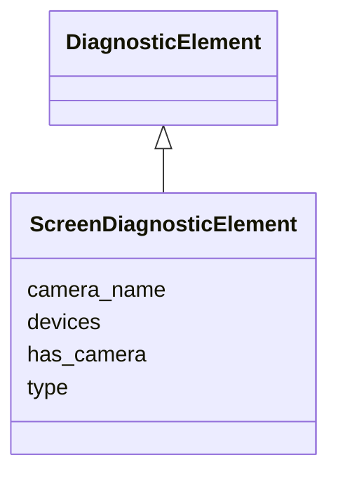

---
search:
  boost: 10.0
---

# Class: ScreenDiagnosticElement 


_Scintillator or OTR screen diagnostic data._


<div data-search-exclude markdown="1">


URI: [laura:ScreenDiagnosticElement](https://w3id.org/laura/ScreenDiagnosticElement)





## Inheritance
* [DiagnosticElement](DiagnosticElement.md)
    * **ScreenDiagnosticElement**


## Class Properties

| Property | Value |
| --- | --- |
| Class URI | [laura:ScreenDiagnosticElement](https://w3id.org/laura/ScreenDiagnosticElement) |


## Slots

| Name | Cardinality and Range | Description | Inheritance |
| ---  | --- | --- | --- |
| [type](type.md) | 0..1 <br/> [String](String.md) | Screen type (e | direct |
| [has_camera](has_camera.md) | 0..1 <br/> [Boolean](Boolean.md) | Whether the screen has an associated camera | direct |
| [camera_name](camera_name.md) | 0..1 <br/> [String](String.md) | Name of the associated camera element | direct |
| [devices](devices.md) | * <br/> [String](String.md) | List of attached devices | direct |


## Usages

| used by | used in | type | used |
| ---  | --- | --- | --- |
| [Screen](Screen.md) | [diagnostic](diagnostic.md) | range | [ScreenDiagnosticElement](ScreenDiagnosticElement.md) |


## In Subsets


* [DiagnosticProperties](DiagnosticProperties.md)


## Identifier and Mapping Information


### Schema Source


* from schema: https://w3id.org/laura/schema


## Mappings

| Mapping Type | Mapped Value |
| ---  | ---  |
| self | laura:ScreenDiagnosticElement |
| native | laura:ScreenDiagnosticElement |


## LinkML Source

<!-- TODO: investigate https://stackoverflow.com/questions/37606292/how-to-create-tabbed-code-blocks-in-mkdocs-or-sphinx -->

### Direct

<details>
```yaml
name: ScreenDiagnosticElement
description: Scintillator or OTR screen diagnostic data.
in_subset:
- diagnostic_properties
from_schema: https://w3id.org/laura/schema
is_a: DiagnosticElement
attributes:
  type:
    name: type
    description: Screen type (e.g., ``OTR``, ``YAG``).
    from_schema: https://w3id.org/laura/schema/diagnostics
    aliases:
    - screen_type
    ifabsent: string(CLARA_HV_MOVER)
    domain_of:
    - BPMDiagnosticElement
    - BAMDiagnosticElement
    - PhotonIntensityMonitorDiagnostic
    - BLMDiagnosticElement
    - ScreenDiagnosticElement
    - ChargeDiagnosticElement
    - CameraDiagnosticElement
    range: string
  has_camera:
    name: has_camera
    description: Whether the screen has an associated camera.
    from_schema: https://w3id.org/laura/schema/diagnostics
    rank: 1000
    ifabsent: 'True'
    domain_of:
    - ScreenDiagnosticElement
    range: boolean
  camera_name:
    name: camera_name
    description: Name of the associated camera element.
    from_schema: https://w3id.org/laura/schema/diagnostics
    rank: 1000
    ifabsent: string()
    domain_of:
    - ScreenDiagnosticElement
    range: string
  devices:
    name: devices
    description: List of attached devices.
    from_schema: https://w3id.org/laura/schema/diagnostics
    rank: 1000
    domain_of:
    - ScreenDiagnosticElement
    range: string
    multivalued: true
class_uri: laura:ScreenDiagnosticElement

```
</details>

### Induced

<details>
```yaml
name: ScreenDiagnosticElement
description: Scintillator or OTR screen diagnostic data.
in_subset:
- diagnostic_properties
from_schema: https://w3id.org/laura/schema
is_a: DiagnosticElement
attributes:
  type:
    name: type
    description: Screen type (e.g., ``OTR``, ``YAG``).
    from_schema: https://w3id.org/laura/schema/diagnostics
    aliases:
    - screen_type
    ifabsent: string(CLARA_HV_MOVER)
    owner: ScreenDiagnosticElement
    domain_of:
    - BPMDiagnosticElement
    - BAMDiagnosticElement
    - PhotonIntensityMonitorDiagnostic
    - BLMDiagnosticElement
    - ScreenDiagnosticElement
    - ChargeDiagnosticElement
    - CameraDiagnosticElement
    range: string
  has_camera:
    name: has_camera
    description: Whether the screen has an associated camera.
    from_schema: https://w3id.org/laura/schema/diagnostics
    rank: 1000
    ifabsent: 'True'
    owner: ScreenDiagnosticElement
    domain_of:
    - ScreenDiagnosticElement
    range: boolean
  camera_name:
    name: camera_name
    description: Name of the associated camera element.
    from_schema: https://w3id.org/laura/schema/diagnostics
    rank: 1000
    ifabsent: string()
    owner: ScreenDiagnosticElement
    domain_of:
    - ScreenDiagnosticElement
    range: string
  devices:
    name: devices
    description: List of attached devices.
    from_schema: https://w3id.org/laura/schema/diagnostics
    rank: 1000
    owner: ScreenDiagnosticElement
    domain_of:
    - ScreenDiagnosticElement
    range: string
    multivalued: true
class_uri: laura:ScreenDiagnosticElement

```
</details></div>