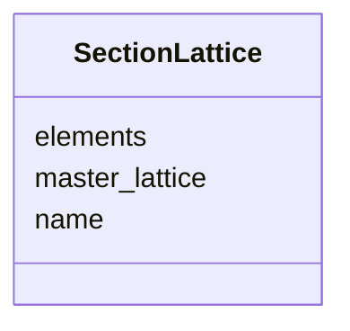

# Class: SectionLattice 


_An ordered list of element names defining a contiguous beamline section._


<div data-search-exclude markdown="1">


URI: [laura:SectionLattice](https://w3id.org/laura/SectionLattice)





<!-- no inheritance hierarchy -->

## Class Properties

| Property | Value |
| --- | --- |
| Class URI | [laura:SectionLattice](https://w3id.org/laura/SectionLattice) |


## Slots

| Name | Cardinality and Range | Description | Inheritance |
| ---  | --- | --- | --- |
| [name](name.md) | 1 <br/> [String](String.md) | Unique section name | direct |
| [master_lattice](master_lattice.md) | 0..1 <br/> [String](String.md) | Name of the master lattice this section belongs to | direct |
| [elements](elements.md) | * <br/> [String](String.md) | Ordered list of element names in this section | direct |


## Usages

| used by | used in | type | used |
| ---  | --- | --- | --- |
| [MachineModel](MachineModel.md) | [sections](sections.md) | range | [SectionLattice](SectionLattice.md) |


## Identifier and Mapping Information


### Schema Source


* from schema: https://w3id.org/laura/schema


## Mappings

| Mapping Type | Mapped Value |
| ---  | ---  |
| self | laura:SectionLattice |
| native | laura:SectionLattice |


## LinkML Source

<!-- TODO: investigate https://stackoverflow.com/questions/37606292/how-to-create-tabbed-code-blocks-in-mkdocs-or-sphinx -->

### Direct

<details>
```yaml
name: SectionLattice
description: An ordered list of element names defining a contiguous beamline section.
from_schema: https://w3id.org/laura/schema
attributes:
  name:
    name: name
    description: Unique section name.
    from_schema: https://w3id.org/laura/schema/machine
    identifier: true
    domain_of:
    - AcceleratorElement
    - ControlVariable
    - SectionLattice
    - MachineLayout
    range: string
  master_lattice:
    name: master_lattice
    description: Name of the master lattice this section belongs to.
    from_schema: https://w3id.org/laura/schema/machine
    rank: 1000
    domain_of:
    - SectionLattice
    - MachineLayout
    range: string
  elements:
    name: elements
    description: Ordered list of element names in this section.
    from_schema: https://w3id.org/laura/schema/machine
    rank: 1000
    domain_of:
    - SectionLattice
    - MachineModel
    range: string
    multivalued: true
class_uri: laura:SectionLattice

```
</details>

### Induced

<details>
```yaml
name: SectionLattice
description: An ordered list of element names defining a contiguous beamline section.
from_schema: https://w3id.org/laura/schema
attributes:
  name:
    name: name
    description: Unique section name.
    from_schema: https://w3id.org/laura/schema/machine
    identifier: true
    owner: SectionLattice
    domain_of:
    - AcceleratorElement
    - ControlVariable
    - SectionLattice
    - MachineLayout
    range: string
    required: true
  master_lattice:
    name: master_lattice
    description: Name of the master lattice this section belongs to.
    from_schema: https://w3id.org/laura/schema/machine
    rank: 1000
    owner: SectionLattice
    domain_of:
    - SectionLattice
    - MachineLayout
    range: string
  elements:
    name: elements
    description: Ordered list of element names in this section.
    from_schema: https://w3id.org/laura/schema/machine
    rank: 1000
    owner: SectionLattice
    domain_of:
    - SectionLattice
    - MachineModel
    range: string
    multivalued: true
class_uri: laura:SectionLattice

```
</details></div>