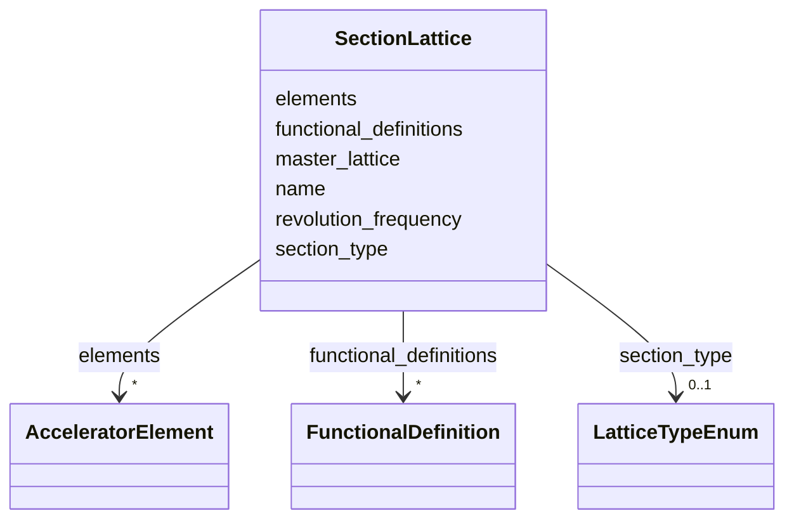

# Class: SectionLattice 


_A contiguous beamline section: an ordered run of elements._


<div data-search-exclude markdown="1">


URI: [laura:SectionLattice](https://w3id.org/laura/SectionLattice)





<!-- no inheritance hierarchy -->

## Class Properties

| Property | Value |
| --- | --- |
| Class URI | [laura:SectionLattice](https://w3id.org/laura/SectionLattice) |


## Slots

| Name | Cardinality and Range | Description | Inheritance |
| ---  | --- | --- | --- |
| [name](name.md) | 1 <br/> [String](String.md) | Unique section name | direct |
| [master_lattice](master_lattice.md) | 0..1 <br/> [String](String.md) | Name of the master lattice this section belongs to | direct |
| [elements](elements.md) | * <br/> [AcceleratorElement](AcceleratorElement.md) | The elements in this section, keyed by name | direct |
| [section_type](section_type.md) | 0..1 <br/> [LatticeTypeEnum](LatticeTypeEnum.md) | What this section carries | direct |
| [functional_definitions](functional_definitions.md) | * <br/> [FunctionalDefinition](FunctionalDefinition.md) | Named constants this section's elements may refer to, keyed by name | direct |
| [revolution_frequency](revolution_frequency.md) | 0..1 <br/> [Double](Double.md) | The ring's revolution frequency [Hz], if this section is part of a closed rin... | direct |


## Usages

| used by | used in | type | used |
| ---  | --- | --- | --- |
| [MachineLayout](MachineLayout.md) | [sections](sections.md) | range | [SectionLattice](SectionLattice.md) |
| [MachineModel](MachineModel.md) | [sections](sections.md) | range | [SectionLattice](SectionLattice.md) |


## Identifier and Mapping Information


### Schema Source


* from schema: https://w3id.org/laura/schema


## Mappings

| Mapping Type | Mapped Value |
| ---  | ---  |
| self | laura:SectionLattice |
| native | laura:SectionLattice |


## LinkML Source

<!-- TODO: investigate https://stackoverflow.com/questions/37606292/how-to-create-tabbed-code-blocks-in-mkdocs-or-sphinx -->

### Direct

<details>
```yaml
name: SectionLattice
description: 'A contiguous beamline section: an ordered run of elements.'
from_schema: https://w3id.org/laura/schema
attributes:
  name:
    name: name
    description: Unique section name.
    from_schema: https://w3id.org/laura/schema/machine
    identifier: true
    domain_of:
    - AcceleratorElement
    - ControlVariable
    - FunctionalDefinition
    - SectionLattice
    - MachineLayout
    range: string
  master_lattice:
    name: master_lattice
    description: Name of the master lattice this section belongs to.
    from_schema: https://w3id.org/laura/schema/machine
    rank: 1000
    domain_of:
    - SectionLattice
    - MachineLayout
    range: string
  elements:
    name: elements
    description: 'The elements in this section, keyed by name.  References into MachineModel.elements
      rather than inlining them -- the Python ElementList holds the same objects,
      not copies.  The Python model''s ``order`` has no slot here: no LinkML multivalued
      collection is ordered, so the sequence would not survive any export.  Recover
      it from each element''s physical.s.'
    from_schema: https://w3id.org/laura/schema/machine
    rank: 1000
    domain_of:
    - SectionLattice
    - MachineModel
    range: AcceleratorElement
    multivalued: true
  section_type:
    name: section_type
    description: What this section carries.
    from_schema: https://w3id.org/laura/schema/machine
    rank: 1000
    ifabsent: string(beam)
    domain_of:
    - SectionLattice
    range: LatticeTypeEnum
  functional_definitions:
    name: functional_definitions
    description: Named constants this section's elements may refer to, keyed by name.
      The Python model also accepts a path to a YAML file holding the mapping, but
      resolves it at construction, so only the resolved mapping is ever exported.
    from_schema: https://w3id.org/laura/schema/machine
    rank: 1000
    domain_of:
    - SectionLattice
    - MachineLayout
    range: FunctionalDefinition
    multivalued: true
    inlined: true
    inlined_as_list: false
  revolution_frequency:
    name: revolution_frequency
    description: The ring's revolution frequency [Hz], if this section is part of
      a closed ring.
    from_schema: https://w3id.org/laura/schema/machine
    rank: 1000
    domain_of:
    - SectionLattice
    - MachineLayout
    range: double
class_uri: laura:SectionLattice

```
</details>

### Induced

<details>
```yaml
name: SectionLattice
description: 'A contiguous beamline section: an ordered run of elements.'
from_schema: https://w3id.org/laura/schema
attributes:
  name:
    name: name
    description: Unique section name.
    from_schema: https://w3id.org/laura/schema/machine
    identifier: true
    owner: SectionLattice
    domain_of:
    - AcceleratorElement
    - ControlVariable
    - FunctionalDefinition
    - SectionLattice
    - MachineLayout
    range: string
    required: true
  master_lattice:
    name: master_lattice
    description: Name of the master lattice this section belongs to.
    from_schema: https://w3id.org/laura/schema/machine
    rank: 1000
    owner: SectionLattice
    domain_of:
    - SectionLattice
    - MachineLayout
    range: string
  elements:
    name: elements
    description: 'The elements in this section, keyed by name.  References into MachineModel.elements
      rather than inlining them -- the Python ElementList holds the same objects,
      not copies.  The Python model''s ``order`` has no slot here: no LinkML multivalued
      collection is ordered, so the sequence would not survive any export.  Recover
      it from each element''s physical.s.'
    from_schema: https://w3id.org/laura/schema/machine
    rank: 1000
    owner: SectionLattice
    domain_of:
    - SectionLattice
    - MachineModel
    range: AcceleratorElement
    multivalued: true
  section_type:
    name: section_type
    description: What this section carries.
    from_schema: https://w3id.org/laura/schema/machine
    rank: 1000
    ifabsent: string(beam)
    owner: SectionLattice
    domain_of:
    - SectionLattice
    range: LatticeTypeEnum
  functional_definitions:
    name: functional_definitions
    description: Named constants this section's elements may refer to, keyed by name.
      The Python model also accepts a path to a YAML file holding the mapping, but
      resolves it at construction, so only the resolved mapping is ever exported.
    from_schema: https://w3id.org/laura/schema/machine
    rank: 1000
    owner: SectionLattice
    domain_of:
    - SectionLattice
    - MachineLayout
    range: FunctionalDefinition
    multivalued: true
    inlined: true
    inlined_as_list: false
  revolution_frequency:
    name: revolution_frequency
    description: The ring's revolution frequency [Hz], if this section is part of
      a closed ring.
    from_schema: https://w3id.org/laura/schema/machine
    rank: 1000
    owner: SectionLattice
    domain_of:
    - SectionLattice
    - MachineLayout
    range: double
class_uri: laura:SectionLattice

```
</details></div>