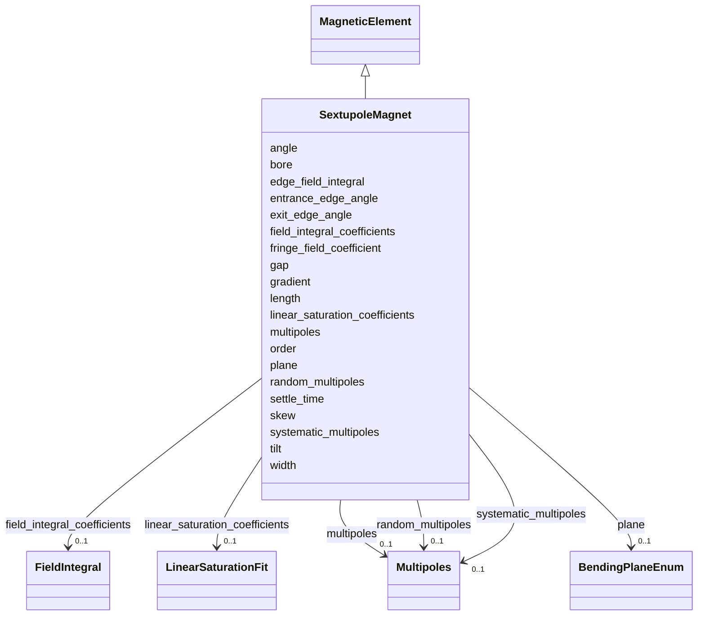

# Class: SextupoleMagnet 


_Sextupole magnet field, principal multipole order 2._


<div data-search-exclude markdown="1">


URI: [laura:SextupoleMagnet](https://w3id.org/laura/SextupoleMagnet)





## Inheritance
* [MagneticElement](MagneticElement.md)
    * **SextupoleMagnet**


## Slots

| Name | Cardinality and Range | Description | Inheritance |
| ---  | --- | --- | --- |
| [order](order.md) | 0..1 <br/> [Integer](Integer.md) | Principal multipole order (0 = dipole, 1 = quad, ?) | [MagneticElement](MagneticElement.md) |
| [skew](skew.md) | 0..1 <br/> [Boolean](Boolean.md) | Whether the magnet is rotated 45? to produce a skew field component | [MagneticElement](MagneticElement.md) |
| [length](length.md) | 0..1 <br/> [Double](Double.md) | Magnetic (effective) length [m] | [MagneticElement](MagneticElement.md) |
| [multipoles](multipoles.md) | 0..1 <br/> [Multipoles](Multipoles.md) | Integrated multipole field components | [MagneticElement](MagneticElement.md) |
| [systematic_multipoles](systematic_multipoles.md) | 0..1 <br/> [Multipoles](Multipoles.md) | Systematic (design) multipole errors at the reference radius | [MagneticElement](MagneticElement.md) |
| [random_multipoles](random_multipoles.md) | 0..1 <br/> [Multipoles](Multipoles.md) | Random multipole errors at the reference radius | [MagneticElement](MagneticElement.md) |
| [field_integral_coefficients](field_integral_coefficients.md) | 0..1 <br/> [FieldIntegral](FieldIntegral.md) | Polynomial calibration of integrated field vs | [MagneticElement](MagneticElement.md) |
| [linear_saturation_coefficients](linear_saturation_coefficients.md) | 0..1 <br/> [LinearSaturationFit](LinearSaturationFit.md) | Bi-linear saturation calibration | [MagneticElement](MagneticElement.md) |
| [settle_time](settle_time.md) | 0..1 <br/> [Double](Double.md) | Power-supply settle time after a change [s] | [MagneticElement](MagneticElement.md) |
| [entrance_edge_angle](entrance_edge_angle.md) | 0..1 <br/> [String](String.md)&nbsp;or&nbsp;<br />[Double](Double.md) | Fringe-field entrance edge angle [rad] | [MagneticElement](MagneticElement.md) |
| [exit_edge_angle](exit_edge_angle.md) | 0..1 <br/> [String](String.md)&nbsp;or&nbsp;<br />[Double](Double.md) | Fringe-field exit edge angle [rad] | [MagneticElement](MagneticElement.md) |
| [gap](gap.md) | 0..1 <br/> [Double](Double.md) | Full gap between pole faces [m] | [MagneticElement](MagneticElement.md) |
| [bore](bore.md) | 0..1 <br/> [Double](Double.md) | Magnet bore radius [m] | [MagneticElement](MagneticElement.md) |
| [plane](plane.md) | 0..1 <br/> [BendingPlaneEnum](BendingPlaneEnum.md) | Principal bending / focusing plane (``Horizontal``, ``Vertical``, or ``Combin... | [MagneticElement](MagneticElement.md) |
| [width](width.md) | 0..1 <br/> [Double](Double.md) | Physical width of the magnet in the bending plane [m] | [MagneticElement](MagneticElement.md) |
| [tilt](tilt.md) | 0..1 <br/> [Double](Double.md) | Global tilt about the beam axis [rad] | [MagneticElement](MagneticElement.md) |
| [edge_field_integral](edge_field_integral.md) | 0..1 <br/> [Double](Double.md) | Enge fringe-field integral parameter (dimensionless) | [MagneticElement](MagneticElement.md) |
| [fringe_field_coefficient](fringe_field_coefficient.md) | 0..1 <br/> [Double](Double.md) | Coefficient controlling the fringe-field roll-off rate | [MagneticElement](MagneticElement.md) |
| [gradient](gradient.md) | 0..1 <br/> [Double](Double.md) | Peak field gradient [T/m] (quads) or peak field [T] (dipoles) | [MagneticElement](MagneticElement.md) |
| [angle](angle.md) | 0..1 <br/> [Double](Double.md) | Integrated bending angle [rad] | [MagneticElement](MagneticElement.md) |


## Usages

| used by | used in | type | used |
| ---  | --- | --- | --- |
| [Sextupole](Sextupole.md) | [magnetic](magnetic.md) | range | [SextupoleMagnet](SextupoleMagnet.md) |


## Identifier and Mapping Information


### Schema Source


* from schema: https://w3id.org/laura/schema


## Mappings

| Mapping Type | Mapped Value |
| ---  | ---  |
| self | laura:SextupoleMagnet |
| native | laura:SextupoleMagnet |


## LinkML Source

<!-- TODO: investigate https://stackoverflow.com/questions/37606292/how-to-create-tabbed-code-blocks-in-mkdocs-or-sphinx -->

### Direct

<details>
```yaml
name: Sextupole_Magnet
description: Sextupole magnet field, principal multipole order 2.
from_schema: https://w3id.org/laura/schema
is_a: MagneticElement
slot_usage:
  order:
    name: order
    ifabsent: '2'
    equals_number: 2

```
</details>

### Induced

<details>
```yaml
name: Sextupole_Magnet
description: Sextupole magnet field, principal multipole order 2.
from_schema: https://w3id.org/laura/schema
is_a: MagneticElement
slot_usage:
  order:
    name: order
    ifabsent: '2'
    equals_number: 2
attributes:
  order:
    name: order
    description: Principal multipole order (0 = dipole, 1 = quad, ?).
    from_schema: https://w3id.org/laura/schema/magnetic
    ifabsent: '2'
    owner: Sextupole_Magnet
    domain_of:
    - Multipole
    - MagneticElement
    - Corrector_Magnet
    - Solenoid_Magnet
    range: integer
    minimum_value: -1
    equals_number: 2
  skew:
    name: skew
    description: Whether the magnet is rotated 45? to produce a skew field component.
    from_schema: https://w3id.org/laura/schema/magnetic
    ifabsent: 'False'
    owner: Sextupole_Magnet
    domain_of:
    - Multipole
    - MagneticElement
    range: boolean
  length:
    name: length
    description: Magnetic (effective) length [m].
    from_schema: https://w3id.org/laura/schema/magnetic
    aliases:
    - magnetic_length
    ifabsent: float(0)
    owner: Sextupole_Magnet
    domain_of:
    - PhysicalElement
    - MagneticElement
    - Corrector_Magnet
    - Solenoid_Magnet
    - Wiggler_Magnet
    - NonLinearLens_Magnet
    range: double
    minimum_value: 0.0
    unit:
      ucum_code: m
  multipoles:
    name: multipoles
    description: Integrated multipole field components.
    from_schema: https://w3id.org/laura/schema/magnetic
    rank: 1000
    owner: Sextupole_Magnet
    domain_of:
    - MagneticElement
    range: Multipoles
  systematic_multipoles:
    name: systematic_multipoles
    description: Systematic (design) multipole errors at the reference radius.
    from_schema: https://w3id.org/laura/schema/magnetic
    rank: 1000
    owner: Sextupole_Magnet
    domain_of:
    - MagneticElement
    range: Multipoles
  random_multipoles:
    name: random_multipoles
    description: Random multipole errors at the reference radius.
    from_schema: https://w3id.org/laura/schema/magnetic
    rank: 1000
    owner: Sextupole_Magnet
    domain_of:
    - MagneticElement
    range: Multipoles
  field_integral_coefficients:
    name: field_integral_coefficients
    description: Polynomial calibration of integrated field vs. current.
    from_schema: https://w3id.org/laura/schema/magnetic
    rank: 1000
    owner: Sextupole_Magnet
    domain_of:
    - MagneticElement
    - Solenoid_Magnet
    range: FieldIntegral
  linear_saturation_coefficients:
    name: linear_saturation_coefficients
    description: Bi-linear saturation calibration.
    from_schema: https://w3id.org/laura/schema/magnetic
    rank: 1000
    owner: Sextupole_Magnet
    domain_of:
    - MagneticElement
    - Solenoid_Magnet
    range: LinearSaturationFit
  settle_time:
    name: settle_time
    description: Power-supply settle time after a change [s].
    from_schema: https://w3id.org/laura/schema/magnetic
    rank: 1000
    owner: Sextupole_Magnet
    domain_of:
    - MagneticElement
    - Solenoid_Magnet
    range: double
    unit:
      ucum_code: s
  entrance_edge_angle:
    name: entrance_edge_angle
    description: Fringe-field entrance edge angle [rad].
    in_subset:
    - functional_parameters
    - bend_angle_reference
    from_schema: https://w3id.org/laura/schema/magnetic
    rank: 1000
    owner: Sextupole_Magnet
    domain_of:
    - MagneticElement
    range: string
    unit:
      ucum_code: rad
    any_of:
    - range: double
    - range: string
  exit_edge_angle:
    name: exit_edge_angle
    description: Fringe-field exit edge angle [rad].
    in_subset:
    - functional_parameters
    - bend_angle_reference
    from_schema: https://w3id.org/laura/schema/magnetic
    rank: 1000
    owner: Sextupole_Magnet
    domain_of:
    - MagneticElement
    range: string
    unit:
      ucum_code: rad
    any_of:
    - range: double
    - range: string
  gap:
    name: gap
    description: Full gap between pole faces [m].
    from_schema: https://w3id.org/laura/schema/magnetic
    rank: 1000
    ifabsent: float(0.032)
    owner: Sextupole_Magnet
    domain_of:
    - MagneticElement
    range: double
    minimum_value: 0.0
    unit:
      ucum_code: m
  bore:
    name: bore
    description: Magnet bore radius [m].
    from_schema: https://w3id.org/laura/schema/magnetic
    rank: 1000
    ifabsent: float(0.037)
    owner: Sextupole_Magnet
    domain_of:
    - MagneticElement
    range: double
    minimum_value: 0.0
    unit:
      ucum_code: m
  plane:
    name: plane
    description: Principal bending / focusing plane (``Horizontal``, ``Vertical``,
      or ``Combined``).
    from_schema: https://w3id.org/laura/schema/magnetic
    rank: 1000
    ifabsent: string(Horizontal)
    owner: Sextupole_Magnet
    domain_of:
    - MagneticElement
    range: BendingPlaneEnum
  width:
    name: width
    description: Physical width of the magnet in the bending plane [m].
    from_schema: https://w3id.org/laura/schema/magnetic
    ifabsent: float(0.2)
    owner: Sextupole_Magnet
    domain_of:
    - BeamBeamSimulationElement
    - MagneticElement
    range: double
    unit:
      ucum_code: m
  tilt:
    name: tilt
    description: Global tilt about the beam axis [rad].
    from_schema: https://w3id.org/laura/schema/magnetic
    ifabsent: float(0.0)
    owner: Sextupole_Magnet
    domain_of:
    - ElectrostaticSeparatorSimulationElement
    - MagneticElement
    - Corrector_Magnet
    range: double
    unit:
      ucum_code: rad
  edge_field_integral:
    name: edge_field_integral
    description: Enge fringe-field integral parameter (dimensionless).
    from_schema: https://w3id.org/laura/schema/magnetic
    ifabsent: float(0.5)
    owner: Sextupole_Magnet
    domain_of:
    - MagnetSimulationElement
    - MagneticElement
    range: double
  fringe_field_coefficient:
    name: fringe_field_coefficient
    description: Coefficient controlling the fringe-field roll-off rate.
    from_schema: https://w3id.org/laura/schema/magnetic
    rank: 1000
    ifabsent: float(0.0)
    owner: Sextupole_Magnet
    domain_of:
    - MagneticElement
    range: double
  gradient:
    name: gradient
    description: Peak field gradient [T/m] (quads) or peak field [T] (dipoles).
    from_schema: https://w3id.org/laura/schema/magnetic
    rank: 1000
    owner: Sextupole_Magnet
    domain_of:
    - MagneticElement
    range: double
    unit:
      ucum_code: T.m-1
  angle:
    name: angle
    description: 'Integrated bending angle [rad]. Dipoles only. Part of the data model
      (lattice YAML may set it), but derived from multipoles.K0L rather than stored:
      the MagneticElement wrapper implements it as a read/write property so a symbolic
      bend angle survives round-tripping and reads follow the global resolution mode.
      Listed in _PYDANTIC_EXCLUDED_SLOTS in generate_pydantic.py so the generated
      base does not also declare it as a field, which would make pydantic treat the
      property object as the field default.'
    from_schema: https://w3id.org/laura/schema/magnetic
    rank: 1000
    owner: Sextupole_Magnet
    domain_of:
    - MagneticElement
    range: double
    unit:
      ucum_code: rad

```
</details></div>