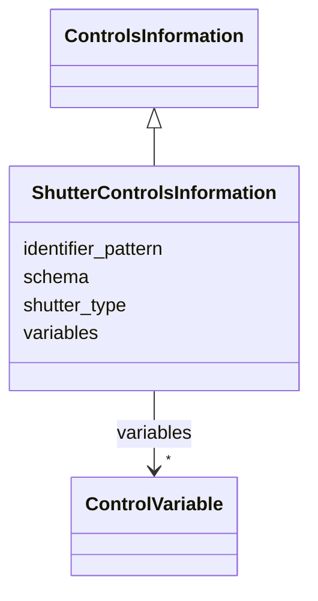

# Class: ShutterControlsInformation 


_Control interface of a beam or laser shutter._


<div data-search-exclude markdown="1">


URI: [laura:ShutterControlsInformation](https://w3id.org/laura/ShutterControlsInformation)





## Inheritance
* [ControlsInformation](ControlsInformation.md)
    * **ShutterControlsInformation**


## Class Properties

| Property | Value |
| --- | --- |
| Class URI | [laura:ShutterControlsInformation](https://w3id.org/laura/ShutterControlsInformation) |


## Slots

| Name | Cardinality and Range | Description | Inheritance |
| ---  | --- | --- | --- |
| [shutter_type](shutter_type.md) | 0..1 <br/> [String](String.md) | What the shutter blocks, e | direct |
| [variables](variables.md) | * <br/> [ControlVariable](ControlVariable.md) | Named control variables keyed by logical name | [ControlsInformation](ControlsInformation.md) |
| [schema](schema.md) | 0..1 <br/> [String](String.md) | The shared controls schema file ``variables`` was expanded from, if any | [ControlsInformation](ControlsInformation.md) |
| [identifier_pattern](identifier_pattern.md) | 0..1 <br/> [String](String.md) | What ``{name}`` in that file was substituted with, where it was not the eleme... | [ControlsInformation](ControlsInformation.md) |


## Usages

| used by | used in | type | used |
| ---  | --- | --- | --- |
| [Shutter](Shutter.md) | [controls](controls.md) | range | [ShutterControlsInformation](ShutterControlsInformation.md) |


## Identifier and Mapping Information


### Schema Source


* from schema: https://w3id.org/laura/schema


## Mappings

| Mapping Type | Mapped Value |
| ---  | ---  |
| self | laura:ShutterControlsInformation |
| native | laura:ShutterControlsInformation |


## LinkML Source

<!-- TODO: investigate https://stackoverflow.com/questions/37606292/how-to-create-tabbed-code-blocks-in-mkdocs-or-sphinx -->

### Direct

<details>
```yaml
name: ShutterControlsInformation
description: Control interface of a beam or laser shutter.
from_schema: https://w3id.org/laura/schema
is_a: ControlsInformation
attributes:
  shutter_type:
    name: shutter_type
    description: What the shutter blocks, e.g. ``BEAM`` or ``LASER``.
    from_schema: https://w3id.org/laura/schema/controls
    rank: 1000
    ifabsent: string(Unknown)
    domain_of:
    - ShutterControlsInformation
    range: string
class_uri: laura:ShutterControlsInformation

```
</details>

### Induced

<details>
```yaml
name: ShutterControlsInformation
description: Control interface of a beam or laser shutter.
from_schema: https://w3id.org/laura/schema
is_a: ControlsInformation
attributes:
  shutter_type:
    name: shutter_type
    description: What the shutter blocks, e.g. ``BEAM`` or ``LASER``.
    from_schema: https://w3id.org/laura/schema/controls
    rank: 1000
    ifabsent: string(Unknown)
    owner: ShutterControlsInformation
    domain_of:
    - ShutterControlsInformation
    range: string
  variables:
    name: variables
    description: Named control variables keyed by logical name.
    from_schema: https://w3id.org/laura/schema/controls
    rank: 1000
    owner: ShutterControlsInformation
    domain_of:
    - ControlsInformation
    range: ControlVariable
    multivalued: true
    inlined: true
    inlined_as_list: false
  schema:
    name: schema
    description: 'The shared controls schema file ``variables`` was expanded from,
      if any.  Kept only as a record of where they came from: the expansion happens
      while the element YAML is read, so ``variables`` is always already resolved
      by the time anything sees this class.'
    from_schema: https://w3id.org/laura/schema/controls
    rank: 1000
    owner: ShutterControlsInformation
    domain_of:
    - ControlsInformation
    range: string
  identifier_pattern:
    name: identifier_pattern
    description: What ``{name}`` in that file was substituted with, where it was not
      the element's own name.
    from_schema: https://w3id.org/laura/schema/controls
    rank: 1000
    owner: ShutterControlsInformation
    domain_of:
    - ControlsInformation
    range: string
class_uri: laura:ShutterControlsInformation

```
</details></div>