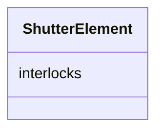

# Class: ShutterElement 


_Shutter interlock configuration._


<div data-search-exclude markdown="1">


URI: [laura:ShutterElement](https://w3id.org/laura/ShutterElement)





<!-- no inheritance hierarchy -->

## Class Properties

| Property | Value |
| --- | --- |
| Class URI | [laura:ShutterElement](https://w3id.org/laura/ShutterElement) |


## Slots

| Name | Cardinality and Range | Description | Inheritance |
| ---  | --- | --- | --- |
| [interlocks](interlocks.md) | * <br/> [String](String.md) | Names of the interlocks guarding this shutter | direct |


## Usages

| used by | used in | type | used |
| ---  | --- | --- | --- |
| [Shutter](Shutter.md) | [shutter](shutter.md) | range | [ShutterElement](ShutterElement.md) |


## Identifier and Mapping Information


### Schema Source


* from schema: https://w3id.org/laura/schema


## Mappings

| Mapping Type | Mapped Value |
| ---  | ---  |
| self | laura:ShutterElement |
| native | laura:ShutterElement |


## LinkML Source

<!-- TODO: investigate https://stackoverflow.com/questions/37606292/how-to-create-tabbed-code-blocks-in-mkdocs-or-sphinx -->

### Direct

<details>
```yaml
name: ShutterElement
description: Shutter interlock configuration.
from_schema: https://w3id.org/laura/schema
attributes:
  interlocks:
    name: interlocks
    description: Names of the interlocks guarding this shutter.
    from_schema: https://w3id.org/laura/schema/elements
    aliases:
    - shutter_interlock_names
    rank: 1000
    domain_of:
    - ShutterElement
    range: string
    multivalued: true
class_uri: laura:ShutterElement

```
</details>

### Induced

<details>
```yaml
name: ShutterElement
description: Shutter interlock configuration.
from_schema: https://w3id.org/laura/schema
attributes:
  interlocks:
    name: interlocks
    description: Names of the interlocks guarding this shutter.
    from_schema: https://w3id.org/laura/schema/elements
    aliases:
    - shutter_interlock_names
    rank: 1000
    owner: ShutterElement
    domain_of:
    - ShutterElement
    range: string
    multivalued: true
class_uri: laura:ShutterElement

```
</details></div>