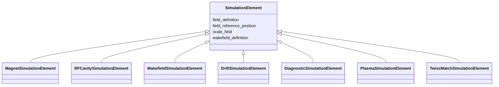

---
search:
  boost: 10.0
---

# Class: SimulationElement 


_Base simulation attributes: field-map files and reference positions for tracking codes._


<div data-search-exclude markdown="1">


URI: [laura:SimulationElement](https://w3id.org/laura/SimulationElement)





## Inheritance
* **SimulationElement**
    * [MagnetSimulationElement](MagnetSimulationElement.md)
    * [RFCavitySimulationElement](RFCavitySimulationElement.md)
    * [WakefieldSimulationElement](WakefieldSimulationElement.md)
    * [DriftSimulationElement](DriftSimulationElement.md)
    * [DiagnosticSimulationElement](DiagnosticSimulationElement.md)
    * [PlasmaSimulationElement](PlasmaSimulationElement.md)
    * [TwissMatchSimulationElement](TwissMatchSimulationElement.md)


## Class Properties

| Property | Value |
| --- | --- |
| Class URI | [laura:SimulationElement](https://w3id.org/laura/SimulationElement) |


## Slots

| Name | Cardinality and Range | Description | Inheritance |
| ---  | --- | --- | --- |
| [field_definition](field_definition.md) | 0..1 <br/> [String](String.md) | Path to the 3-D field-map file | direct |
| [wakefield_definition](wakefield_definition.md) | 0..1 <br/> [String](String.md) | Path to the wakefield impedance file | direct |
| [field_reference_position](field_reference_position.md) | 0..1 <br/> [Float](Float.md) | Longitudinal origin of the field map [m] | direct |
| [scale_field](scale_field.md) | 0..1 <br/> [Float](Float.md) | Multiplicative scale factor applied to the field map | direct |


## Usages

| used by | used in | type | used |
| ---  | --- | --- | --- |
| [StandardElement](StandardElement.md) | [simulation](simulation.md) | range | [SimulationElement](SimulationElement.md) |
| [PhysicalAcceleratorElement](PhysicalAcceleratorElement.md) | [simulation](simulation.md) | range | [SimulationElement](SimulationElement.md) |
| [LowLevelRF](LowLevelRF.md) | [simulation](simulation.md) | range | [SimulationElement](SimulationElement.md) |
| [RFModulator](RFModulator.md) | [simulation](simulation.md) | range | [SimulationElement](SimulationElement.md) |
| [RFProtection](RFProtection.md) | [simulation](simulation.md) | range | [SimulationElement](SimulationElement.md) |
| [RFHeartbeat](RFHeartbeat.md) | [simulation](simulation.md) | range | [SimulationElement](SimulationElement.md) |
| [PID](PID.md) | [simulation](simulation.md) | range | [SimulationElement](SimulationElement.md) |
| [Stage](Stage.md) | [simulation](simulation.md) | range | [SimulationElement](SimulationElement.md) |
| [VacuumGauge](VacuumGauge.md) | [simulation](simulation.md) | range | [SimulationElement](SimulationElement.md) |
| [Laser](Laser.md) | [simulation](simulation.md) | range | [SimulationElement](SimulationElement.md) |
| [Shutter](Shutter.md) | [simulation](simulation.md) | range | [SimulationElement](SimulationElement.md) |
| [Valve](Valve.md) | [simulation](simulation.md) | range | [SimulationElement](SimulationElement.md) |
| [Marker](Marker.md) | [simulation](simulation.md) | range | [SimulationElement](SimulationElement.md) |
| [Aperture](Aperture.md) | [simulation](simulation.md) | range | [SimulationElement](SimulationElement.md) |
| [Collimator](Collimator.md) | [simulation](simulation.md) | range | [SimulationElement](SimulationElement.md) |
| [LaserEnergyMeter](LaserEnergyMeter.md) | [simulation](simulation.md) | range | [SimulationElement](SimulationElement.md) |
| [LaserHalfWavePlate](LaserHalfWavePlate.md) | [simulation](simulation.md) | range | [SimulationElement](SimulationElement.md) |
| [LaserMirror](LaserMirror.md) | [simulation](simulation.md) | range | [SimulationElement](SimulationElement.md) |
| [LaserAttenuator](LaserAttenuator.md) | [simulation](simulation.md) | range | [SimulationElement](SimulationElement.md) |
| [Lighting](Lighting.md) | [simulation](simulation.md) | range | [SimulationElement](SimulationElement.md) |


## Identifier and Mapping Information


### Schema Source


* from schema: https://w3id.org/laura/schema


## Mappings

| Mapping Type | Mapped Value |
| ---  | ---  |
| self | laura:SimulationElement |
| native | laura:SimulationElement |


## LinkML Source

<!-- TODO: investigate https://stackoverflow.com/questions/37606292/how-to-create-tabbed-code-blocks-in-mkdocs-or-sphinx -->

### Direct

<details>
```yaml
name: SimulationElement
description: 'Base simulation attributes: field-map files and reference positions
  for tracking codes.'
from_schema: https://w3id.org/laura/schema
attributes:
  field_definition:
    name: field_definition
    description: Path to the 3-D field-map file.
    from_schema: https://w3id.org/laura/schema
    rank: 1000
    domain_of:
    - SimulationElement
    range: string
  wakefield_definition:
    name: wakefield_definition
    description: Path to the wakefield impedance file.
    from_schema: https://w3id.org/laura/schema
    rank: 1000
    domain_of:
    - SimulationElement
    range: string
  field_reference_position:
    name: field_reference_position
    description: Longitudinal origin of the field map [m].
    from_schema: https://w3id.org/laura/schema
    rank: 1000
    domain_of:
    - SimulationElement
    range: float
    unit:
      ucum_code: m
  scale_field:
    name: scale_field
    description: Multiplicative scale factor applied to the field map.
    from_schema: https://w3id.org/laura/schema
    rank: 1000
    domain_of:
    - SimulationElement
    range: float
class_uri: laura:SimulationElement

```
</details>

### Induced

<details>
```yaml
name: SimulationElement
description: 'Base simulation attributes: field-map files and reference positions
  for tracking codes.'
from_schema: https://w3id.org/laura/schema
attributes:
  field_definition:
    name: field_definition
    description: Path to the 3-D field-map file.
    from_schema: https://w3id.org/laura/schema
    rank: 1000
    owner: SimulationElement
    domain_of:
    - SimulationElement
    range: string
  wakefield_definition:
    name: wakefield_definition
    description: Path to the wakefield impedance file.
    from_schema: https://w3id.org/laura/schema
    rank: 1000
    owner: SimulationElement
    domain_of:
    - SimulationElement
    range: string
  field_reference_position:
    name: field_reference_position
    description: Longitudinal origin of the field map [m].
    from_schema: https://w3id.org/laura/schema
    rank: 1000
    owner: SimulationElement
    domain_of:
    - SimulationElement
    range: float
    unit:
      ucum_code: m
  scale_field:
    name: scale_field
    description: Multiplicative scale factor applied to the field map.
    from_schema: https://w3id.org/laura/schema
    rank: 1000
    owner: SimulationElement
    domain_of:
    - SimulationElement
    range: float
class_uri: laura:SimulationElement

```
</details></div>