# Class: SimulationElement


_Base simulation attributes: field-map files, reference positions, and optional tracking controls for simulation codes._


<div data-search-exclude markdown="1">


URI: [laura:SimulationElement](https://w3id.org/laura/SimulationElement)

```mermaid
 classDiagram
    class SimulationElement
    click SimulationElement href "../SimulationElement/"
      SimulationElement <|-- MagnetSimulationElement
        click MagnetSimulationElement href "../MagnetSimulationElement/"
      SimulationElement <|-- RFCavitySimulationElement
        click RFCavitySimulationElement href "../RFCavitySimulationElement/"
      SimulationElement <|-- WakefieldSimulationElement
        click WakefieldSimulationElement href "../WakefieldSimulationElement/"
      SimulationElement <|-- DriftSimulationElement
        click DriftSimulationElement href "../DriftSimulationElement/"
      SimulationElement <|-- DiagnosticSimulationElement
        click DiagnosticSimulationElement href "../DiagnosticSimulationElement/"
      SimulationElement <|-- PlasmaSimulationElement
        click PlasmaSimulationElement href "../PlasmaSimulationElement/"
      SimulationElement <|-- TwissMatchSimulationElement
        click TwissMatchSimulationElement href "../TwissMatchSimulationElement/"
      SimulationElement <|-- MatrixTransformSimulationElement
        click MatrixTransformSimulationElement href "../MatrixTransformSimulationElement/"
      SimulationElement <|-- ElectrostaticSeparatorSimulationElement
        click ElectrostaticSeparatorSimulationElement href "../ElectrostaticSeparatorSimulationElement/"
      SimulationElement <|-- ACDipoleSimulationElement
        click ACDipoleSimulationElement href "../ACDipoleSimulationElement/"
      SimulationElement <|-- WireSimulationElement
        click WireSimulationElement href "../WireSimulationElement/"
      SimulationElement <|-- BeamBeamSimulationElement
        click BeamBeamSimulationElement href "../BeamBeamSimulationElement/"
      SimulationElement <|-- RFMultipoleSimulationElement
        click RFMultipoleSimulationElement href "../RFMultipoleSimulationElement/"

      SimulationElement : csr_enable

      SimulationElement : csr_method

      SimulationElement : csrdz

      SimulationElement : deltaL

      SimulationElement : field_definition

      SimulationElement : field_reference_position

      SimulationElement : horizontal_offset

      SimulationElement : integration_order

      SimulationElement : lsc_bins

      SimulationElement : lsc_enable

      SimulationElement : mat6_calc_method

      SimulationElement : n_kicks

      SimulationElement : num_steps

      SimulationElement : scale_field

      SimulationElement : smooth

      SimulationElement : space_charge_method

      SimulationElement : spin_tracking_method

      SimulationElement : tracking_method

      SimulationElement : vertical_offset

      SimulationElement : wakefield_definition

      SimulationElement : wakefield_enable


```





## Inheritance
* **SimulationElement**
    * [MagnetSimulationElement](MagnetSimulationElement.md)
    * [RFCavitySimulationElement](RFCavitySimulationElement.md)
    * [WakefieldSimulationElement](WakefieldSimulationElement.md)
    * [DriftSimulationElement](DriftSimulationElement.md)
    * [DiagnosticSimulationElement](DiagnosticSimulationElement.md)
    * [PlasmaSimulationElement](PlasmaSimulationElement.md)
    * [TwissMatchSimulationElement](TwissMatchSimulationElement.md)
    * [MatrixTransformSimulationElement](MatrixTransformSimulationElement.md)
    * [ElectrostaticSeparatorSimulationElement](ElectrostaticSeparatorSimulationElement.md)
    * [ACDipoleSimulationElement](ACDipoleSimulationElement.md)
    * [WireSimulationElement](WireSimulationElement.md)
    * [BeamBeamSimulationElement](BeamBeamSimulationElement.md)
    * [RFMultipoleSimulationElement](RFMultipoleSimulationElement.md)


## Class Properties

| Property | Value |
| --- | --- |
| Class URI | [laura:SimulationElement](https://w3id.org/laura/SimulationElement) |


## Slots

| Name | Cardinality and Range | Description | Inheritance |
| ---  | --- | --- | --- |
| [n_kicks](n_kicks.md) | 0..1 <br/> [Integer](Integer.md) | Number of integration kicks | direct |
| [lsc_bins](lsc_bins.md) | 0..1 <br/> [Integer](Integer.md) | Number of bins used in longitudinal space-charge calculations | direct |
| [csr_enable](csr_enable.md) | 0..1 <br/> [Boolean](Boolean.md) | Whether coherent synchrotron radiation effects are enabled | direct |
| [lsc_enable](lsc_enable.md) | 0..1 <br/> [Boolean](Boolean.md) | Whether longitudinal space-charge effects are enabled | direct |
| [tracking_method](tracking_method.md) | 0..1 <br/> [String](String.md) | Phase-space tracking algorithm requested from the target code | direct |
| [mat6_calc_method](mat6_calc_method.md) | 0..1 <br/> [String](String.md) | Method used to calculate the element's 6x6 transfer matrix | direct |
| [spin_tracking_method](spin_tracking_method.md) | 0..1 <br/> [String](String.md) | Spin-tracking algorithm requested from the target code | direct |
| [integration_order](integration_order.md) | 0..1 <br/> [Integer](Integer.md) | Order of the target code's integration formula | direct |
| [num_steps](num_steps.md) | 0..1 <br/> [Integer](Integer.md) | Number of integration steps through the element | direct |
| [deltaL](deltaL.md) | 0..1 <br/> [Float](Float.md) | Longitudinal integration step size [m] | direct |
| [csr_method](csr_method.md) | 0..1 <br/> [String](String.md) | Coherent-synchrotron-radiation tracking method | direct |
| [space_charge_method](space_charge_method.md) | 0..1 <br/> [String](String.md) | Space-charge tracking method | direct |
| [csrdz](csrdz.md) | 0..1 <br/> [Float](Float.md) | Longitudinal step size between CSR kicks [m] | direct |
| [smooth](smooth.md) | 0..1 <br/> [Float](Float.md)&nbsp;or&nbsp;<br />[Integer](Integer.md) | Smoothing control for field or wake interpolation | direct |
| [horizontal_offset](horizontal_offset.md) | 0..1 <br/> [Float](Float.md) | Horizontal simulation offset from the reference orbit [m] | direct |
| [vertical_offset](vertical_offset.md) | 0..1 <br/> [Float](Float.md) | Vertical simulation offset from the reference orbit [m] | direct |
| [field_definition](field_definition.md) | 0..1 <br/> [String](String.md) | Path to the 3-D field-map file | direct |
| [wakefield_definition](wakefield_definition.md) | 0..1 <br/> [String](String.md) | Path to the wakefield impedance file | direct |
| [wakefield_enable](wakefield_enable.md) | 0..1 <br/> [Boolean](Boolean.md) | Whether the wakefield named by wakefield_definition is applied | direct |
| [field_reference_position](field_reference_position.md) | 0..1 <br/> [String](String.md) | Longitudinal origin of the field map [m] | direct |
| [scale_field](scale_field.md) | 0..1 <br/> [Float](Float.md) | Multiplicative scale factor applied to the field map | direct |


## Usages

| used by | used in | type | used |
| ---  | --- | --- | --- |
| [StandardElement](StandardElement.md) | [simulation](simulation.md) | range | [SimulationElement](SimulationElement.md) |
| [Element](Element.md) | [simulation](simulation.md) | range | [SimulationElement](SimulationElement.md) |
| [PhysicalAcceleratorElement](PhysicalAcceleratorElement.md) | [simulation](simulation.md) | range | [SimulationElement](SimulationElement.md) |
| [Stage](Stage.md) | [simulation](simulation.md) | range | [SimulationElement](SimulationElement.md) |
| [VacuumGauge](VacuumGauge.md) | [simulation](simulation.md) | range | [SimulationElement](SimulationElement.md) |
| [Laser](Laser.md) | [simulation](simulation.md) | range | [SimulationElement](SimulationElement.md) |
| [Shutter](Shutter.md) | [simulation](simulation.md) | range | [SimulationElement](SimulationElement.md) |
| [Valve](Valve.md) | [simulation](simulation.md) | range | [SimulationElement](SimulationElement.md) |
| [Marker](Marker.md) | [simulation](simulation.md) | range | [SimulationElement](SimulationElement.md) |
| [Aperture](Aperture.md) | [simulation](simulation.md) | range | [SimulationElement](SimulationElement.md) |
| [Collimator](Collimator.md) | [simulation](simulation.md) | range | [SimulationElement](SimulationElement.md) |
| [Lighting](Lighting.md) | [simulation](simulation.md) | range | [SimulationElement](SimulationElement.md) |
| [PowerSupply](PowerSupply.md) | [simulation](simulation.md) | range | [SimulationElement](SimulationElement.md) |
| [LowLevelRF](LowLevelRF.md) | [simulation](simulation.md) | range | [SimulationElement](SimulationElement.md) |
| [RFModulator](RFModulator.md) | [simulation](simulation.md) | range | [SimulationElement](SimulationElement.md) |
| [RFProtection](RFProtection.md) | [simulation](simulation.md) | range | [SimulationElement](SimulationElement.md) |
| [RFHeartbeat](RFHeartbeat.md) | [simulation](simulation.md) | range | [SimulationElement](SimulationElement.md) |
| [PID](PID.md) | [simulation](simulation.md) | range | [SimulationElement](SimulationElement.md) |
| [LaserEnergyMeter](LaserEnergyMeter.md) | [simulation](simulation.md) | range | [SimulationElement](SimulationElement.md) |
| [LaserHalfWavePlate](LaserHalfWavePlate.md) | [simulation](simulation.md) | range | [SimulationElement](SimulationElement.md) |
| [LaserMirror](LaserMirror.md) | [simulation](simulation.md) | range | [SimulationElement](SimulationElement.md) |
| [LaserAttenuator](LaserAttenuator.md) | [simulation](simulation.md) | range | [SimulationElement](SimulationElement.md) |


## Identifier and Mapping Information


### Schema Source


* from schema: https://w3id.org/laura/schema


## Mappings

| Mapping Type | Mapped Value |
| ---  | ---  |
| self | laura:SimulationElement |
| native | laura:SimulationElement |


## LinkML Source

<!-- TODO: investigate https://stackoverflow.com/questions/37606292/how-to-create-tabbed-code-blocks-in-mkdocs-or-sphinx -->

### Direct

<details>
```yaml
name: SimulationElement
description: 'Base simulation attributes: field-map files, reference positions, and
  optional tracking controls for simulation codes.'
from_schema: https://w3id.org/laura/schema
slots:
- n_kicks
- lsc_bins
- csr_enable
- lsc_enable
- tracking_method
- mat6_calc_method
- spin_tracking_method
- integration_order
- num_steps
- deltaL
- csr_method
- space_charge_method
- csrdz
- smooth
- horizontal_offset
- vertical_offset
attributes:
  field_definition:
    name: field_definition
    description: Path to the 3-D field-map file.
    from_schema: https://w3id.org/laura/schema/simulation
    rank: 1000
    domain_of:
    - SimulationElement
    range: string
  wakefield_definition:
    name: wakefield_definition
    description: Path to the wakefield impedance file.
    from_schema: https://w3id.org/laura/schema/simulation
    rank: 1000
    domain_of:
    - SimulationElement
    range: string
  wakefield_enable:
    name: wakefield_enable
    description: Whether the wakefield named by wakefield_definition is applied. Set
      false to track the element without its wakefield while keeping the definition
      itself.
    from_schema: https://w3id.org/laura/schema/simulation
    rank: 1000
    ifabsent: 'true'
    domain_of:
    - SimulationElement
    range: boolean
  field_reference_position:
    name: field_reference_position
    description: Longitudinal origin of the field map [m].
    from_schema: https://w3id.org/laura/schema/simulation
    rank: 1000
    domain_of:
    - SimulationElement
    range: string
  scale_field:
    name: scale_field
    description: Multiplicative scale factor applied to the field map.
    from_schema: https://w3id.org/laura/schema/simulation
    rank: 1000
    ifabsent: float(1)
    domain_of:
    - SimulationElement
    range: float
class_uri: laura:SimulationElement

```
</details>

### Induced

<details>
```yaml
name: SimulationElement
description: 'Base simulation attributes: field-map files, reference positions, and
  optional tracking controls for simulation codes.'
from_schema: https://w3id.org/laura/schema
attributes:
  field_definition:
    name: field_definition
    description: Path to the 3-D field-map file.
    from_schema: https://w3id.org/laura/schema/simulation
    rank: 1000
    owner: SimulationElement
    domain_of:
    - SimulationElement
    range: string
  wakefield_definition:
    name: wakefield_definition
    description: Path to the wakefield impedance file.
    from_schema: https://w3id.org/laura/schema/simulation
    rank: 1000
    owner: SimulationElement
    domain_of:
    - SimulationElement
    range: string
  wakefield_enable:
    name: wakefield_enable
    description: Whether the wakefield named by wakefield_definition is applied. Set
      false to track the element without its wakefield while keeping the definition
      itself.
    from_schema: https://w3id.org/laura/schema/simulation
    rank: 1000
    ifabsent: 'true'
    owner: SimulationElement
    domain_of:
    - SimulationElement
    range: boolean
  field_reference_position:
    name: field_reference_position
    description: Longitudinal origin of the field map [m].
    from_schema: https://w3id.org/laura/schema/simulation
    rank: 1000
    owner: SimulationElement
    domain_of:
    - SimulationElement
    range: string
  scale_field:
    name: scale_field
    description: Multiplicative scale factor applied to the field map.
    from_schema: https://w3id.org/laura/schema/simulation
    rank: 1000
    ifabsent: float(1)
    owner: SimulationElement
    domain_of:
    - SimulationElement
    range: float
  n_kicks:
    name: n_kicks
    description: Number of integration kicks.
    from_schema: https://w3id.org/laura/schema
    rank: 1000
    owner: SimulationElement
    domain_of:
    - SimulationElement
    range: integer
  lsc_bins:
    name: lsc_bins
    description: Number of bins used in longitudinal space-charge calculations.
    from_schema: https://w3id.org/laura/schema
    rank: 1000
    owner: SimulationElement
    domain_of:
    - SimulationElement
    range: integer
  csr_enable:
    name: csr_enable
    description: Whether coherent synchrotron radiation effects are enabled.
    from_schema: https://w3id.org/laura/schema
    rank: 1000
    ifabsent: 'true'
    owner: SimulationElement
    domain_of:
    - SimulationElement
    range: boolean
  lsc_enable:
    name: lsc_enable
    description: Whether longitudinal space-charge effects are enabled.
    from_schema: https://w3id.org/laura/schema
    rank: 1000
    ifabsent: 'true'
    owner: SimulationElement
    domain_of:
    - SimulationElement
    range: boolean
  tracking_method:
    name: tracking_method
    description: Phase-space tracking algorithm requested from the target code.
    from_schema: https://w3id.org/laura/schema
    rank: 1000
    owner: SimulationElement
    domain_of:
    - SimulationElement
    range: string
  mat6_calc_method:
    name: mat6_calc_method
    description: Method used to calculate the element's 6x6 transfer matrix.
    from_schema: https://w3id.org/laura/schema
    rank: 1000
    owner: SimulationElement
    domain_of:
    - SimulationElement
    range: string
  spin_tracking_method:
    name: spin_tracking_method
    description: Spin-tracking algorithm requested from the target code.
    from_schema: https://w3id.org/laura/schema
    rank: 1000
    owner: SimulationElement
    domain_of:
    - SimulationElement
    range: string
  integration_order:
    name: integration_order
    description: Order of the target code's integration formula.
    from_schema: https://w3id.org/laura/schema
    aliases:
    - integrator_order
    rank: 1000
    owner: SimulationElement
    domain_of:
    - SimulationElement
    range: integer
    minimum_value: 1
  num_steps:
    name: num_steps
    description: Number of integration steps through the element.
    from_schema: https://w3id.org/laura/schema
    rank: 1000
    owner: SimulationElement
    domain_of:
    - SimulationElement
    range: integer
    minimum_value: 1
  deltaL:
    name: deltaL
    description: Longitudinal integration step size [m].
    from_schema: https://w3id.org/laura/schema
    aliases:
    - ds_step
    rank: 1000
    owner: SimulationElement
    domain_of:
    - SimulationElement
    range: float
    minimum_value: 0
    unit:
      ucum_code: m
  csr_method:
    name: csr_method
    description: Coherent-synchrotron-radiation tracking method.
    from_schema: https://w3id.org/laura/schema
    rank: 1000
    owner: SimulationElement
    domain_of:
    - SimulationElement
    range: string
  space_charge_method:
    name: space_charge_method
    description: Space-charge tracking method.
    from_schema: https://w3id.org/laura/schema
    rank: 1000
    owner: SimulationElement
    domain_of:
    - SimulationElement
    range: string
  csrdz:
    name: csrdz
    description: Longitudinal step size between CSR kicks [m].
    from_schema: https://w3id.org/laura/schema
    aliases:
    - csr_ds_step
    rank: 1000
    owner: SimulationElement
    domain_of:
    - SimulationElement
    range: float
    minimum_value: 0
    unit:
      ucum_code: m
  smooth:
    name: smooth
    description: Smoothing control for field or wake interpolation.
    from_schema: https://w3id.org/laura/schema
    rank: 1000
    owner: SimulationElement
    domain_of:
    - SimulationElement
    range: float
    any_of:
    - range: integer
    - range: float
  horizontal_offset:
    name: horizontal_offset
    description: Horizontal simulation offset from the reference orbit [m].
    from_schema: https://w3id.org/laura/schema
    rank: 1000
    ifabsent: float(0.0)
    owner: SimulationElement
    domain_of:
    - SimulationElement
    range: float
    unit:
      ucum_code: m
  vertical_offset:
    name: vertical_offset
    description: Vertical simulation offset from the reference orbit [m].
    from_schema: https://w3id.org/laura/schema
    rank: 1000
    ifabsent: float(0.0)
    owner: SimulationElement
    domain_of:
    - SimulationElement
    range: float
    unit:
      ucum_code: m
class_uri: laura:SimulationElement

```
</details></div>