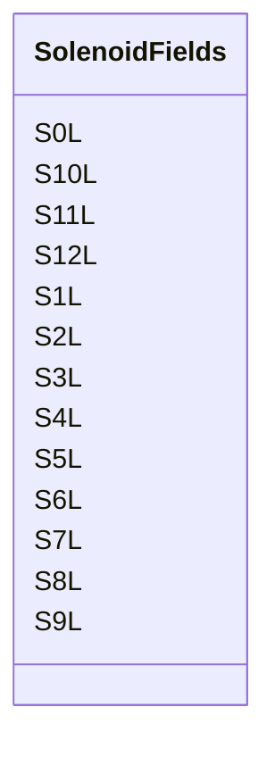

# Class: SolenoidFields 


_Solenoid integrated axial field components ``S0L``–``S12L`` [T.m]._


<div data-search-exclude markdown="1">


URI: [laura:SolenoidFields](https://w3id.org/laura/SolenoidFields)





<!-- no inheritance hierarchy -->

## Class Properties

| Property | Value |
| --- | --- |
| Class URI | [laura:SolenoidFields](https://w3id.org/laura/SolenoidFields) |


## Slots

| Name | Cardinality and Range | Description | Inheritance |
| ---  | --- | --- | --- |
| [S0L](S0L.md) | 0..1 <br/> [Float](Float.md) | Integrated solenoid field, order 0 [T | direct |
| [S1L](S1L.md) | 0..1 <br/> [Float](Float.md) | Integrated solenoid field, order 1 [T | direct |
| [S2L](S2L.md) | 0..1 <br/> [Float](Float.md) | Integrated solenoid field, order 2 [T | direct |
| [S3L](S3L.md) | 0..1 <br/> [Float](Float.md) | Integrated solenoid field, order 3 [T | direct |
| [S4L](S4L.md) | 0..1 <br/> [Float](Float.md) | Integrated solenoid field, order 4 [T | direct |
| [S5L](S5L.md) | 0..1 <br/> [Float](Float.md) | Integrated solenoid field, order 5 [T | direct |
| [S6L](S6L.md) | 0..1 <br/> [Float](Float.md) | Integrated solenoid field, order 6 [T | direct |
| [S7L](S7L.md) | 0..1 <br/> [Float](Float.md) | Integrated solenoid field, order 7 [T | direct |
| [S8L](S8L.md) | 0..1 <br/> [Float](Float.md) | Integrated solenoid field, order 8 [T | direct |
| [S9L](S9L.md) | 0..1 <br/> [Float](Float.md) | Integrated solenoid field, order 9 [T | direct |
| [S10L](S10L.md) | 0..1 <br/> [Float](Float.md) | Integrated solenoid field, order 10 [T | direct |
| [S11L](S11L.md) | 0..1 <br/> [Float](Float.md) | Integrated solenoid field, order 11 [T | direct |
| [S12L](S12L.md) | 0..1 <br/> [Float](Float.md) | Integrated solenoid field, order 12 [T | direct |


## Usages

| used by | used in | type | used |
| ---  | --- | --- | --- |
| [SolenoidMagnet](SolenoidMagnet.md) | [fields](fields.md) | range | [SolenoidFields](SolenoidFields.md) |
| [SolenoidMagnet](SolenoidMagnet.md) | [systematic_fields](systematic_fields.md) | range | [SolenoidFields](SolenoidFields.md) |
| [SolenoidMagnet](SolenoidMagnet.md) | [random_fields](random_fields.md) | range | [SolenoidFields](SolenoidFields.md) |


## Identifier and Mapping Information


### Schema Source


* from schema: https://w3id.org/laura/schema


## Mappings

| Mapping Type | Mapped Value |
| ---  | ---  |
| self | laura:SolenoidFields |
| native | laura:SolenoidFields |


## LinkML Source

<!-- TODO: investigate https://stackoverflow.com/questions/37606292/how-to-create-tabbed-code-blocks-in-mkdocs-or-sphinx -->

### Direct

<details>
```yaml
name: SolenoidFields
description: Solenoid integrated axial field components ``S0L``–``S12L`` [T.m].
from_schema: https://w3id.org/laura/schema
attributes:
  S0L:
    name: S0L
    description: Integrated solenoid field, order 0 [T.m].
    from_schema: https://w3id.org/laura/schema/magnetic
    rank: 1000
    ifabsent: float(0.0)
    domain_of:
    - SolenoidFields
    range: float
  S1L:
    name: S1L
    description: Integrated solenoid field, order 1 [T.m].
    from_schema: https://w3id.org/laura/schema/magnetic
    rank: 1000
    ifabsent: float(0.0)
    domain_of:
    - SolenoidFields
    range: float
  S2L:
    name: S2L
    description: Integrated solenoid field, order 2 [T.m].
    from_schema: https://w3id.org/laura/schema/magnetic
    rank: 1000
    ifabsent: float(0.0)
    domain_of:
    - SolenoidFields
    range: float
  S3L:
    name: S3L
    description: Integrated solenoid field, order 3 [T.m].
    from_schema: https://w3id.org/laura/schema/magnetic
    rank: 1000
    ifabsent: float(0.0)
    domain_of:
    - SolenoidFields
    range: float
  S4L:
    name: S4L
    description: Integrated solenoid field, order 4 [T.m].
    from_schema: https://w3id.org/laura/schema/magnetic
    rank: 1000
    ifabsent: float(0.0)
    domain_of:
    - SolenoidFields
    range: float
  S5L:
    name: S5L
    description: Integrated solenoid field, order 5 [T.m].
    from_schema: https://w3id.org/laura/schema/magnetic
    rank: 1000
    ifabsent: float(0.0)
    domain_of:
    - SolenoidFields
    range: float
  S6L:
    name: S6L
    description: Integrated solenoid field, order 6 [T.m].
    from_schema: https://w3id.org/laura/schema/magnetic
    rank: 1000
    ifabsent: float(0.0)
    domain_of:
    - SolenoidFields
    range: float
  S7L:
    name: S7L
    description: Integrated solenoid field, order 7 [T.m].
    from_schema: https://w3id.org/laura/schema/magnetic
    rank: 1000
    ifabsent: float(0.0)
    domain_of:
    - SolenoidFields
    range: float
  S8L:
    name: S8L
    description: Integrated solenoid field, order 8 [T.m].
    from_schema: https://w3id.org/laura/schema/magnetic
    rank: 1000
    ifabsent: float(0.0)
    domain_of:
    - SolenoidFields
    range: float
  S9L:
    name: S9L
    description: Integrated solenoid field, order 9 [T.m].
    from_schema: https://w3id.org/laura/schema/magnetic
    rank: 1000
    ifabsent: float(0.0)
    domain_of:
    - SolenoidFields
    range: float
  S10L:
    name: S10L
    description: Integrated solenoid field, order 10 [T.m].
    from_schema: https://w3id.org/laura/schema/magnetic
    rank: 1000
    ifabsent: float(0.0)
    domain_of:
    - SolenoidFields
    range: float
  S11L:
    name: S11L
    description: Integrated solenoid field, order 11 [T.m].
    from_schema: https://w3id.org/laura/schema/magnetic
    rank: 1000
    ifabsent: float(0.0)
    domain_of:
    - SolenoidFields
    range: float
  S12L:
    name: S12L
    description: Integrated solenoid field, order 12 [T.m].
    from_schema: https://w3id.org/laura/schema/magnetic
    rank: 1000
    ifabsent: float(0.0)
    domain_of:
    - SolenoidFields
    range: float
class_uri: laura:SolenoidFields

```
</details>

### Induced

<details>
```yaml
name: SolenoidFields
description: Solenoid integrated axial field components ``S0L``–``S12L`` [T.m].
from_schema: https://w3id.org/laura/schema
attributes:
  S0L:
    name: S0L
    description: Integrated solenoid field, order 0 [T.m].
    from_schema: https://w3id.org/laura/schema/magnetic
    rank: 1000
    ifabsent: float(0.0)
    owner: SolenoidFields
    domain_of:
    - SolenoidFields
    range: float
  S1L:
    name: S1L
    description: Integrated solenoid field, order 1 [T.m].
    from_schema: https://w3id.org/laura/schema/magnetic
    rank: 1000
    ifabsent: float(0.0)
    owner: SolenoidFields
    domain_of:
    - SolenoidFields
    range: float
  S2L:
    name: S2L
    description: Integrated solenoid field, order 2 [T.m].
    from_schema: https://w3id.org/laura/schema/magnetic
    rank: 1000
    ifabsent: float(0.0)
    owner: SolenoidFields
    domain_of:
    - SolenoidFields
    range: float
  S3L:
    name: S3L
    description: Integrated solenoid field, order 3 [T.m].
    from_schema: https://w3id.org/laura/schema/magnetic
    rank: 1000
    ifabsent: float(0.0)
    owner: SolenoidFields
    domain_of:
    - SolenoidFields
    range: float
  S4L:
    name: S4L
    description: Integrated solenoid field, order 4 [T.m].
    from_schema: https://w3id.org/laura/schema/magnetic
    rank: 1000
    ifabsent: float(0.0)
    owner: SolenoidFields
    domain_of:
    - SolenoidFields
    range: float
  S5L:
    name: S5L
    description: Integrated solenoid field, order 5 [T.m].
    from_schema: https://w3id.org/laura/schema/magnetic
    rank: 1000
    ifabsent: float(0.0)
    owner: SolenoidFields
    domain_of:
    - SolenoidFields
    range: float
  S6L:
    name: S6L
    description: Integrated solenoid field, order 6 [T.m].
    from_schema: https://w3id.org/laura/schema/magnetic
    rank: 1000
    ifabsent: float(0.0)
    owner: SolenoidFields
    domain_of:
    - SolenoidFields
    range: float
  S7L:
    name: S7L
    description: Integrated solenoid field, order 7 [T.m].
    from_schema: https://w3id.org/laura/schema/magnetic
    rank: 1000
    ifabsent: float(0.0)
    owner: SolenoidFields
    domain_of:
    - SolenoidFields
    range: float
  S8L:
    name: S8L
    description: Integrated solenoid field, order 8 [T.m].
    from_schema: https://w3id.org/laura/schema/magnetic
    rank: 1000
    ifabsent: float(0.0)
    owner: SolenoidFields
    domain_of:
    - SolenoidFields
    range: float
  S9L:
    name: S9L
    description: Integrated solenoid field, order 9 [T.m].
    from_schema: https://w3id.org/laura/schema/magnetic
    rank: 1000
    ifabsent: float(0.0)
    owner: SolenoidFields
    domain_of:
    - SolenoidFields
    range: float
  S10L:
    name: S10L
    description: Integrated solenoid field, order 10 [T.m].
    from_schema: https://w3id.org/laura/schema/magnetic
    rank: 1000
    ifabsent: float(0.0)
    owner: SolenoidFields
    domain_of:
    - SolenoidFields
    range: float
  S11L:
    name: S11L
    description: Integrated solenoid field, order 11 [T.m].
    from_schema: https://w3id.org/laura/schema/magnetic
    rank: 1000
    ifabsent: float(0.0)
    owner: SolenoidFields
    domain_of:
    - SolenoidFields
    range: float
  S12L:
    name: S12L
    description: Integrated solenoid field, order 12 [T.m].
    from_schema: https://w3id.org/laura/schema/magnetic
    rank: 1000
    ifabsent: float(0.0)
    owner: SolenoidFields
    domain_of:
    - SolenoidFields
    range: float
class_uri: laura:SolenoidFields

```
</details></div>