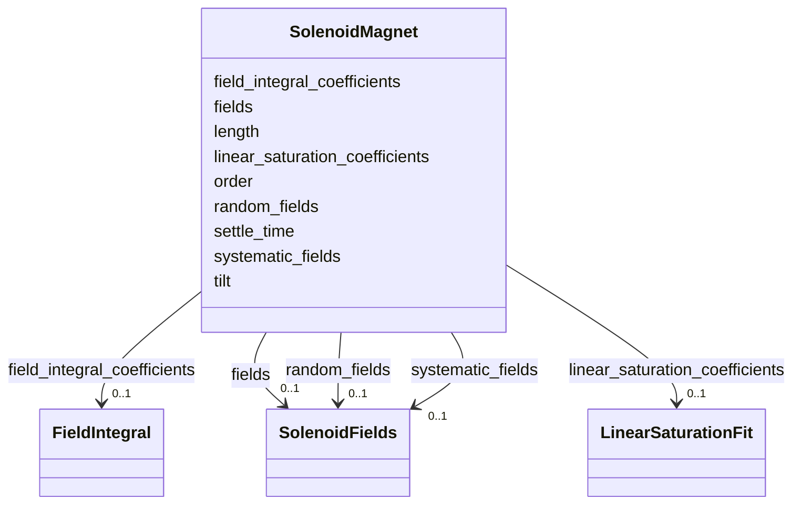

# Class: SolenoidMagnet 


_Solenoid field model, including systematic and random field errors and the current-to-field calibration._


<div data-search-exclude markdown="1">


URI: [laura:Solenoid_Magnet](https://w3id.org/laura/Solenoid_Magnet)





<!-- no inheritance hierarchy -->

## Class Properties

| Property | Value |
| --- | --- |
| Class URI | [laura:Solenoid_Magnet](https://w3id.org/laura/Solenoid_Magnet) |


## Slots

| Name | Cardinality and Range | Description | Inheritance |
| ---  | --- | --- | --- |
| [length](length.md) | 0..1 <br/> [Float](Float.md) | Magnetic length [m] | direct |
| [tilt](tilt.md) | 0..1 <br/> [Float](Float.md) | Global tilt about the beam axis [rad] | direct |
| [order](order.md) | 0..1 <br/> [Integer](Integer.md) | Principal solenoid multipole order | direct |
| [fields](fields.md) | 0..1 <br/> [SolenoidFields](SolenoidFields.md) | Nominal integrated axial field components | direct |
| [systematic_fields](systematic_fields.md) | 0..1 <br/> [SolenoidFields](SolenoidFields.md) | Systematic field errors | direct |
| [random_fields](random_fields.md) | 0..1 <br/> [SolenoidFields](SolenoidFields.md) | Random field errors | direct |
| [field_integral_coefficients](field_integral_coefficients.md) | 0..1 <br/> [FieldIntegral](FieldIntegral.md) | Polynomial current-to-integrated-field coefficients | direct |
| [linear_saturation_coefficients](linear_saturation_coefficients.md) | 0..1 <br/> [LinearSaturationFit](LinearSaturationFit.md) | Linear-plus-saturation fit of field against current | direct |
| [settle_time](settle_time.md) | 0..1 <br/> [Float](Float.md) | Time to wait after a set before the field is stable [s] | direct |


## Usages

| used by | used in | type | used |
| ---  | --- | --- | --- |
| [Solenoid](Solenoid.md) | [magnetic](magnetic.md) | range | [SolenoidMagnet](SolenoidMagnet.md) |


## Identifier and Mapping Information


### Schema Source


* from schema: https://w3id.org/laura/schema


## Mappings

| Mapping Type | Mapped Value |
| ---  | ---  |
| self | laura:Solenoid_Magnet |
| native | laura:SolenoidMagnet |


## LinkML Source

<!-- TODO: investigate https://stackoverflow.com/questions/37606292/how-to-create-tabbed-code-blocks-in-mkdocs-or-sphinx -->

### Direct

<details>
```yaml
name: Solenoid_Magnet
description: Solenoid field model, including systematic and random field errors and
  the current-to-field calibration.
from_schema: https://w3id.org/laura/schema
attributes:
  length:
    name: length
    description: Magnetic length [m].
    from_schema: https://w3id.org/laura/schema/magnetic
    ifabsent: float(0.0)
    domain_of:
    - PhysicalElement
    - MagneticElement
    - Corrector_Magnet
    - Solenoid_Magnet
    - Wiggler_Magnet
    - NonLinearLens_Magnet
    range: float
    minimum_value: 0
  tilt:
    name: tilt
    description: Global tilt about the beam axis [rad].
    from_schema: https://w3id.org/laura/schema/magnetic
    ifabsent: float(0.0)
    domain_of:
    - ElectrostaticSeparatorSimulationElement
    - MagneticElement
    - Corrector_Magnet
    - Solenoid_Magnet
    - Wiggler_Magnet
    - NonLinearLens_Magnet
    range: float
    unit:
      ucum_code: rad
  order:
    name: order
    description: Principal solenoid multipole order.
    from_schema: https://w3id.org/laura/schema/magnetic
    ifabsent: int(0)
    domain_of:
    - Multipole
    - MagneticElement
    - Corrector_Magnet
    - Solenoid_Magnet
    range: integer
  fields:
    name: fields
    description: Nominal integrated axial field components.
    from_schema: https://w3id.org/laura/schema/magnetic
    rank: 1000
    domain_of:
    - Solenoid_Magnet
    range: SolenoidFields
  systematic_fields:
    name: systematic_fields
    description: Systematic field errors.
    from_schema: https://w3id.org/laura/schema/magnetic
    rank: 1000
    domain_of:
    - Solenoid_Magnet
    range: SolenoidFields
  random_fields:
    name: random_fields
    description: Random field errors.
    from_schema: https://w3id.org/laura/schema/magnetic
    rank: 1000
    domain_of:
    - Solenoid_Magnet
    range: SolenoidFields
  field_integral_coefficients:
    name: field_integral_coefficients
    description: Polynomial current-to-integrated-field coefficients.
    from_schema: https://w3id.org/laura/schema/magnetic
    domain_of:
    - MagneticElement
    - Solenoid_Magnet
    range: FieldIntegral
  linear_saturation_coefficients:
    name: linear_saturation_coefficients
    description: Linear-plus-saturation fit of field against current.
    from_schema: https://w3id.org/laura/schema/magnetic
    domain_of:
    - MagneticElement
    - Solenoid_Magnet
    range: LinearSaturationFit
  settle_time:
    name: settle_time
    description: Time to wait after a set before the field is stable [s].
    from_schema: https://w3id.org/laura/schema/magnetic
    ifabsent: float(45.0)
    domain_of:
    - MagneticElement
    - Solenoid_Magnet
    range: float
    minimum_value: 0
class_uri: laura:Solenoid_Magnet

```
</details>

### Induced

<details>
```yaml
name: Solenoid_Magnet
description: Solenoid field model, including systematic and random field errors and
  the current-to-field calibration.
from_schema: https://w3id.org/laura/schema
attributes:
  length:
    name: length
    description: Magnetic length [m].
    from_schema: https://w3id.org/laura/schema/magnetic
    ifabsent: float(0.0)
    owner: Solenoid_Magnet
    domain_of:
    - PhysicalElement
    - MagneticElement
    - Corrector_Magnet
    - Solenoid_Magnet
    - Wiggler_Magnet
    - NonLinearLens_Magnet
    range: float
    minimum_value: 0
  tilt:
    name: tilt
    description: Global tilt about the beam axis [rad].
    from_schema: https://w3id.org/laura/schema/magnetic
    ifabsent: float(0.0)
    owner: Solenoid_Magnet
    domain_of:
    - ElectrostaticSeparatorSimulationElement
    - MagneticElement
    - Corrector_Magnet
    - Solenoid_Magnet
    - Wiggler_Magnet
    - NonLinearLens_Magnet
    range: float
    unit:
      ucum_code: rad
  order:
    name: order
    description: Principal solenoid multipole order.
    from_schema: https://w3id.org/laura/schema/magnetic
    ifabsent: int(0)
    owner: Solenoid_Magnet
    domain_of:
    - Multipole
    - MagneticElement
    - Corrector_Magnet
    - Solenoid_Magnet
    range: integer
  fields:
    name: fields
    description: Nominal integrated axial field components.
    from_schema: https://w3id.org/laura/schema/magnetic
    rank: 1000
    owner: Solenoid_Magnet
    domain_of:
    - Solenoid_Magnet
    range: SolenoidFields
  systematic_fields:
    name: systematic_fields
    description: Systematic field errors.
    from_schema: https://w3id.org/laura/schema/magnetic
    rank: 1000
    owner: Solenoid_Magnet
    domain_of:
    - Solenoid_Magnet
    range: SolenoidFields
  random_fields:
    name: random_fields
    description: Random field errors.
    from_schema: https://w3id.org/laura/schema/magnetic
    rank: 1000
    owner: Solenoid_Magnet
    domain_of:
    - Solenoid_Magnet
    range: SolenoidFields
  field_integral_coefficients:
    name: field_integral_coefficients
    description: Polynomial current-to-integrated-field coefficients.
    from_schema: https://w3id.org/laura/schema/magnetic
    owner: Solenoid_Magnet
    domain_of:
    - MagneticElement
    - Solenoid_Magnet
    range: FieldIntegral
  linear_saturation_coefficients:
    name: linear_saturation_coefficients
    description: Linear-plus-saturation fit of field against current.
    from_schema: https://w3id.org/laura/schema/magnetic
    owner: Solenoid_Magnet
    domain_of:
    - MagneticElement
    - Solenoid_Magnet
    range: LinearSaturationFit
  settle_time:
    name: settle_time
    description: Time to wait after a set before the field is stable [s].
    from_schema: https://w3id.org/laura/schema/magnetic
    ifabsent: float(45.0)
    owner: Solenoid_Magnet
    domain_of:
    - MagneticElement
    - Solenoid_Magnet
    range: float
    minimum_value: 0
class_uri: laura:Solenoid_Magnet

```
</details></div>