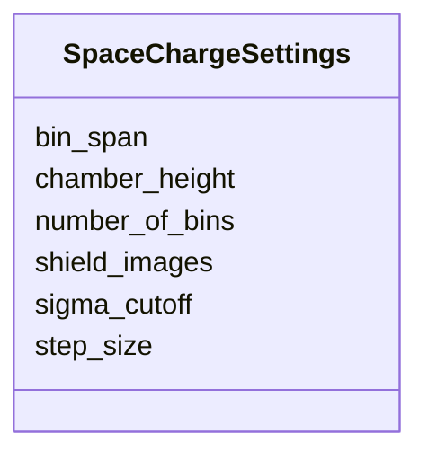

# Class: SpaceChargeSettings 


_How finely a code should resolve CSR and space charge over one section._

_On the section: a bunch compressor is run with one binning and the linac around it with another.  The switches that turn the effects on stay per-element, as they can vary._

_All fields is optional; absence means "use the code's defaults"._


<div data-search-exclude markdown="1">


URI: [laura:SpaceChargeSettings](https://w3id.org/laura/SpaceChargeSettings)





<!-- no inheritance hierarchy -->

## Class Properties

| Property | Value |
| --- | --- |
| Class URI | [laura:SpaceChargeSettings](https://w3id.org/laura/SpaceChargeSettings) |


## Slots

| Name | Cardinality and Range | Description | Inheritance |
| ---  | --- | --- | --- |
| [number_of_bins](number_of_bins.md) | 0..1 <br/> [Integer](Integer.md) | Longitudinal bins the bunch is divided into to build the collective field | direct |
| [step_size](step_size.md) | 0..1 <br/> [Float](Float.md) | Distance between collective-field recalculations | direct |
| [chamber_height](chamber_height.md) | 0..1 <br/> [Float](Float.md) | Full height of the vacuum chamber for CSR shielding | direct |
| [shield_images](shield_images.md) | 0..1 <br/> [Integer](Integer.md) | Number of image charges to sum when modelling wall shielding | direct |
| [bin_span](bin_span.md) | 0..1 <br/> [Integer](Integer.md) | Width of a particle's deposition kernel, counted in bins | direct |
| [sigma_cutoff](sigma_cutoff.md) | 0..1 <br/> [Float](Float.md) | Transverse beam size below which a slice is treated as having none | direct |


## Usages

| used by | used in | type | used |
| ---  | --- | --- | --- |
| [SectionLattice](SectionLattice.md) | [space_charge](space_charge.md) | range | [SpaceChargeSettings](SpaceChargeSettings.md) |


## Identifier and Mapping Information


### Schema Source


* from schema: https://w3id.org/laura/schema


## Mappings

| Mapping Type | Mapped Value |
| ---  | ---  |
| self | laura:SpaceChargeSettings |
| native | laura:SpaceChargeSettings |


## LinkML Source

<!-- TODO: investigate https://stackoverflow.com/questions/37606292/how-to-create-tabbed-code-blocks-in-mkdocs-or-sphinx -->

### Direct

<details>
```yaml
name: SpaceChargeSettings
description: 'How finely a code should resolve CSR and space charge over one section.

  On the section: a bunch compressor is run with one binning and the linac around
  it with another.  The switches that turn the effects on stay per-element, as they
  can vary.

  All fields is optional; absence means "use the code''s defaults".'
from_schema: https://w3id.org/laura/schema
attributes:
  number_of_bins:
    name: number_of_bins
    description: Longitudinal bins the bunch is divided into to build the collective
      field.
    from_schema: https://w3id.org/laura/schema/machine
    rank: 1000
    domain_of:
    - SpaceChargeSettings
    range: integer
    required: false
    minimum_value: 1
  step_size:
    name: step_size
    description: Distance between collective-field recalculations.
    from_schema: https://w3id.org/laura/schema/machine
    rank: 1000
    domain_of:
    - SpaceChargeSettings
    range: float
    required: false
    minimum_value: 0.0
    unit:
      ucum_code: m
  chamber_height:
    name: chamber_height
    description: Full height of the vacuum chamber for CSR shielding.
    from_schema: https://w3id.org/laura/schema/machine
    rank: 1000
    domain_of:
    - SpaceChargeSettings
    range: float
    required: false
    minimum_value: 0.0
    unit:
      ucum_code: m
  shield_images:
    name: shield_images
    description: Number of image charges to sum when modelling wall shielding.
    from_schema: https://w3id.org/laura/schema/machine
    rank: 1000
    domain_of:
    - SpaceChargeSettings
    range: integer
    required: false
    minimum_value: 0
  bin_span:
    name: bin_span
    description: Width of a particle's deposition kernel, counted in bins.
    from_schema: https://w3id.org/laura/schema/machine
    rank: 1000
    domain_of:
    - SpaceChargeSettings
    range: integer
    required: false
    minimum_value: 1
  sigma_cutoff:
    name: sigma_cutoff
    description: Transverse beam size below which a slice is treated as having none.
    from_schema: https://w3id.org/laura/schema/machine
    rank: 1000
    domain_of:
    - SpaceChargeSettings
    range: float
    required: false
    minimum_value: 0.0
class_uri: laura:SpaceChargeSettings

```
</details>

### Induced

<details>
```yaml
name: SpaceChargeSettings
description: 'How finely a code should resolve CSR and space charge over one section.

  On the section: a bunch compressor is run with one binning and the linac around
  it with another.  The switches that turn the effects on stay per-element, as they
  can vary.

  All fields is optional; absence means "use the code''s defaults".'
from_schema: https://w3id.org/laura/schema
attributes:
  number_of_bins:
    name: number_of_bins
    description: Longitudinal bins the bunch is divided into to build the collective
      field.
    from_schema: https://w3id.org/laura/schema/machine
    rank: 1000
    owner: SpaceChargeSettings
    domain_of:
    - SpaceChargeSettings
    range: integer
    required: false
    minimum_value: 1
  step_size:
    name: step_size
    description: Distance between collective-field recalculations.
    from_schema: https://w3id.org/laura/schema/machine
    rank: 1000
    owner: SpaceChargeSettings
    domain_of:
    - SpaceChargeSettings
    range: float
    required: false
    minimum_value: 0.0
    unit:
      ucum_code: m
  chamber_height:
    name: chamber_height
    description: Full height of the vacuum chamber for CSR shielding.
    from_schema: https://w3id.org/laura/schema/machine
    rank: 1000
    owner: SpaceChargeSettings
    domain_of:
    - SpaceChargeSettings
    range: float
    required: false
    minimum_value: 0.0
    unit:
      ucum_code: m
  shield_images:
    name: shield_images
    description: Number of image charges to sum when modelling wall shielding.
    from_schema: https://w3id.org/laura/schema/machine
    rank: 1000
    owner: SpaceChargeSettings
    domain_of:
    - SpaceChargeSettings
    range: integer
    required: false
    minimum_value: 0
  bin_span:
    name: bin_span
    description: Width of a particle's deposition kernel, counted in bins.
    from_schema: https://w3id.org/laura/schema/machine
    rank: 1000
    owner: SpaceChargeSettings
    domain_of:
    - SpaceChargeSettings
    range: integer
    required: false
    minimum_value: 1
  sigma_cutoff:
    name: sigma_cutoff
    description: Transverse beam size below which a slice is treated as having none.
    from_schema: https://w3id.org/laura/schema/machine
    rank: 1000
    owner: SpaceChargeSettings
    domain_of:
    - SpaceChargeSettings
    range: float
    required: false
    minimum_value: 0.0
class_uri: laura:SpaceChargeSettings

```
</details></div>