---
search:
  boost: 10.0
---

# Class: StandardElement 


_Accelerator element with control-system, electrical, manufacturer, simulation, and reference sub-models._


<div data-search-exclude markdown="1">


URI: [laura:StandardElement](https://w3id.org/laura/StandardElement)

```mermaid
 classDiagram
    class StandardElement
    click StandardElement href "../StandardElement/"
      AcceleratorElement <|-- StandardElement
        click AcceleratorElement href "../AcceleratorElement/"
      

      StandardElement <|-- PhysicalAcceleratorElement
        click PhysicalAcceleratorElement href "../PhysicalAcceleratorElement/"
      StandardElement <|-- LowLevelRF
        click LowLevelRF href "../LowLevelRF/"
      StandardElement <|-- RFModulator
        click RFModulator href "../RFModulator/"
      StandardElement <|-- RFProtection
        click RFProtection href "../RFProtection/"
      StandardElement <|-- RFHeartbeat
        click RFHeartbeat href "../RFHeartbeat/"
      StandardElement <|-- PID
        click PID href "../PID/"
      StandardElement <|-- LaserEnergyMeter
        click LaserEnergyMeter href "../LaserEnergyMeter/"
      StandardElement <|-- LaserHalfWavePlate
        click LaserHalfWavePlate href "../LaserHalfWavePlate/"
      StandardElement <|-- LaserMirror
        click LaserMirror href "../LaserMirror/"
      StandardElement <|-- LaserAttenuator
        click LaserAttenuator href "../LaserAttenuator/"
      StandardElement <|-- Lighting
        click Lighting href "../Lighting/"
      

      StandardElement : alias
        
      StandardElement : controls
        
          
    
        
        
        StandardElement --> "0..1" ControlsInformation : controls
        click ControlsInformation href "../ControlsInformation/"
    

        
      StandardElement : electrical
        
          
    
        
        
        StandardElement --> "0..1" ElectricalElement : electrical
        click ElectricalElement href "../ElectricalElement/"
    

        
      StandardElement : hardware_class
        
          
    
        
        
        StandardElement --> "0..1" HardwareClassEnum : hardware_class
        click HardwareClassEnum href "../HardwareClassEnum/"
    

        
      StandardElement : hardware_model
        
      StandardElement : hardware_type
        
      StandardElement : machine_area
        
      StandardElement : manufacturer
        
          
    
        
        
        StandardElement --> "0..1" ManufacturerElement : manufacturer
        click ManufacturerElement href "../ManufacturerElement/"
    

        
      StandardElement : name
        
      StandardElement : reference
        
          
    
        
        
        StandardElement --> "0..1" ReferenceElement : reference
        click ReferenceElement href "../ReferenceElement/"
    

        
      StandardElement : simulation
        
          
    
        
        
        StandardElement --> "0..1" SimulationElement : simulation
        click SimulationElement href "../SimulationElement/"
    

        
      StandardElement : subelement
        
      StandardElement : virtual_name
        
      
```





## Inheritance
* [AcceleratorElement](AcceleratorElement.md)
    * **StandardElement**
        * [PhysicalAcceleratorElement](PhysicalAcceleratorElement.md)
        * [LowLevelRF](LowLevelRF.md)
        * [RFModulator](RFModulator.md)
        * [RFProtection](RFProtection.md)
        * [RFHeartbeat](RFHeartbeat.md)
        * [PID](PID.md)
        * [LaserEnergyMeter](LaserEnergyMeter.md)
        * [LaserHalfWavePlate](LaserHalfWavePlate.md)
        * [LaserMirror](LaserMirror.md)
        * [LaserAttenuator](LaserAttenuator.md)
        * [Lighting](Lighting.md)


## Class Properties

| Property | Value |
| --- | --- |
| Class URI | [laura:StandardElement](https://w3id.org/laura/StandardElement) |


## Slots

| Name | Cardinality and Range | Description | Inheritance |
| ---  | --- | --- | --- |
| [simulation](simulation.md) | 0..1 <br/> [SimulationElement](SimulationElement.md) | Simulation / tracking attributes | direct |
| [electrical](electrical.md) | 0..1 <br/> [ElectricalElement](ElectricalElement.md) | Power-supply electrical limits | direct |
| [manufacturer](manufacturer.md) | 0..1 <br/> [ManufacturerElement](ManufacturerElement.md) | Manufacturer and serial-number data | direct |
| [controls](controls.md) | 0..1 <br/> [ControlsInformation](ControlsInformation.md) | Control-system process-variable definitions | direct |
| [reference](reference.md) | 0..1 <br/> [ReferenceElement](ReferenceElement.md) | Links to design drawings and files | direct |
| [name](name.md) | 1 <br/> [String](String.md) | Unique element name within the machine | [AcceleratorElement](AcceleratorElement.md) |
| [hardware_class](hardware_class.md) | 0..1 <br/> [HardwareClassEnum](HardwareClassEnum.md) | Functional category (e | [AcceleratorElement](AcceleratorElement.md) |
| [hardware_type](hardware_type.md) | 0..1 <br/> [String](String.md) | Python class name used for MODEL_REGISTRY dispatch | [AcceleratorElement](AcceleratorElement.md) |
| [hardware_model](hardware_model.md) | 0..1 <br/> [String](String.md) | Model or variant name within the hardware type (e | [AcceleratorElement](AcceleratorElement.md) |
| [machine_area](machine_area.md) | 0..1 <br/> [String](String.md) | Machine area label grouping related elements (e | [AcceleratorElement](AcceleratorElement.md) |
| [virtual_name](virtual_name.md) | 0..1 <br/> [String](String.md) | Alternative internal name used by the control system when the physical name i... | [AcceleratorElement](AcceleratorElement.md) |
| [alias](alias.md) | 0..1 <br/> [String](String.md) | Short human-readable alias | [AcceleratorElement](AcceleratorElement.md) |
| [subelement](subelement.md) | 0..1 <br/> [String](String.md) | If set, this element is a logical sub-component of the named parent element | [AcceleratorElement](AcceleratorElement.md) |


## Identifier and Mapping Information


### Schema Source


* from schema: https://w3id.org/laura/schema


## Mappings

| Mapping Type | Mapped Value |
| ---  | ---  |
| self | laura:StandardElement |
| native | laura:StandardElement |


## LinkML Source

<!-- TODO: investigate https://stackoverflow.com/questions/37606292/how-to-create-tabbed-code-blocks-in-mkdocs-or-sphinx -->

### Direct

<details>
```yaml
name: StandardElement
description: Accelerator element with control-system, electrical, manufacturer, simulation,
  and reference sub-models.
from_schema: https://w3id.org/laura/schema
is_a: AcceleratorElement
attributes:
  simulation:
    name: simulation
    description: Simulation / tracking attributes.
    from_schema: https://w3id.org/laura/schema
    rank: 1000
    domain_of:
    - StandardElement
    range: SimulationElement
  electrical:
    name: electrical
    description: Power-supply electrical limits.
    from_schema: https://w3id.org/laura/schema
    rank: 1000
    domain_of:
    - StandardElement
    range: ElectricalElement
  manufacturer:
    name: manufacturer
    description: Manufacturer and serial-number data.
    from_schema: https://w3id.org/laura/schema
    domain_of:
    - ManufacturerElement
    - StandardElement
    range: ManufacturerElement
  controls:
    name: controls
    description: Control-system process-variable definitions.
    from_schema: https://w3id.org/laura/schema
    rank: 1000
    domain_of:
    - StandardElement
    range: ControlsInformation
  reference:
    name: reference
    description: Links to design drawings and files.
    from_schema: https://w3id.org/laura/schema
    rank: 1000
    domain_of:
    - StandardElement
    range: ReferenceElement
class_uri: laura:StandardElement

```
</details>

### Induced

<details>
```yaml
name: StandardElement
description: Accelerator element with control-system, electrical, manufacturer, simulation,
  and reference sub-models.
from_schema: https://w3id.org/laura/schema
is_a: AcceleratorElement
attributes:
  simulation:
    name: simulation
    description: Simulation / tracking attributes.
    from_schema: https://w3id.org/laura/schema
    rank: 1000
    owner: StandardElement
    domain_of:
    - StandardElement
    range: SimulationElement
  electrical:
    name: electrical
    description: Power-supply electrical limits.
    from_schema: https://w3id.org/laura/schema
    rank: 1000
    owner: StandardElement
    domain_of:
    - StandardElement
    range: ElectricalElement
  manufacturer:
    name: manufacturer
    description: Manufacturer and serial-number data.
    from_schema: https://w3id.org/laura/schema
    owner: StandardElement
    domain_of:
    - ManufacturerElement
    - StandardElement
    range: ManufacturerElement
  controls:
    name: controls
    description: Control-system process-variable definitions.
    from_schema: https://w3id.org/laura/schema
    rank: 1000
    owner: StandardElement
    domain_of:
    - StandardElement
    range: ControlsInformation
  reference:
    name: reference
    description: Links to design drawings and files.
    from_schema: https://w3id.org/laura/schema
    rank: 1000
    owner: StandardElement
    domain_of:
    - StandardElement
    range: ReferenceElement
  name:
    name: name
    description: Unique element name within the machine.
    from_schema: https://w3id.org/laura/schema
    rank: 1000
    identifier: true
    owner: StandardElement
    domain_of:
    - AcceleratorElement
    - SectionLattice
    - MachineLayout
    range: string
    required: true
  hardware_class:
    name: hardware_class
    description: Functional category (e.g., ``Magnet``, ``Diagnostic``).
    from_schema: https://w3id.org/laura/schema
    rank: 1000
    owner: StandardElement
    domain_of:
    - AcceleratorElement
    range: HardwareClassEnum
  hardware_type:
    name: hardware_type
    description: Python class name used for MODEL_REGISTRY dispatch.  Identifies the
      concrete subclass to instantiate when loading from YAML.
    from_schema: https://w3id.org/laura/schema
    rank: 1000
    designates_type: true
    owner: StandardElement
    domain_of:
    - AcceleratorElement
    range: string
  hardware_model:
    name: hardware_model
    description: Model or variant name within the hardware type (e.g., ``Generic``,
      ``TESLA``).
    from_schema: https://w3id.org/laura/schema
    rank: 1000
    owner: StandardElement
    domain_of:
    - AcceleratorElement
    range: string
  machine_area:
    name: machine_area
    description: Machine area label grouping related elements (e.g., ``LINAC``, ``BA1``).
    from_schema: https://w3id.org/laura/schema
    rank: 1000
    owner: StandardElement
    domain_of:
    - AcceleratorElement
    range: string
  virtual_name:
    name: virtual_name
    description: Alternative internal name used by the control system when the physical
      name is inaccessible.
    from_schema: https://w3id.org/laura/schema
    rank: 1000
    owner: StandardElement
    domain_of:
    - AcceleratorElement
    range: string
  alias:
    name: alias
    description: Short human-readable alias. Populated from ``name_alias`` in YAML.
    from_schema: https://w3id.org/laura/schema
    aliases:
    - name_alias
    rank: 1000
    owner: StandardElement
    domain_of:
    - AcceleratorElement
    range: string
  subelement:
    name: subelement
    description: If set, this element is a logical sub-component of the named parent
      element.
    from_schema: https://w3id.org/laura/schema
    rank: 1000
    owner: StandardElement
    domain_of:
    - AcceleratorElement
    range: string
class_uri: laura:StandardElement

```
</details></div>