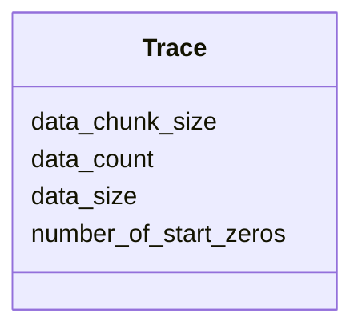

# Class: Trace 


_LLRF trace metadata._


<div data-search-exclude markdown="1">


URI: [laura:Trace](https://w3id.org/laura/Trace)





<!-- no inheritance hierarchy -->

## Class Properties

| Property | Value |
| --- | --- |
| Class URI | [laura:Trace](https://w3id.org/laura/Trace) |


## Slots

| Name | Cardinality and Range | Description | Inheritance |
| ---  | --- | --- | --- |
| [data_size](data_size.md) | 0..1 <br/> [Integer](Integer.md) | Number of points in a trace | direct |
| [data_count](data_count.md) | 0..1 <br/> [Integer](Integer.md) | Number of one-record trace entries | direct |
| [data_chunk_size](data_chunk_size.md) | 0..1 <br/> [Integer](Integer.md) | Chunk size for one-record traces | direct |
| [number_of_start_zeros](number_of_start_zeros.md) | 0..1 <br/> [Integer](Integer.md) | Number of leading zeros in a trace | direct |


## Usages

| used by | used in | type | used |
| ---  | --- | --- | --- |
| [LowLevelRFElement](LowLevelRFElement.md) | [trace](trace.md) | range | [Trace](Trace.md) |


## Identifier and Mapping Information


### Schema Source


* from schema: https://w3id.org/laura/schema


## Mappings

| Mapping Type | Mapped Value |
| ---  | ---  |
| self | laura:Trace |
| native | laura:Trace |


## LinkML Source

<!-- TODO: investigate https://stackoverflow.com/questions/37606292/how-to-create-tabbed-code-blocks-in-mkdocs-or-sphinx -->

### Direct

<details>
```yaml
name: Trace
description: LLRF trace metadata.
from_schema: https://w3id.org/laura/schema
attributes:
  data_size:
    name: data_size
    description: Number of points in a trace.
    from_schema: https://w3id.org/laura/schema/rf
    aliases:
    - trace_data_size
    rank: 1000
    domain_of:
    - Trace
    range: integer
  data_count:
    name: data_count
    description: Number of one-record trace entries.
    from_schema: https://w3id.org/laura/schema/rf
    aliases:
    - one_trace_data_count
    rank: 1000
    domain_of:
    - Trace
    range: integer
  data_chunk_size:
    name: data_chunk_size
    description: Chunk size for one-record traces.
    from_schema: https://w3id.org/laura/schema/rf
    aliases:
    - one_trace_data_chunk_size
    rank: 1000
    domain_of:
    - Trace
    range: integer
  number_of_start_zeros:
    name: number_of_start_zeros
    description: Number of leading zeros in a trace.
    from_schema: https://w3id.org/laura/schema/rf
    aliases:
    - trace_num_of_start_zeros
    rank: 1000
    domain_of:
    - Trace
    range: integer
class_uri: laura:Trace

```
</details>

### Induced

<details>
```yaml
name: Trace
description: LLRF trace metadata.
from_schema: https://w3id.org/laura/schema
attributes:
  data_size:
    name: data_size
    description: Number of points in a trace.
    from_schema: https://w3id.org/laura/schema/rf
    aliases:
    - trace_data_size
    rank: 1000
    owner: Trace
    domain_of:
    - Trace
    range: integer
  data_count:
    name: data_count
    description: Number of one-record trace entries.
    from_schema: https://w3id.org/laura/schema/rf
    aliases:
    - one_trace_data_count
    rank: 1000
    owner: Trace
    domain_of:
    - Trace
    range: integer
  data_chunk_size:
    name: data_chunk_size
    description: Chunk size for one-record traces.
    from_schema: https://w3id.org/laura/schema/rf
    aliases:
    - one_trace_data_chunk_size
    rank: 1000
    owner: Trace
    domain_of:
    - Trace
    range: integer
  number_of_start_zeros:
    name: number_of_start_zeros
    description: Number of leading zeros in a trace.
    from_schema: https://w3id.org/laura/schema/rf
    aliases:
    - trace_num_of_start_zeros
    rank: 1000
    owner: Trace
    domain_of:
    - Trace
    range: integer
class_uri: laura:Trace

```
</details></div>