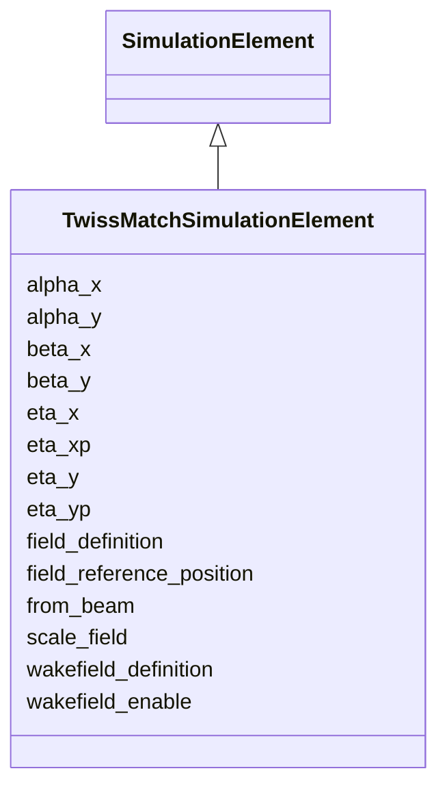

# Class: TwissMatchSimulationElement 


_Simulation attributes for Twiss-matching points._


<div data-search-exclude markdown="1">


URI: [laura:TwissMatchSimulationElement](https://w3id.org/laura/TwissMatchSimulationElement)





## Inheritance
* [SimulationElement](SimulationElement.md)
    * **TwissMatchSimulationElement**


## Class Properties

| Property | Value |
| --- | --- |
| Class URI | [laura:TwissMatchSimulationElement](https://w3id.org/laura/TwissMatchSimulationElement) |


## Slots

| Name | Cardinality and Range | Description | Inheritance |
| ---  | --- | --- | --- |
| [beta_x](beta_x.md) | 0..1 <br/> [Double](Double.md) | Horizontal beta | direct |
| [beta_y](beta_y.md) | 0..1 <br/> [Double](Double.md) | Vertical beta | direct |
| [alpha_x](alpha_x.md) | 0..1 <br/> [Double](Double.md) | Horizontal alpha | direct |
| [alpha_y](alpha_y.md) | 0..1 <br/> [Double](Double.md) | Vertical alpha | direct |
| [eta_x](eta_x.md) | 0..1 <br/> [Double](Double.md) | Horizontal dispersion | direct |
| [eta_y](eta_y.md) | 0..1 <br/> [Double](Double.md) | Vertical dispersion | direct |
| [eta_xp](eta_xp.md) | 0..1 <br/> [Double](Double.md) | Horizontal dispersion derivative | direct |
| [eta_yp](eta_yp.md) | 0..1 <br/> [Double](Double.md) | Vertical dispersion derivative | direct |
| [from_beam](from_beam.md) | 0..1 <br/> [Boolean](Boolean.md) | Compute transform from tracked beam properties | direct |
| [field_definition](field_definition.md) | 0..1 <br/> [String](String.md) | Path to the 3-D field-map file | [SimulationElement](SimulationElement.md) |
| [wakefield_definition](wakefield_definition.md) | 0..1 <br/> [String](String.md) | Path to the wakefield impedance file | [SimulationElement](SimulationElement.md) |
| [wakefield_enable](wakefield_enable.md) | 0..1 <br/> [Boolean](Boolean.md) | Whether the wakefield named by wakefield_definition is applied | [SimulationElement](SimulationElement.md) |
| [field_reference_position](field_reference_position.md) | 0..1 <br/> [String](String.md) | Longitudinal origin of the field map [m] | [SimulationElement](SimulationElement.md) |
| [scale_field](scale_field.md) | 0..1 <br/> [Double](Double.md) | Multiplicative scale factor applied to the field map | [SimulationElement](SimulationElement.md) |


## Usages

| used by | used in | type | used |
| ---  | --- | --- | --- |
| [TwissMatch](TwissMatch.md) | [simulation](simulation.md) | range | [TwissMatchSimulationElement](TwissMatchSimulationElement.md) |


## Identifier and Mapping Information


### Schema Source


* from schema: https://w3id.org/laura/schema


## Mappings

| Mapping Type | Mapped Value |
| ---  | ---  |
| self | laura:TwissMatchSimulationElement |
| native | laura:TwissMatchSimulationElement |


## LinkML Source

<!-- TODO: investigate https://stackoverflow.com/questions/37606292/how-to-create-tabbed-code-blocks-in-mkdocs-or-sphinx -->

### Direct

<details>
```yaml
name: TwissMatchSimulationElement
description: Simulation attributes for Twiss-matching points.
from_schema: https://w3id.org/laura/schema
is_a: SimulationElement
attributes:
  beta_x:
    name: beta_x
    description: Horizontal beta.
    from_schema: https://w3id.org/laura/schema/simulation
    rank: 1000
    domain_of:
    - TwissMatchSimulationElement
    range: double
  beta_y:
    name: beta_y
    description: Vertical beta.
    from_schema: https://w3id.org/laura/schema/simulation
    rank: 1000
    domain_of:
    - TwissMatchSimulationElement
    range: double
  alpha_x:
    name: alpha_x
    description: Horizontal alpha.
    from_schema: https://w3id.org/laura/schema/simulation
    rank: 1000
    domain_of:
    - TwissMatchSimulationElement
    range: double
  alpha_y:
    name: alpha_y
    description: Vertical alpha.
    from_schema: https://w3id.org/laura/schema/simulation
    rank: 1000
    domain_of:
    - TwissMatchSimulationElement
    range: double
  eta_x:
    name: eta_x
    description: Horizontal dispersion.
    from_schema: https://w3id.org/laura/schema/simulation
    rank: 1000
    ifabsent: float(0.0)
    domain_of:
    - TwissMatchSimulationElement
    range: double
  eta_y:
    name: eta_y
    description: Vertical dispersion.
    from_schema: https://w3id.org/laura/schema/simulation
    rank: 1000
    ifabsent: float(0.0)
    domain_of:
    - TwissMatchSimulationElement
    range: double
  eta_xp:
    name: eta_xp
    description: Horizontal dispersion derivative.
    from_schema: https://w3id.org/laura/schema/simulation
    rank: 1000
    ifabsent: float(0.0)
    domain_of:
    - TwissMatchSimulationElement
    range: double
  eta_yp:
    name: eta_yp
    description: Vertical dispersion derivative.
    from_schema: https://w3id.org/laura/schema/simulation
    rank: 1000
    ifabsent: float(0.0)
    domain_of:
    - TwissMatchSimulationElement
    range: double
  from_beam:
    name: from_beam
    description: Compute transform from tracked beam properties.
    from_schema: https://w3id.org/laura/schema/simulation
    rank: 1000
    ifabsent: 'True'
    domain_of:
    - TwissMatchSimulationElement
    range: boolean
class_uri: laura:TwissMatchSimulationElement

```
</details>

### Induced

<details>
```yaml
name: TwissMatchSimulationElement
description: Simulation attributes for Twiss-matching points.
from_schema: https://w3id.org/laura/schema
is_a: SimulationElement
attributes:
  beta_x:
    name: beta_x
    description: Horizontal beta.
    from_schema: https://w3id.org/laura/schema/simulation
    rank: 1000
    owner: TwissMatchSimulationElement
    domain_of:
    - TwissMatchSimulationElement
    range: double
  beta_y:
    name: beta_y
    description: Vertical beta.
    from_schema: https://w3id.org/laura/schema/simulation
    rank: 1000
    owner: TwissMatchSimulationElement
    domain_of:
    - TwissMatchSimulationElement
    range: double
  alpha_x:
    name: alpha_x
    description: Horizontal alpha.
    from_schema: https://w3id.org/laura/schema/simulation
    rank: 1000
    owner: TwissMatchSimulationElement
    domain_of:
    - TwissMatchSimulationElement
    range: double
  alpha_y:
    name: alpha_y
    description: Vertical alpha.
    from_schema: https://w3id.org/laura/schema/simulation
    rank: 1000
    owner: TwissMatchSimulationElement
    domain_of:
    - TwissMatchSimulationElement
    range: double
  eta_x:
    name: eta_x
    description: Horizontal dispersion.
    from_schema: https://w3id.org/laura/schema/simulation
    rank: 1000
    ifabsent: float(0.0)
    owner: TwissMatchSimulationElement
    domain_of:
    - TwissMatchSimulationElement
    range: double
  eta_y:
    name: eta_y
    description: Vertical dispersion.
    from_schema: https://w3id.org/laura/schema/simulation
    rank: 1000
    ifabsent: float(0.0)
    owner: TwissMatchSimulationElement
    domain_of:
    - TwissMatchSimulationElement
    range: double
  eta_xp:
    name: eta_xp
    description: Horizontal dispersion derivative.
    from_schema: https://w3id.org/laura/schema/simulation
    rank: 1000
    ifabsent: float(0.0)
    owner: TwissMatchSimulationElement
    domain_of:
    - TwissMatchSimulationElement
    range: double
  eta_yp:
    name: eta_yp
    description: Vertical dispersion derivative.
    from_schema: https://w3id.org/laura/schema/simulation
    rank: 1000
    ifabsent: float(0.0)
    owner: TwissMatchSimulationElement
    domain_of:
    - TwissMatchSimulationElement
    range: double
  from_beam:
    name: from_beam
    description: Compute transform from tracked beam properties.
    from_schema: https://w3id.org/laura/schema/simulation
    rank: 1000
    ifabsent: 'True'
    owner: TwissMatchSimulationElement
    domain_of:
    - TwissMatchSimulationElement
    range: boolean
  field_definition:
    name: field_definition
    description: Path to the 3-D field-map file.
    from_schema: https://w3id.org/laura/schema/simulation
    rank: 1000
    owner: TwissMatchSimulationElement
    domain_of:
    - SimulationElement
    range: string
  wakefield_definition:
    name: wakefield_definition
    description: Path to the wakefield impedance file.
    from_schema: https://w3id.org/laura/schema/simulation
    rank: 1000
    owner: TwissMatchSimulationElement
    domain_of:
    - SimulationElement
    range: string
  wakefield_enable:
    name: wakefield_enable
    description: Whether the wakefield named by wakefield_definition is applied. Set
      false to track the element without its wakefield while keeping the definition
      itself.
    from_schema: https://w3id.org/laura/schema/simulation
    rank: 1000
    ifabsent: 'true'
    owner: TwissMatchSimulationElement
    domain_of:
    - SimulationElement
    range: boolean
  field_reference_position:
    name: field_reference_position
    description: Longitudinal origin of the field map [m].
    from_schema: https://w3id.org/laura/schema/simulation
    rank: 1000
    owner: TwissMatchSimulationElement
    domain_of:
    - SimulationElement
    range: string
  scale_field:
    name: scale_field
    description: Multiplicative scale factor applied to the field map.
    from_schema: https://w3id.org/laura/schema/simulation
    rank: 1000
    ifabsent: float(1)
    owner: TwissMatchSimulationElement
    domain_of:
    - SimulationElement
    range: double
class_uri: laura:TwissMatchSimulationElement

```
</details></div>