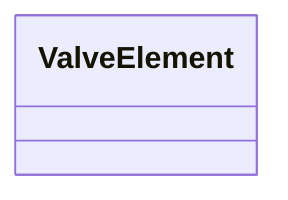

---
search:
  boost: 10.0
---

# Class: ValveElement 


_Vacuum valve configuration (no additional fields)._


<div data-search-exclude markdown="1">


URI: [laura:ValveElement](https://w3id.org/laura/ValveElement)





<!-- no inheritance hierarchy -->

## Class Properties

| Property | Value |
| --- | --- |
| Class URI | [laura:ValveElement](https://w3id.org/laura/ValveElement) |


## Slots

| Name | Cardinality and Range | Description | Inheritance |
| ---  | --- | --- | --- |


## Usages

| used by | used in | type | used |
| ---  | --- | --- | --- |
| [Valve](Valve.md) | [valve](valve.md) | range | [ValveElement](ValveElement.md) |


## Identifier and Mapping Information


### Schema Source


* from schema: https://w3id.org/laura/schema


## Mappings

| Mapping Type | Mapped Value |
| ---  | ---  |
| self | laura:ValveElement |
| native | laura:ValveElement |


## LinkML Source

<!-- TODO: investigate https://stackoverflow.com/questions/37606292/how-to-create-tabbed-code-blocks-in-mkdocs-or-sphinx -->

### Direct

<details>
```yaml
name: ValveElement
description: Vacuum valve configuration (no additional fields).
from_schema: https://w3id.org/laura/schema
class_uri: laura:ValveElement

```
</details>

### Induced

<details>
```yaml
name: ValveElement
description: Vacuum valve configuration (no additional fields).
from_schema: https://w3id.org/laura/schema
class_uri: laura:ValveElement

```
</details></div>