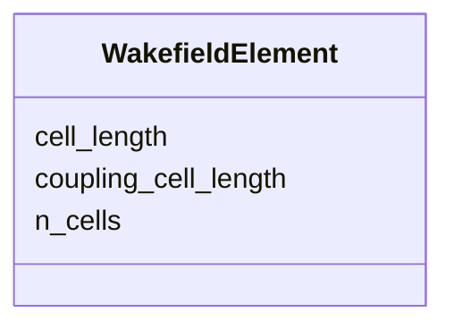

# Class: WakefieldElement 


_Passive wakefield structure parameters._


<div data-search-exclude markdown="1">


URI: [laura:WakefieldElement](https://w3id.org/laura/WakefieldElement)





<!-- no inheritance hierarchy -->

## Class Properties

| Property | Value |
| --- | --- |
| Class URI | [laura:WakefieldElement](https://w3id.org/laura/WakefieldElement) |


## Slots

| Name | Cardinality and Range | Description | Inheritance |
| ---  | --- | --- | --- |
| [cell_length](cell_length.md) | 0..1 <br/> [Double](Double.md) | Length of a single cell [m] | direct |
| [n_cells](n_cells.md) | 0..1 <br/> [Double](Double.md) | Number of cells | direct |
| [coupling_cell_length](coupling_cell_length.md) | 0..1 <br/> [Double](Double.md) | Length of the coupling cell [m] | direct |


## Usages

| used by | used in | type | used |
| ---  | --- | --- | --- |
| [Wakefield](Wakefield.md) | [cavity](cavity.md) | range | [WakefieldElement](WakefieldElement.md) |


## In Subsets


* [RfProperties](RfProperties.md)


## Identifier and Mapping Information


### Schema Source


* from schema: https://w3id.org/laura/schema


## Mappings

| Mapping Type | Mapped Value |
| ---  | ---  |
| self | laura:WakefieldElement |
| native | laura:WakefieldElement |


## LinkML Source

<!-- TODO: investigate https://stackoverflow.com/questions/37606292/how-to-create-tabbed-code-blocks-in-mkdocs-or-sphinx -->

### Direct

<details>
```yaml
name: WakefieldElement
description: Passive wakefield structure parameters.
in_subset:
- rf_properties
from_schema: https://w3id.org/laura/schema
slots:
- cell_length
- n_cells
- coupling_cell_length
class_uri: laura:WakefieldElement

```
</details>

### Induced

<details>
```yaml
name: WakefieldElement
description: Passive wakefield structure parameters.
in_subset:
- rf_properties
from_schema: https://w3id.org/laura/schema
attributes:
  cell_length:
    name: cell_length
    description: Length of a single cell [m].
    from_schema: https://w3id.org/laura/schema
    rank: 1000
    ifabsent: float(0.03333333333333333)
    owner: WakefieldElement
    domain_of:
    - RFCavityElement
    - WakefieldElement
    - RFDeflectingCavityElement
    range: double
    minimum_value: 0.0
    unit:
      ucum_code: m
  n_cells:
    name: n_cells
    description: Number of cells.
    from_schema: https://w3id.org/laura/schema
    rank: 1000
    ifabsent: float(1)
    owner: WakefieldElement
    domain_of:
    - RFCavityElement
    - WakefieldElement
    - RFDeflectingCavityElement
    range: double
    minimum_value: 0
  coupling_cell_length:
    name: coupling_cell_length
    description: Length of the coupling cell [m].
    from_schema: https://w3id.org/laura/schema
    rank: 1000
    ifabsent: float(0.0)
    owner: WakefieldElement
    domain_of:
    - RFCavityElement
    - WakefieldElement
    - RFDeflectingCavityElement
    range: double
    minimum_value: 0.0
    unit:
      ucum_code: m
class_uri: laura:WakefieldElement

```
</details></div>