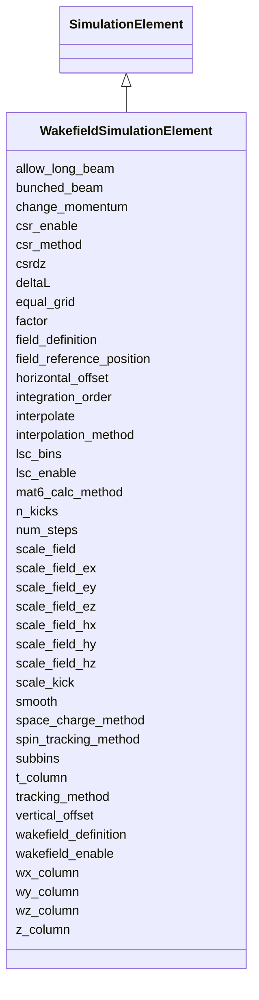

# Class: WakefieldSimulationElement


_Simulation attributes for passive wakefield structures._


<div data-search-exclude markdown="1">


URI: [laura:WakefieldSimulationElement](https://w3id.org/laura/WakefieldSimulationElement)





## Inheritance
* [SimulationElement](SimulationElement.md)
    * **WakefieldSimulationElement**


## Class Properties

| Property | Value |
| --- | --- |
| Class URI | [laura:WakefieldSimulationElement](https://w3id.org/laura/WakefieldSimulationElement) |


## Slots

| Name | Cardinality and Range | Description | Inheritance |
| ---  | --- | --- | --- |
| [t_column](t_column.md) | 0..1 <br/> [String](String.md) | Time column in the wake file | direct |
| [z_column](z_column.md) | 0..1 <br/> [String](String.md) | Longitudinal position column in the wake file | direct |
| [wx_column](wx_column.md) | 0..1 <br/> [String](String.md) | Horizontal wake column in the wake file | direct |
| [wy_column](wy_column.md) | 0..1 <br/> [String](String.md) | Vertical wake column in the wake file | direct |
| [wz_column](wz_column.md) | 0..1 <br/> [String](String.md) | Longitudinal wake column in the wake file | direct |
| [allow_long_beam](allow_long_beam.md) | 0..1 <br/> [Boolean](Boolean.md) | Allow beams longer than the wakefield | direct |
| [bunched_beam](bunched_beam.md) | 0..1 <br/> [Boolean](Boolean.md) | Use bunched beam mode | direct |
| [change_momentum](change_momentum.md) | 0..1 <br/> [Boolean](Boolean.md) | Allow wakefield to change bunch momentum | direct |
| [factor](factor.md) | 0..1 <br/> [Float](Float.md) | Wake scaling factor | direct |
| [interpolate](interpolate.md) | 0..1 <br/> [Boolean](Boolean.md) | Interpolate points in wake file | direct |
| [scale_kick](scale_kick.md) | 0..1 <br/> [Float](Float.md) | Factor by which to scale wake kicks | direct |
| [scale_field_ex](scale_field_ex.md) | 0..1 <br/> [Float](Float.md) | x-component of the longitudinal direction vector | direct |
| [scale_field_ey](scale_field_ey.md) | 0..1 <br/> [Float](Float.md) | y-component of the longitudinal direction vector | direct |
| [scale_field_ez](scale_field_ez.md) | 0..1 <br/> [Float](Float.md) | z-component of the longitudinal direction vector | direct |
| [scale_field_hx](scale_field_hx.md) | 0..1 <br/> [Float](Float.md) | x-component of the horizontal direction vector | direct |
| [scale_field_hy](scale_field_hy.md) | 0..1 <br/> [Float](Float.md) | y-component of the horizontal direction vector | direct |
| [scale_field_hz](scale_field_hz.md) | 0..1 <br/> [Float](Float.md) | z-component of the horizontal direction vector | direct |
| [equal_grid](equal_grid.md) | 0..1 <br/> [Float](Float.md) | Interpolation between equidistant and equal-charge grids | direct |
| [interpolation_method](interpolation_method.md) | 0..1 <br/> [Integer](Integer.md) | Interpolation method for ASTRA | direct |
| [subbins](subbins.md) | 0..1 <br/> [Integer](Integer.md) | Sub-binning parameter | direct |
| [n_kicks](n_kicks.md) | 0..1 <br/> [Integer](Integer.md) | Number of integration kicks | [SimulationElement](SimulationElement.md) |
| [lsc_bins](lsc_bins.md) | 0..1 <br/> [Integer](Integer.md) | Number of bins used in longitudinal space-charge calculations | [SimulationElement](SimulationElement.md) |
| [csr_enable](csr_enable.md) | 0..1 <br/> [Boolean](Boolean.md) | Whether coherent synchrotron radiation effects are enabled | [SimulationElement](SimulationElement.md) |
| [lsc_enable](lsc_enable.md) | 0..1 <br/> [Boolean](Boolean.md) | Whether longitudinal space-charge effects are enabled | [SimulationElement](SimulationElement.md) |
| [tracking_method](tracking_method.md) | 0..1 <br/> [String](String.md) | Phase-space tracking algorithm requested from the target code | [SimulationElement](SimulationElement.md) |
| [mat6_calc_method](mat6_calc_method.md) | 0..1 <br/> [String](String.md) | Method used to calculate the element's 6x6 transfer matrix | [SimulationElement](SimulationElement.md) |
| [spin_tracking_method](spin_tracking_method.md) | 0..1 <br/> [String](String.md) | Spin-tracking algorithm requested from the target code | [SimulationElement](SimulationElement.md) |
| [integration_order](integration_order.md) | 0..1 <br/> [Integer](Integer.md) | Order of the target code's integration formula | [SimulationElement](SimulationElement.md) |
| [num_steps](num_steps.md) | 0..1 <br/> [Integer](Integer.md) | Number of integration steps through the element | [SimulationElement](SimulationElement.md) |
| [deltaL](deltaL.md) | 0..1 <br/> [Float](Float.md) | Longitudinal integration step size [m] | [SimulationElement](SimulationElement.md) |
| [csr_method](csr_method.md) | 0..1 <br/> [String](String.md) | Coherent-synchrotron-radiation tracking method | [SimulationElement](SimulationElement.md) |
| [space_charge_method](space_charge_method.md) | 0..1 <br/> [String](String.md) | Space-charge tracking method | [SimulationElement](SimulationElement.md) |
| [csrdz](csrdz.md) | 0..1 <br/> [Float](Float.md) | Longitudinal step size between CSR kicks [m] | [SimulationElement](SimulationElement.md) |
| [smooth](smooth.md) | 0..1 <br/> [Float](Float.md)&nbsp;or&nbsp;<br />[Integer](Integer.md) | Smoothing parameter for Gaussian interpolation | [SimulationElement](SimulationElement.md) |
| [horizontal_offset](horizontal_offset.md) | 0..1 <br/> [Float](Float.md) | Horizontal simulation offset from the reference orbit [m] | [SimulationElement](SimulationElement.md) |
| [vertical_offset](vertical_offset.md) | 0..1 <br/> [Float](Float.md) | Vertical simulation offset from the reference orbit [m] | [SimulationElement](SimulationElement.md) |
| [field_definition](field_definition.md) | 0..1 <br/> [String](String.md) | Path to the 3-D field-map file | [SimulationElement](SimulationElement.md) |
| [wakefield_definition](wakefield_definition.md) | 0..1 <br/> [String](String.md) | Path to the wakefield impedance file | [SimulationElement](SimulationElement.md) |
| [wakefield_enable](wakefield_enable.md) | 0..1 <br/> [Boolean](Boolean.md) | Whether the wakefield named by wakefield_definition is applied | [SimulationElement](SimulationElement.md) |
| [field_reference_position](field_reference_position.md) | 0..1 <br/> [String](String.md) | Longitudinal origin of the field map [m] | [SimulationElement](SimulationElement.md) |
| [scale_field](scale_field.md) | 0..1 <br/> [Float](Float.md) | Multiplicative scale factor applied to the field map | [SimulationElement](SimulationElement.md) |


## Usages

| used by | used in | type | used |
| ---  | --- | --- | --- |
| [Wakefield](Wakefield.md) | [simulation](simulation.md) | range | [WakefieldSimulationElement](WakefieldSimulationElement.md) |


## Identifier and Mapping Information


### Schema Source


* from schema: https://w3id.org/laura/schema


## Mappings

| Mapping Type | Mapped Value |
| ---  | ---  |
| self | laura:WakefieldSimulationElement |
| native | laura:WakefieldSimulationElement |


## LinkML Source

<!-- TODO: investigate https://stackoverflow.com/questions/37606292/how-to-create-tabbed-code-blocks-in-mkdocs-or-sphinx -->

### Direct

<details>
```yaml
name: WakefieldSimulationElement
description: Simulation attributes for passive wakefield structures.
from_schema: https://w3id.org/laura/schema
is_a: SimulationElement
slots:
- t_column
- z_column
- wx_column
- wy_column
- wz_column
slot_usage:
  smooth:
    name: smooth
    description: Smoothing parameter for Gaussian interpolation.
    ifabsent: float(0.25)
    range: float
attributes:
  allow_long_beam:
    name: allow_long_beam
    description: Allow beams longer than the wakefield.
    from_schema: https://w3id.org/laura/schema/simulation
    rank: 1000
    ifabsent: 'True'
    domain_of:
    - WakefieldSimulationElement
    range: boolean
  bunched_beam:
    name: bunched_beam
    description: Use bunched beam mode.
    from_schema: https://w3id.org/laura/schema/simulation
    rank: 1000
    ifabsent: 'False'
    domain_of:
    - WakefieldSimulationElement
    range: boolean
  change_momentum:
    name: change_momentum
    description: Allow wakefield to change bunch momentum.
    from_schema: https://w3id.org/laura/schema/simulation
    rank: 1000
    ifabsent: 'True'
    domain_of:
    - WakefieldSimulationElement
    range: boolean
  factor:
    name: factor
    description: Wake scaling factor.
    from_schema: https://w3id.org/laura/schema/simulation
    rank: 1000
    ifabsent: float(1)
    domain_of:
    - WakefieldSimulationElement
    range: float
  interpolate:
    name: interpolate
    description: Interpolate points in wake file.
    from_schema: https://w3id.org/laura/schema/simulation
    rank: 1000
    ifabsent: 'True'
    domain_of:
    - WakefieldSimulationElement
    range: boolean
  scale_kick:
    name: scale_kick
    description: Factor by which to scale wake kicks.
    from_schema: https://w3id.org/laura/schema/simulation
    rank: 1000
    ifabsent: float(1)
    domain_of:
    - WakefieldSimulationElement
    range: float
  scale_field_ex:
    name: scale_field_ex
    description: x-component of the longitudinal direction vector.
    from_schema: https://w3id.org/laura/schema/simulation
    rank: 1000
    ifabsent: float(0.0)
    domain_of:
    - WakefieldSimulationElement
    range: float
  scale_field_ey:
    name: scale_field_ey
    description: y-component of the longitudinal direction vector.
    from_schema: https://w3id.org/laura/schema/simulation
    rank: 1000
    ifabsent: float(0.0)
    domain_of:
    - WakefieldSimulationElement
    range: float
  scale_field_ez:
    name: scale_field_ez
    description: z-component of the longitudinal direction vector.
    from_schema: https://w3id.org/laura/schema/simulation
    rank: 1000
    ifabsent: float(1.0)
    domain_of:
    - WakefieldSimulationElement
    range: float
  scale_field_hx:
    name: scale_field_hx
    description: x-component of the horizontal direction vector.
    from_schema: https://w3id.org/laura/schema/simulation
    rank: 1000
    ifabsent: float(1.0)
    domain_of:
    - WakefieldSimulationElement
    range: float
  scale_field_hy:
    name: scale_field_hy
    description: y-component of the horizontal direction vector.
    from_schema: https://w3id.org/laura/schema/simulation
    rank: 1000
    ifabsent: float(0.0)
    domain_of:
    - WakefieldSimulationElement
    range: float
  scale_field_hz:
    name: scale_field_hz
    description: z-component of the horizontal direction vector.
    from_schema: https://w3id.org/laura/schema/simulation
    rank: 1000
    ifabsent: float(0.0)
    domain_of:
    - WakefieldSimulationElement
    range: float
  equal_grid:
    name: equal_grid
    description: Interpolation between equidistant and equal-charge grids.
    from_schema: https://w3id.org/laura/schema/simulation
    rank: 1000
    ifabsent: float(0.66)
    domain_of:
    - WakefieldSimulationElement
    range: float
  interpolation_method:
    name: interpolation_method
    description: Interpolation method for ASTRA.
    from_schema: https://w3id.org/laura/schema/simulation
    rank: 1000
    ifabsent: int(2)
    domain_of:
    - WakefieldSimulationElement
    range: integer
  subbins:
    name: subbins
    description: Sub-binning parameter.
    from_schema: https://w3id.org/laura/schema/simulation
    rank: 1000
    ifabsent: int(10)
    domain_of:
    - WakefieldSimulationElement
    range: integer
class_uri: laura:WakefieldSimulationElement

```
</details>

### Induced

<details>
```yaml
name: WakefieldSimulationElement
description: Simulation attributes for passive wakefield structures.
from_schema: https://w3id.org/laura/schema
is_a: SimulationElement
slot_usage:
  smooth:
    name: smooth
    description: Smoothing parameter for Gaussian interpolation.
    ifabsent: float(0.25)
    range: float
attributes:
  allow_long_beam:
    name: allow_long_beam
    description: Allow beams longer than the wakefield.
    from_schema: https://w3id.org/laura/schema/simulation
    rank: 1000
    ifabsent: 'True'
    owner: WakefieldSimulationElement
    domain_of:
    - WakefieldSimulationElement
    range: boolean
  bunched_beam:
    name: bunched_beam
    description: Use bunched beam mode.
    from_schema: https://w3id.org/laura/schema/simulation
    rank: 1000
    ifabsent: 'False'
    owner: WakefieldSimulationElement
    domain_of:
    - WakefieldSimulationElement
    range: boolean
  change_momentum:
    name: change_momentum
    description: Allow wakefield to change bunch momentum.
    from_schema: https://w3id.org/laura/schema/simulation
    rank: 1000
    ifabsent: 'True'
    owner: WakefieldSimulationElement
    domain_of:
    - WakefieldSimulationElement
    range: boolean
  factor:
    name: factor
    description: Wake scaling factor.
    from_schema: https://w3id.org/laura/schema/simulation
    rank: 1000
    ifabsent: float(1)
    owner: WakefieldSimulationElement
    domain_of:
    - WakefieldSimulationElement
    range: float
  interpolate:
    name: interpolate
    description: Interpolate points in wake file.
    from_schema: https://w3id.org/laura/schema/simulation
    rank: 1000
    ifabsent: 'True'
    owner: WakefieldSimulationElement
    domain_of:
    - WakefieldSimulationElement
    range: boolean
  scale_kick:
    name: scale_kick
    description: Factor by which to scale wake kicks.
    from_schema: https://w3id.org/laura/schema/simulation
    rank: 1000
    ifabsent: float(1)
    owner: WakefieldSimulationElement
    domain_of:
    - WakefieldSimulationElement
    range: float
  scale_field_ex:
    name: scale_field_ex
    description: x-component of the longitudinal direction vector.
    from_schema: https://w3id.org/laura/schema/simulation
    rank: 1000
    ifabsent: float(0.0)
    owner: WakefieldSimulationElement
    domain_of:
    - WakefieldSimulationElement
    range: float
  scale_field_ey:
    name: scale_field_ey
    description: y-component of the longitudinal direction vector.
    from_schema: https://w3id.org/laura/schema/simulation
    rank: 1000
    ifabsent: float(0.0)
    owner: WakefieldSimulationElement
    domain_of:
    - WakefieldSimulationElement
    range: float
  scale_field_ez:
    name: scale_field_ez
    description: z-component of the longitudinal direction vector.
    from_schema: https://w3id.org/laura/schema/simulation
    rank: 1000
    ifabsent: float(1.0)
    owner: WakefieldSimulationElement
    domain_of:
    - WakefieldSimulationElement
    range: float
  scale_field_hx:
    name: scale_field_hx
    description: x-component of the horizontal direction vector.
    from_schema: https://w3id.org/laura/schema/simulation
    rank: 1000
    ifabsent: float(1.0)
    owner: WakefieldSimulationElement
    domain_of:
    - WakefieldSimulationElement
    range: float
  scale_field_hy:
    name: scale_field_hy
    description: y-component of the horizontal direction vector.
    from_schema: https://w3id.org/laura/schema/simulation
    rank: 1000
    ifabsent: float(0.0)
    owner: WakefieldSimulationElement
    domain_of:
    - WakefieldSimulationElement
    range: float
  scale_field_hz:
    name: scale_field_hz
    description: z-component of the horizontal direction vector.
    from_schema: https://w3id.org/laura/schema/simulation
    rank: 1000
    ifabsent: float(0.0)
    owner: WakefieldSimulationElement
    domain_of:
    - WakefieldSimulationElement
    range: float
  equal_grid:
    name: equal_grid
    description: Interpolation between equidistant and equal-charge grids.
    from_schema: https://w3id.org/laura/schema/simulation
    rank: 1000
    ifabsent: float(0.66)
    owner: WakefieldSimulationElement
    domain_of:
    - WakefieldSimulationElement
    range: float
  interpolation_method:
    name: interpolation_method
    description: Interpolation method for ASTRA.
    from_schema: https://w3id.org/laura/schema/simulation
    rank: 1000
    ifabsent: int(2)
    owner: WakefieldSimulationElement
    domain_of:
    - WakefieldSimulationElement
    range: integer
  subbins:
    name: subbins
    description: Sub-binning parameter.
    from_schema: https://w3id.org/laura/schema/simulation
    rank: 1000
    ifabsent: int(10)
    owner: WakefieldSimulationElement
    domain_of:
    - WakefieldSimulationElement
    range: integer
  t_column:
    name: t_column
    description: Time column in the wake file.
    from_schema: https://w3id.org/laura/schema
    rank: 1000
    owner: WakefieldSimulationElement
    domain_of:
    - RFCavitySimulationElement
    - WakefieldSimulationElement
    range: string
  z_column:
    name: z_column
    description: Longitudinal position column in the wake file.
    from_schema: https://w3id.org/laura/schema
    rank: 1000
    owner: WakefieldSimulationElement
    domain_of:
    - RFCavitySimulationElement
    - WakefieldSimulationElement
    range: string
  wx_column:
    name: wx_column
    description: Horizontal wake column in the wake file.
    from_schema: https://w3id.org/laura/schema
    rank: 1000
    owner: WakefieldSimulationElement
    domain_of:
    - RFCavitySimulationElement
    - WakefieldSimulationElement
    range: string
  wy_column:
    name: wy_column
    description: Vertical wake column in the wake file.
    from_schema: https://w3id.org/laura/schema
    rank: 1000
    owner: WakefieldSimulationElement
    domain_of:
    - RFCavitySimulationElement
    - WakefieldSimulationElement
    range: string
  wz_column:
    name: wz_column
    description: Longitudinal wake column in the wake file.
    from_schema: https://w3id.org/laura/schema
    rank: 1000
    owner: WakefieldSimulationElement
    domain_of:
    - RFCavitySimulationElement
    - WakefieldSimulationElement
    range: string
  n_kicks:
    name: n_kicks
    description: Number of integration kicks.
    from_schema: https://w3id.org/laura/schema
    rank: 1000
    owner: WakefieldSimulationElement
    domain_of:
    - SimulationElement
    range: integer
  lsc_bins:
    name: lsc_bins
    description: Number of bins used in longitudinal space-charge calculations.
    from_schema: https://w3id.org/laura/schema
    rank: 1000
    owner: WakefieldSimulationElement
    domain_of:
    - SimulationElement
    range: integer
  csr_enable:
    name: csr_enable
    description: Whether coherent synchrotron radiation effects are enabled.
    from_schema: https://w3id.org/laura/schema
    rank: 1000
    ifabsent: 'true'
    owner: WakefieldSimulationElement
    domain_of:
    - SimulationElement
    range: boolean
  lsc_enable:
    name: lsc_enable
    description: Whether longitudinal space-charge effects are enabled.
    from_schema: https://w3id.org/laura/schema
    rank: 1000
    ifabsent: 'true'
    owner: WakefieldSimulationElement
    domain_of:
    - SimulationElement
    range: boolean
  tracking_method:
    name: tracking_method
    description: Phase-space tracking algorithm requested from the target code.
    from_schema: https://w3id.org/laura/schema
    rank: 1000
    owner: WakefieldSimulationElement
    domain_of:
    - SimulationElement
    range: string
  mat6_calc_method:
    name: mat6_calc_method
    description: Method used to calculate the element's 6x6 transfer matrix.
    from_schema: https://w3id.org/laura/schema
    rank: 1000
    owner: WakefieldSimulationElement
    domain_of:
    - SimulationElement
    range: string
  spin_tracking_method:
    name: spin_tracking_method
    description: Spin-tracking algorithm requested from the target code.
    from_schema: https://w3id.org/laura/schema
    rank: 1000
    owner: WakefieldSimulationElement
    domain_of:
    - SimulationElement
    range: string
  integration_order:
    name: integration_order
    description: Order of the target code's integration formula.
    from_schema: https://w3id.org/laura/schema
    aliases:
    - integrator_order
    rank: 1000
    owner: WakefieldSimulationElement
    domain_of:
    - SimulationElement
    range: integer
    minimum_value: 1
  num_steps:
    name: num_steps
    description: Number of integration steps through the element.
    from_schema: https://w3id.org/laura/schema
    rank: 1000
    owner: WakefieldSimulationElement
    domain_of:
    - SimulationElement
    range: integer
    minimum_value: 1
  deltaL:
    name: deltaL
    description: Longitudinal integration step size [m].
    from_schema: https://w3id.org/laura/schema
    aliases:
    - ds_step
    rank: 1000
    owner: WakefieldSimulationElement
    domain_of:
    - SimulationElement
    range: float
    minimum_value: 0
    unit:
      ucum_code: m
  csr_method:
    name: csr_method
    description: Coherent-synchrotron-radiation tracking method.
    from_schema: https://w3id.org/laura/schema
    rank: 1000
    owner: WakefieldSimulationElement
    domain_of:
    - SimulationElement
    range: string
  space_charge_method:
    name: space_charge_method
    description: Space-charge tracking method.
    from_schema: https://w3id.org/laura/schema
    rank: 1000
    owner: WakefieldSimulationElement
    domain_of:
    - SimulationElement
    range: string
  csrdz:
    name: csrdz
    description: Longitudinal step size between CSR kicks [m].
    from_schema: https://w3id.org/laura/schema
    aliases:
    - csr_ds_step
    rank: 1000
    owner: WakefieldSimulationElement
    domain_of:
    - SimulationElement
    range: float
    minimum_value: 0
    unit:
      ucum_code: m
  smooth:
    name: smooth
    description: Smoothing parameter for Gaussian interpolation.
    from_schema: https://w3id.org/laura/schema
    rank: 1000
    ifabsent: float(0.25)
    owner: WakefieldSimulationElement
    domain_of:
    - SimulationElement
    range: float
    any_of:
    - range: integer
    - range: float
  horizontal_offset:
    name: horizontal_offset
    description: Horizontal simulation offset from the reference orbit [m].
    from_schema: https://w3id.org/laura/schema
    rank: 1000
    ifabsent: float(0.0)
    owner: WakefieldSimulationElement
    domain_of:
    - SimulationElement
    range: float
    unit:
      ucum_code: m
  vertical_offset:
    name: vertical_offset
    description: Vertical simulation offset from the reference orbit [m].
    from_schema: https://w3id.org/laura/schema
    rank: 1000
    ifabsent: float(0.0)
    owner: WakefieldSimulationElement
    domain_of:
    - SimulationElement
    range: float
    unit:
      ucum_code: m
  field_definition:
    name: field_definition
    description: Path to the 3-D field-map file.
    from_schema: https://w3id.org/laura/schema/simulation
    rank: 1000
    owner: WakefieldSimulationElement
    domain_of:
    - SimulationElement
    range: string
  wakefield_definition:
    name: wakefield_definition
    description: Path to the wakefield impedance file.
    from_schema: https://w3id.org/laura/schema/simulation
    rank: 1000
    owner: WakefieldSimulationElement
    domain_of:
    - SimulationElement
    range: string
  wakefield_enable:
    name: wakefield_enable
    description: Whether the wakefield named by wakefield_definition is applied. Set
      false to track the element without its wakefield while keeping the definition
      itself.
    from_schema: https://w3id.org/laura/schema/simulation
    rank: 1000
    ifabsent: 'true'
    owner: WakefieldSimulationElement
    domain_of:
    - SimulationElement
    range: boolean
  field_reference_position:
    name: field_reference_position
    description: Longitudinal origin of the field map [m].
    from_schema: https://w3id.org/laura/schema/simulation
    rank: 1000
    owner: WakefieldSimulationElement
    domain_of:
    - SimulationElement
    range: string
  scale_field:
    name: scale_field
    description: Multiplicative scale factor applied to the field map.
    from_schema: https://w3id.org/laura/schema/simulation
    rank: 1000
    ifabsent: float(1)
    owner: WakefieldSimulationElement
    domain_of:
    - SimulationElement
    range: float
class_uri: laura:WakefieldSimulationElement

```
</details></div>