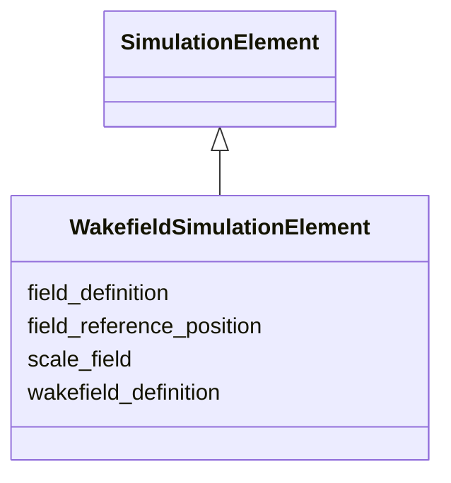

---
search:
  boost: 10.0
---

# Class: WakefieldSimulationElement 


_Simulation attributes for passive wakefield structures._


<div data-search-exclude markdown="1">


URI: [laura:WakefieldSimulationElement](https://w3id.org/laura/WakefieldSimulationElement)





## Inheritance
* [SimulationElement](SimulationElement.md)
    * **WakefieldSimulationElement**


## Class Properties

| Property | Value |
| --- | --- |
| Class URI | [laura:WakefieldSimulationElement](https://w3id.org/laura/WakefieldSimulationElement) |


## Slots

| Name | Cardinality and Range | Description | Inheritance |
| ---  | --- | --- | --- |
| [field_definition](field_definition.md) | 0..1 <br/> [String](String.md) | Path to the 3-D field-map file | [SimulationElement](SimulationElement.md) |
| [wakefield_definition](wakefield_definition.md) | 0..1 <br/> [String](String.md) | Path to the wakefield impedance file | [SimulationElement](SimulationElement.md) |
| [field_reference_position](field_reference_position.md) | 0..1 <br/> [Float](Float.md) | Longitudinal origin of the field map [m] | [SimulationElement](SimulationElement.md) |
| [scale_field](scale_field.md) | 0..1 <br/> [Float](Float.md) | Multiplicative scale factor applied to the field map | [SimulationElement](SimulationElement.md) |


## Usages

| used by | used in | type | used |
| ---  | --- | --- | --- |
| [Wakefield](Wakefield.md) | [simulation](simulation.md) | range | [WakefieldSimulationElement](WakefieldSimulationElement.md) |


## Identifier and Mapping Information


### Schema Source


* from schema: https://w3id.org/laura/schema


## Mappings

| Mapping Type | Mapped Value |
| ---  | ---  |
| self | laura:WakefieldSimulationElement |
| native | laura:WakefieldSimulationElement |


## LinkML Source

<!-- TODO: investigate https://stackoverflow.com/questions/37606292/how-to-create-tabbed-code-blocks-in-mkdocs-or-sphinx -->

### Direct

<details>
```yaml
name: WakefieldSimulationElement
description: Simulation attributes for passive wakefield structures.
from_schema: https://w3id.org/laura/schema
is_a: SimulationElement
class_uri: laura:WakefieldSimulationElement

```
</details>

### Induced

<details>
```yaml
name: WakefieldSimulationElement
description: Simulation attributes for passive wakefield structures.
from_schema: https://w3id.org/laura/schema
is_a: SimulationElement
attributes:
  field_definition:
    name: field_definition
    description: Path to the 3-D field-map file.
    from_schema: https://w3id.org/laura/schema
    rank: 1000
    owner: WakefieldSimulationElement
    domain_of:
    - SimulationElement
    range: string
  wakefield_definition:
    name: wakefield_definition
    description: Path to the wakefield impedance file.
    from_schema: https://w3id.org/laura/schema
    rank: 1000
    owner: WakefieldSimulationElement
    domain_of:
    - SimulationElement
    range: string
  field_reference_position:
    name: field_reference_position
    description: Longitudinal origin of the field map [m].
    from_schema: https://w3id.org/laura/schema
    rank: 1000
    owner: WakefieldSimulationElement
    domain_of:
    - SimulationElement
    range: float
    unit:
      ucum_code: m
  scale_field:
    name: scale_field
    description: Multiplicative scale factor applied to the field map.
    from_schema: https://w3id.org/laura/schema
    rank: 1000
    owner: WakefieldSimulationElement
    domain_of:
    - SimulationElement
    range: float
class_uri: laura:WakefieldSimulationElement

```
</details></div>