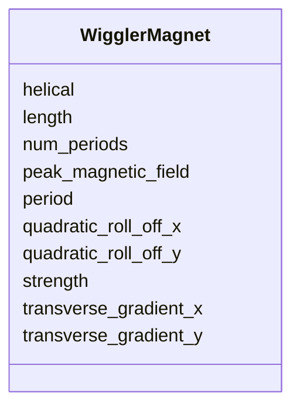

# Class: WigglerMagnet 


_Periodic wiggler/undulator field._


<div data-search-exclude markdown="1">


URI: [laura:Wiggler_Magnet](https://w3id.org/laura/Wiggler_Magnet)





<!-- no inheritance hierarchy -->

## Class Properties

| Property | Value |
| --- | --- |
| Class URI | [laura:Wiggler_Magnet](https://w3id.org/laura/Wiggler_Magnet) |


## Slots

| Name | Cardinality and Range | Description | Inheritance |
| ---  | --- | --- | --- |
| [length](length.md) | 0..1 <br/> [Float](Float.md) | Magnetic length [m] | direct |
| [strength](strength.md) | 0..1 <br/> [Float](Float.md) | Deflection parameter K | direct |
| [peak_magnetic_field](peak_magnetic_field.md) | 0..1 <br/> [Float](Float.md) | Peak on-axis field [T] | direct |
| [period](period.md) | 0..1 <br/> [Float](Float.md) | Magnetic period length [m] | direct |
| [num_periods](num_periods.md) | 0..1 <br/> [Integer](Integer.md) | Number of full magnetic periods | direct |
| [helical](helical.md) | 0..1 <br/> [Boolean](Boolean.md) | True for a helical device, False for planar | direct |
| [quadratic_roll_off_x](quadratic_roll_off_x.md) | 0..1 <br/> [Float](Float.md) | Quadratic field roll-off in x [1/m^2] | direct |
| [quadratic_roll_off_y](quadratic_roll_off_y.md) | 0..1 <br/> [Float](Float.md) | Quadratic field roll-off in y [1/m^2] | direct |
| [transverse_gradient_x](transverse_gradient_x.md) | 0..1 <br/> [Float](Float.md) | Transverse field gradient in x [1/m] | direct |
| [transverse_gradient_y](transverse_gradient_y.md) | 0..1 <br/> [Float](Float.md) | Transverse field gradient in y [1/m] | direct |


## Usages

| used by | used in | type | used |
| ---  | --- | --- | --- |
| [Wiggler](Wiggler.md) | [magnetic](magnetic.md) | range | [WigglerMagnet](WigglerMagnet.md) |


## Identifier and Mapping Information


### Schema Source


* from schema: https://w3id.org/laura/schema


## Mappings

| Mapping Type | Mapped Value |
| ---  | ---  |
| self | laura:Wiggler_Magnet |
| native | laura:WigglerMagnet |


## LinkML Source

<!-- TODO: investigate https://stackoverflow.com/questions/37606292/how-to-create-tabbed-code-blocks-in-mkdocs-or-sphinx -->

### Direct

<details>
```yaml
name: Wiggler_Magnet
description: Periodic wiggler/undulator field.
from_schema: https://w3id.org/laura/schema
attributes:
  length:
    name: length
    description: Magnetic length [m].
    from_schema: https://w3id.org/laura/schema/magnetic
    ifabsent: float(0.0)
    domain_of:
    - PhysicalElement
    - MagneticElement
    - Corrector_Magnet
    - Solenoid_Magnet
    - Wiggler_Magnet
    - NonLinearLens_Magnet
    range: float
    minimum_value: 0
  strength:
    name: strength
    description: Deflection parameter K. May be a functional expression.
    from_schema: https://w3id.org/laura/schema/magnetic
    rank: 1000
    ifabsent: float(0.0)
    domain_of:
    - Wiggler_Magnet
    range: float
    minimum_value: 0
  peak_magnetic_field:
    name: peak_magnetic_field
    description: Peak on-axis field [T].
    from_schema: https://w3id.org/laura/schema/magnetic
    rank: 1000
    ifabsent: float(0.0)
    domain_of:
    - Wiggler_Magnet
    range: float
  period:
    name: period
    description: Magnetic period length [m].
    from_schema: https://w3id.org/laura/schema/magnetic
    rank: 1000
    ifabsent: float(0.0)
    domain_of:
    - Wiggler_Magnet
    range: float
  num_periods:
    name: num_periods
    description: Number of full magnetic periods.
    from_schema: https://w3id.org/laura/schema/magnetic
    rank: 1000
    ifabsent: int(0)
    domain_of:
    - Wiggler_Magnet
    range: integer
    minimum_value: 0
  helical:
    name: helical
    description: True for a helical device, False for planar.
    from_schema: https://w3id.org/laura/schema/magnetic
    rank: 1000
    ifabsent: 'False'
    domain_of:
    - Wiggler_Magnet
    range: boolean
  quadratic_roll_off_x:
    name: quadratic_roll_off_x
    description: Quadratic field roll-off in x [1/m^2].
    from_schema: https://w3id.org/laura/schema/magnetic
    rank: 1000
    ifabsent: float(0.0)
    domain_of:
    - Wiggler_Magnet
    range: float
  quadratic_roll_off_y:
    name: quadratic_roll_off_y
    description: Quadratic field roll-off in y [1/m^2].
    from_schema: https://w3id.org/laura/schema/magnetic
    rank: 1000
    ifabsent: float(0.0)
    domain_of:
    - Wiggler_Magnet
    range: float
  transverse_gradient_x:
    name: transverse_gradient_x
    description: Transverse field gradient in x [1/m].
    from_schema: https://w3id.org/laura/schema/magnetic
    rank: 1000
    ifabsent: float(0.0)
    domain_of:
    - Wiggler_Magnet
    range: float
  transverse_gradient_y:
    name: transverse_gradient_y
    description: Transverse field gradient in y [1/m].
    from_schema: https://w3id.org/laura/schema/magnetic
    rank: 1000
    ifabsent: float(0.0)
    domain_of:
    - Wiggler_Magnet
    range: float
class_uri: laura:Wiggler_Magnet

```
</details>

### Induced

<details>
```yaml
name: Wiggler_Magnet
description: Periodic wiggler/undulator field.
from_schema: https://w3id.org/laura/schema
attributes:
  length:
    name: length
    description: Magnetic length [m].
    from_schema: https://w3id.org/laura/schema/magnetic
    ifabsent: float(0.0)
    owner: Wiggler_Magnet
    domain_of:
    - PhysicalElement
    - MagneticElement
    - Corrector_Magnet
    - Solenoid_Magnet
    - Wiggler_Magnet
    - NonLinearLens_Magnet
    range: float
    minimum_value: 0
  strength:
    name: strength
    description: Deflection parameter K. May be a functional expression.
    from_schema: https://w3id.org/laura/schema/magnetic
    rank: 1000
    ifabsent: float(0.0)
    owner: Wiggler_Magnet
    domain_of:
    - Wiggler_Magnet
    range: float
    minimum_value: 0
  peak_magnetic_field:
    name: peak_magnetic_field
    description: Peak on-axis field [T].
    from_schema: https://w3id.org/laura/schema/magnetic
    rank: 1000
    ifabsent: float(0.0)
    owner: Wiggler_Magnet
    domain_of:
    - Wiggler_Magnet
    range: float
  period:
    name: period
    description: Magnetic period length [m].
    from_schema: https://w3id.org/laura/schema/magnetic
    rank: 1000
    ifabsent: float(0.0)
    owner: Wiggler_Magnet
    domain_of:
    - Wiggler_Magnet
    range: float
  num_periods:
    name: num_periods
    description: Number of full magnetic periods.
    from_schema: https://w3id.org/laura/schema/magnetic
    rank: 1000
    ifabsent: int(0)
    owner: Wiggler_Magnet
    domain_of:
    - Wiggler_Magnet
    range: integer
    minimum_value: 0
  helical:
    name: helical
    description: True for a helical device, False for planar.
    from_schema: https://w3id.org/laura/schema/magnetic
    rank: 1000
    ifabsent: 'False'
    owner: Wiggler_Magnet
    domain_of:
    - Wiggler_Magnet
    range: boolean
  quadratic_roll_off_x:
    name: quadratic_roll_off_x
    description: Quadratic field roll-off in x [1/m^2].
    from_schema: https://w3id.org/laura/schema/magnetic
    rank: 1000
    ifabsent: float(0.0)
    owner: Wiggler_Magnet
    domain_of:
    - Wiggler_Magnet
    range: float
  quadratic_roll_off_y:
    name: quadratic_roll_off_y
    description: Quadratic field roll-off in y [1/m^2].
    from_schema: https://w3id.org/laura/schema/magnetic
    rank: 1000
    ifabsent: float(0.0)
    owner: Wiggler_Magnet
    domain_of:
    - Wiggler_Magnet
    range: float
  transverse_gradient_x:
    name: transverse_gradient_x
    description: Transverse field gradient in x [1/m].
    from_schema: https://w3id.org/laura/schema/magnetic
    rank: 1000
    ifabsent: float(0.0)
    owner: Wiggler_Magnet
    domain_of:
    - Wiggler_Magnet
    range: float
  transverse_gradient_y:
    name: transverse_gradient_y
    description: Transverse field gradient in y [1/m].
    from_schema: https://w3id.org/laura/schema/magnetic
    rank: 1000
    ifabsent: float(0.0)
    owner: Wiggler_Magnet
    domain_of:
    - Wiggler_Magnet
    range: float
class_uri: laura:Wiggler_Magnet

```
</details></div>