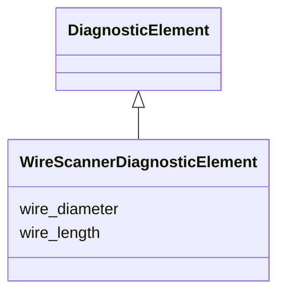

# Class: WireScannerDiagnosticElement 


_Intercepting wire-scanner diagnostic: a thin wire swept through the beam to measure its transverse profile. Distinct from a Wire element, which carries a current to act on the beam rather than to intercept it._


<div data-search-exclude markdown="1">


URI: [laura:WireScannerDiagnosticElement](https://w3id.org/laura/WireScannerDiagnosticElement)





## Inheritance
* [DiagnosticElement](DiagnosticElement.md)
    * **WireScannerDiagnosticElement**


## Class Properties

| Property | Value |
| --- | --- |
| Class URI | [laura:WireScannerDiagnosticElement](https://w3id.org/laura/WireScannerDiagnosticElement) |


## Slots

| Name | Cardinality and Range | Description | Inheritance |
| ---  | --- | --- | --- |
| [wire_diameter](wire_diameter.md) | 0..1 <br/> [Float](Float.md) | Diameter of the scanning wire [m] | direct |
| [wire_length](wire_length.md) | 0..1 <br/> [Float](Float.md) | Length of the scanning wire [m] | direct |


## Usages

| used by | used in | type | used |
| ---  | --- | --- | --- |
| [WireScanner](WireScanner.md) | [diagnostic](diagnostic.md) | range | [WireScannerDiagnosticElement](WireScannerDiagnosticElement.md) |


## In Subsets


* [DiagnosticProperties](DiagnosticProperties.md)


## Identifier and Mapping Information


### Schema Source


* from schema: https://w3id.org/laura/schema


## Mappings

| Mapping Type | Mapped Value |
| ---  | ---  |
| self | laura:WireScannerDiagnosticElement |
| native | laura:WireScannerDiagnosticElement |


## LinkML Source

<!-- TODO: investigate https://stackoverflow.com/questions/37606292/how-to-create-tabbed-code-blocks-in-mkdocs-or-sphinx -->

### Direct

<details>
```yaml
name: WireScannerDiagnosticElement
description: 'Intercepting wire-scanner diagnostic: a thin wire swept through the
  beam to measure its transverse profile. Distinct from a Wire element, which carries
  a current to act on the beam rather than to intercept it.'
in_subset:
- diagnostic_properties
from_schema: https://w3id.org/laura/schema
is_a: DiagnosticElement
attributes:
  wire_diameter:
    name: wire_diameter
    description: Diameter of the scanning wire [m].
    from_schema: https://w3id.org/laura/schema/diagnostics
    rank: 1000
    ifabsent: float(0.0)
    domain_of:
    - WireScannerDiagnosticElement
    range: float
    minimum_value: 0
    unit:
      ucum_code: m
  wire_length:
    name: wire_length
    description: Length of the scanning wire [m].
    from_schema: https://w3id.org/laura/schema/diagnostics
    rank: 1000
    ifabsent: float(0.0)
    domain_of:
    - WireScannerDiagnosticElement
    range: float
    minimum_value: 0
    unit:
      ucum_code: m
class_uri: laura:WireScannerDiagnosticElement

```
</details>

### Induced

<details>
```yaml
name: WireScannerDiagnosticElement
description: 'Intercepting wire-scanner diagnostic: a thin wire swept through the
  beam to measure its transverse profile. Distinct from a Wire element, which carries
  a current to act on the beam rather than to intercept it.'
in_subset:
- diagnostic_properties
from_schema: https://w3id.org/laura/schema
is_a: DiagnosticElement
attributes:
  wire_diameter:
    name: wire_diameter
    description: Diameter of the scanning wire [m].
    from_schema: https://w3id.org/laura/schema/diagnostics
    rank: 1000
    ifabsent: float(0.0)
    owner: WireScannerDiagnosticElement
    domain_of:
    - WireScannerDiagnosticElement
    range: float
    minimum_value: 0
    unit:
      ucum_code: m
  wire_length:
    name: wire_length
    description: Length of the scanning wire [m].
    from_schema: https://w3id.org/laura/schema/diagnostics
    rank: 1000
    ifabsent: float(0.0)
    owner: WireScannerDiagnosticElement
    domain_of:
    - WireScannerDiagnosticElement
    range: float
    minimum_value: 0
    unit:
      ucum_code: m
class_uri: laura:WireScannerDiagnosticElement

```
</details></div>