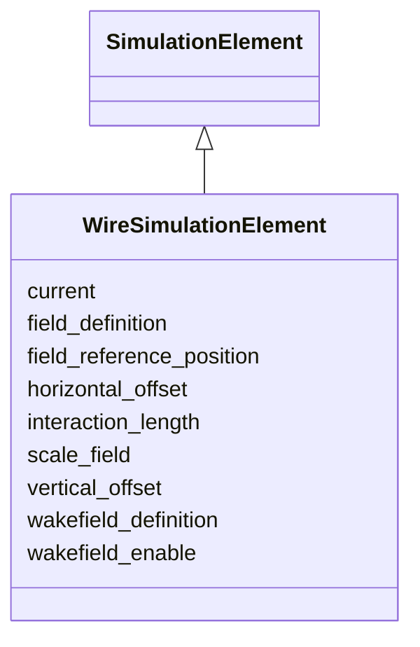

# Class: WireSimulationElement 


_Simulation attributes for a compensating wire._


<div data-search-exclude markdown="1">


URI: [laura:WireSimulationElement](https://w3id.org/laura/WireSimulationElement)





## Inheritance
* [SimulationElement](SimulationElement.md)
    * **WireSimulationElement**


## Class Properties

| Property | Value |
| --- | --- |
| Class URI | [laura:WireSimulationElement](https://w3id.org/laura/WireSimulationElement) |


## Slots

| Name | Cardinality and Range | Description | Inheritance |
| ---  | --- | --- | --- |
| [current](current.md) | 0..1 <br/> [Double](Double.md) | Current carried by the wire [A] | direct |
| [interaction_length](interaction_length.md) | 0..1 <br/> [Double](Double.md) | Effective interaction length [m] | direct |
| [horizontal_offset](horizontal_offset.md) | 0..1 <br/> [Double](Double.md) | Horizontal wire offset from the reference orbit [m] | direct |
| [vertical_offset](vertical_offset.md) | 0..1 <br/> [Double](Double.md) | Vertical wire offset from the reference orbit [m] | direct |
| [field_definition](field_definition.md) | 0..1 <br/> [String](String.md) | Path to the 3-D field-map file | [SimulationElement](SimulationElement.md) |
| [wakefield_definition](wakefield_definition.md) | 0..1 <br/> [String](String.md) | Path to the wakefield impedance file | [SimulationElement](SimulationElement.md) |
| [wakefield_enable](wakefield_enable.md) | 0..1 <br/> [Boolean](Boolean.md) | Whether the wakefield named by wakefield_definition is applied | [SimulationElement](SimulationElement.md) |
| [field_reference_position](field_reference_position.md) | 0..1 <br/> [String](String.md) | Longitudinal origin of the field map [m] | [SimulationElement](SimulationElement.md) |
| [scale_field](scale_field.md) | 0..1 <br/> [Double](Double.md) | Multiplicative scale factor applied to the field map | [SimulationElement](SimulationElement.md) |


## Usages

| used by | used in | type | used |
| ---  | --- | --- | --- |
| [Wire](Wire.md) | [simulation](simulation.md) | range | [WireSimulationElement](WireSimulationElement.md) |


## Identifier and Mapping Information


### Schema Source


* from schema: https://w3id.org/laura/schema


## Mappings

| Mapping Type | Mapped Value |
| ---  | ---  |
| self | laura:WireSimulationElement |
| native | laura:WireSimulationElement |


## LinkML Source

<!-- TODO: investigate https://stackoverflow.com/questions/37606292/how-to-create-tabbed-code-blocks-in-mkdocs-or-sphinx -->

### Direct

<details>
```yaml
name: WireSimulationElement
description: Simulation attributes for a compensating wire.
from_schema: https://w3id.org/laura/schema
is_a: SimulationElement
attributes:
  current:
    name: current
    description: Current carried by the wire [A].
    from_schema: https://w3id.org/laura/schema/simulation
    rank: 1000
    ifabsent: float(0.0)
    domain_of:
    - WireSimulationElement
    range: double
    unit:
      ucum_code: A
  interaction_length:
    name: interaction_length
    description: Effective interaction length [m].
    from_schema: https://w3id.org/laura/schema/simulation
    rank: 1000
    ifabsent: float(0.0)
    domain_of:
    - WireSimulationElement
    range: double
    unit:
      ucum_code: m
  horizontal_offset:
    name: horizontal_offset
    description: Horizontal wire offset from the reference orbit [m].
    from_schema: https://w3id.org/laura/schema/simulation
    rank: 1000
    ifabsent: float(0.0)
    domain_of:
    - WireSimulationElement
    - BeamBeamSimulationElement
    range: double
    unit:
      ucum_code: m
  vertical_offset:
    name: vertical_offset
    description: Vertical wire offset from the reference orbit [m].
    from_schema: https://w3id.org/laura/schema/simulation
    rank: 1000
    ifabsent: float(0.0)
    domain_of:
    - WireSimulationElement
    - BeamBeamSimulationElement
    range: double
    unit:
      ucum_code: m
class_uri: laura:WireSimulationElement

```
</details>

### Induced

<details>
```yaml
name: WireSimulationElement
description: Simulation attributes for a compensating wire.
from_schema: https://w3id.org/laura/schema
is_a: SimulationElement
attributes:
  current:
    name: current
    description: Current carried by the wire [A].
    from_schema: https://w3id.org/laura/schema/simulation
    rank: 1000
    ifabsent: float(0.0)
    owner: WireSimulationElement
    domain_of:
    - WireSimulationElement
    range: double
    unit:
      ucum_code: A
  interaction_length:
    name: interaction_length
    description: Effective interaction length [m].
    from_schema: https://w3id.org/laura/schema/simulation
    rank: 1000
    ifabsent: float(0.0)
    owner: WireSimulationElement
    domain_of:
    - WireSimulationElement
    range: double
    unit:
      ucum_code: m
  horizontal_offset:
    name: horizontal_offset
    description: Horizontal wire offset from the reference orbit [m].
    from_schema: https://w3id.org/laura/schema/simulation
    rank: 1000
    ifabsent: float(0.0)
    owner: WireSimulationElement
    domain_of:
    - WireSimulationElement
    - BeamBeamSimulationElement
    range: double
    unit:
      ucum_code: m
  vertical_offset:
    name: vertical_offset
    description: Vertical wire offset from the reference orbit [m].
    from_schema: https://w3id.org/laura/schema/simulation
    rank: 1000
    ifabsent: float(0.0)
    owner: WireSimulationElement
    domain_of:
    - WireSimulationElement
    - BeamBeamSimulationElement
    range: double
    unit:
      ucum_code: m
  field_definition:
    name: field_definition
    description: Path to the 3-D field-map file.
    from_schema: https://w3id.org/laura/schema/simulation
    rank: 1000
    owner: WireSimulationElement
    domain_of:
    - SimulationElement
    range: string
  wakefield_definition:
    name: wakefield_definition
    description: Path to the wakefield impedance file.
    from_schema: https://w3id.org/laura/schema/simulation
    rank: 1000
    owner: WireSimulationElement
    domain_of:
    - SimulationElement
    range: string
  wakefield_enable:
    name: wakefield_enable
    description: Whether the wakefield named by wakefield_definition is applied. Set
      false to track the element without its wakefield while keeping the definition
      itself.
    from_schema: https://w3id.org/laura/schema/simulation
    rank: 1000
    ifabsent: 'true'
    owner: WireSimulationElement
    domain_of:
    - SimulationElement
    range: boolean
  field_reference_position:
    name: field_reference_position
    description: Longitudinal origin of the field map [m].
    from_schema: https://w3id.org/laura/schema/simulation
    rank: 1000
    owner: WireSimulationElement
    domain_of:
    - SimulationElement
    range: string
  scale_field:
    name: scale_field
    description: Multiplicative scale factor applied to the field map.
    from_schema: https://w3id.org/laura/schema/simulation
    rank: 1000
    ifabsent: float(1)
    owner: WireSimulationElement
    domain_of:
    - SimulationElement
    range: double
class_uri: laura:WireSimulationElement

```
</details></div>