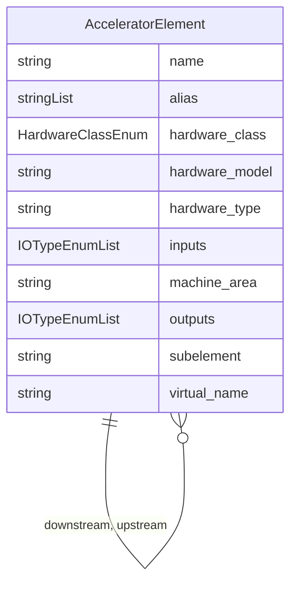

```mermaid
erDiagram
AcceleratorElement {
    string name  
    stringList alias  
    HardwareClassEnum hardware_class  
    string hardware_model  
    string hardware_type  
    IOTypeEnumList inputs  
    string machine_area  
    IOTypeEnumList outputs  
    string subelement  
    string virtual_name  
}

AcceleratorElement ||--}o AcceleratorElement : "downstream, upstream"

```

